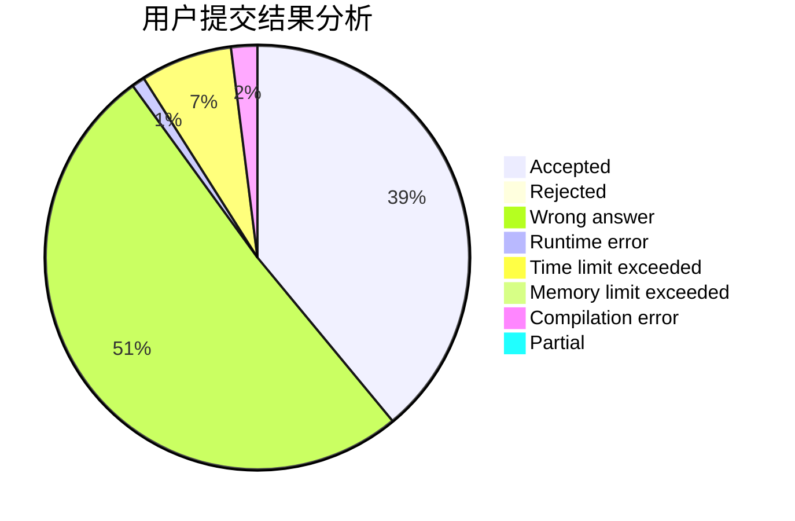
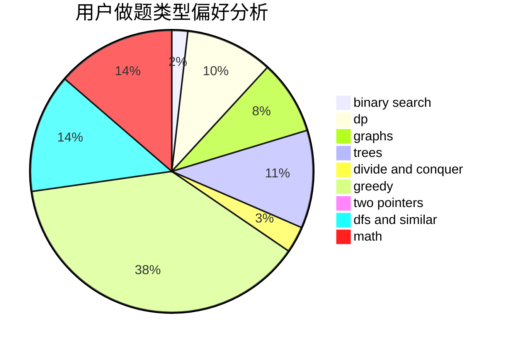

# Verly

<!-- tabs:start -->

#### **用户提交结果分析**

#### **用户做题类型偏好分析**

<!-- tabs:end -->
# 推荐题目
[912C](https://codeforces.com/contest/912/problem/C)
[519E](https://codeforces.com/contest/519/problem/E)
[916C](https://codeforces.com/contest/916/problem/C)
[602A](https://codeforces.com/contest/602/problem/A)
[717I](https://codeforces.com/contest/717/problem/I)
[477A](https://codeforces.com/contest/477/problem/A)
[859A](https://codeforces.com/contest/859/problem/A)
[988C](https://codeforces.com/contest/988/problem/C)
[1262B](https://codeforces.com/contest/1262/problem/B)
[12132](https://codeforces.com/contest/1213/problem/2)
