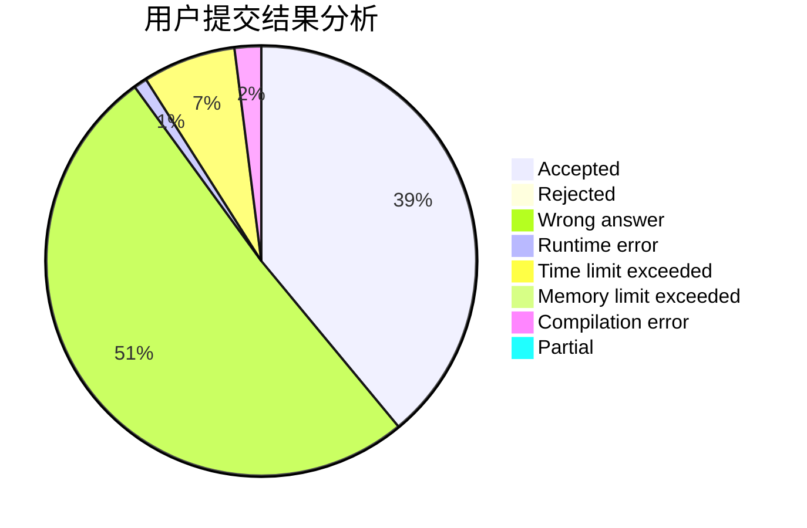
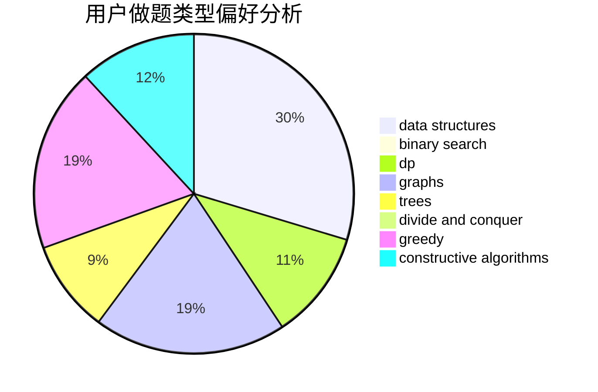

# Verly

<!-- tabs:start -->

#### **用户提交结果分析**

#### **用户做题类型偏好分析**

#### **用户错题知识点分析**

<!-- tabs:end -->
# 推荐题目
[912C](https://codeforces.com/contest/912/problem/C)		brute force,
                        greedy,
                        sortings		  
[519E](https://codeforces.com/contest/519/problem/E)		binary search,
                        data structures,
                        dfs and similar,
                        dp,
                        trees		  
[916C](https://codeforces.com/contest/916/problem/C)		constructive algorithms,
                        graphs,
                        shortest paths		  
[602A](https://codeforces.com/contest/602/problem/A)		brute force,
                        implementation		  
[717I](https://codeforces.com/contest/717/problem/I)		geometry		  
[477A](https://codeforces.com/contest/477/problem/A)		dsu,graphs,sortings,trees		  
[859A](https://codeforces.com/contest/859/problem/A)		greedy,
                        implementation		  
[988C](https://codeforces.com/contest/988/problem/C)		implementation,
                        sortings		  
[1262B](https://codeforces.com/contest/1262/problem/B)		dsu,graphs,sortings,trees		  
[12132](https://codeforces.com/contest/1213/problem/2)		dsu,graphs,sortings,trees		  
