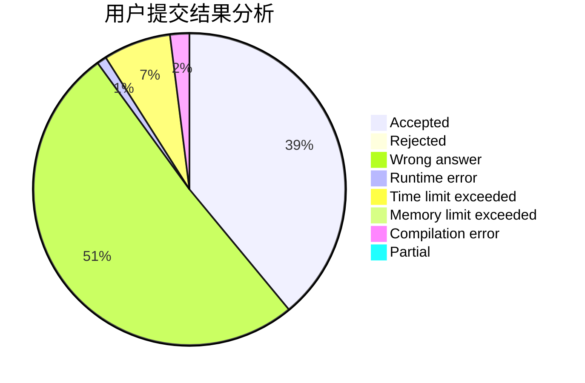
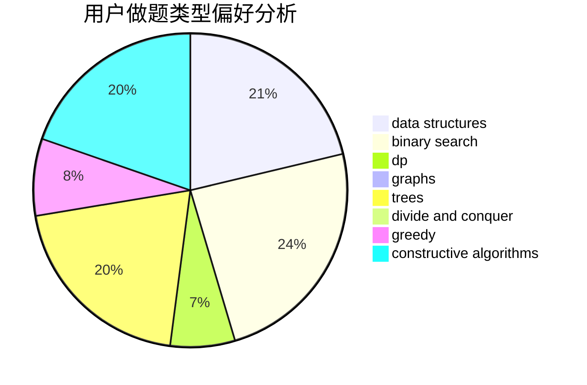
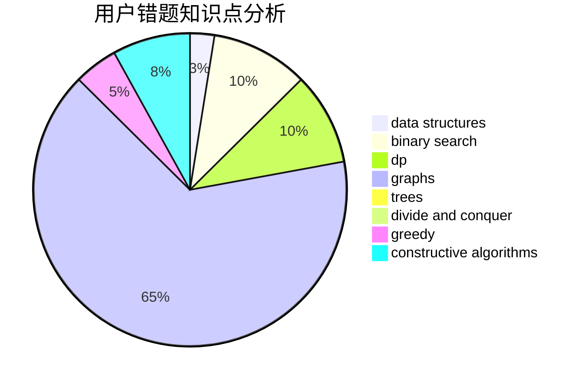

# Verly

<!-- tabs:start -->

#### **用户提交结果分析**

#### **用户做题类型偏好分析**

#### **用户错题知识点分析**

<!-- tabs:end -->
# 推荐题目
[894D](https://codeforces.com/contest/894/problem/D)		brute force,
                        data structures,
                        trees		  
[498E](https://codeforces.com/contest/498/problem/E)		dp,
                        matrices		  
[8E](https://codeforces.com/contest/8/problem/E)		dp,
                        graphs		  
[581D](https://codeforces.com/contest/581/problem/D)		bitmasks,
                        brute force,
                        constructive algorithms,
                        geometry,
                        implementation,
                        math		  
[6E](https://codeforces.com/contest/6/problem/E)		binary search,
                        data structures,
                        dsu,
                        trees,
                        two pointers		  
[455E](https://codeforces.com/contest/455/problem/E)		data structures		  
[839D](https://codeforces.com/contest/839/problem/D)		combinatorics,
                        dp,
                        math,
                        number theory		  
[966E](https://codeforces.com/contest/966/problem/E)		dsu,graphs,sortings,trees		  
[1255B](https://codeforces.com/contest/1255/problem/B)		graphs,
                        implementation		  
[1207D](https://codeforces.com/contest/1207/problem/D)		combinatorics		  
