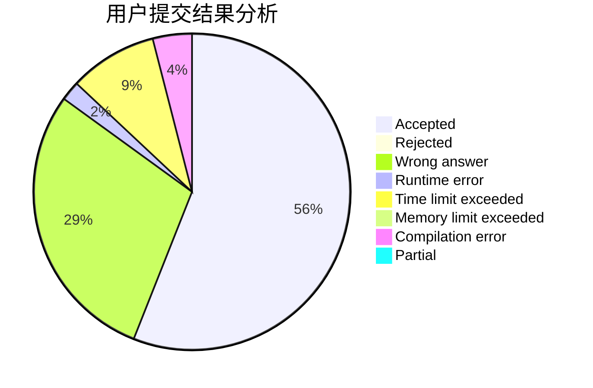
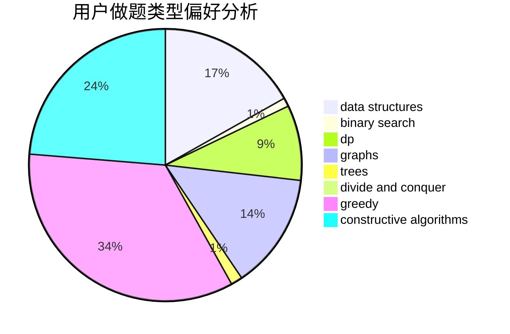
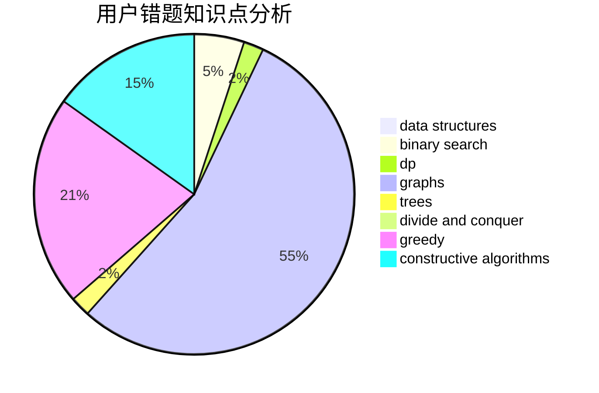

# VictorW

<!-- tabs:start -->

#### **用户提交结果分析**

#### **用户做题类型偏好分析**

#### **用户错题知识点分析**

<!-- tabs:end -->
# 推荐题目
[1488B](https://codeforces.com/contest/1488/problem/B)		*special problem,
                        greedy		  
[1312E](https://codeforces.com/contest/1312/problem/E)		dp,
                        greedy		  
[405B](https://codeforces.com/contest/405/problem/B)		nan		  
[868B](https://codeforces.com/contest/868/problem/B)		implementation		  
[1109E](https://codeforces.com/contest/1109/problem/E)		data structures,
                        number theory		  
[401D](https://codeforces.com/contest/401/problem/D)		bitmasks,
                        brute force,
                        combinatorics,
                        dp,
                        number theory		  
[1020C](https://codeforces.com/contest/1020/problem/C)		dsu,graphs,sortings,trees		  
[1030C](https://codeforces.com/contest/1030/problem/C)		implementation		  
[780G](https://codeforces.com/contest/780/problem/G)		data structures,
                        dp		  
[645G](https://codeforces.com/contest/645/problem/G)		binary search,
                        geometry		  
