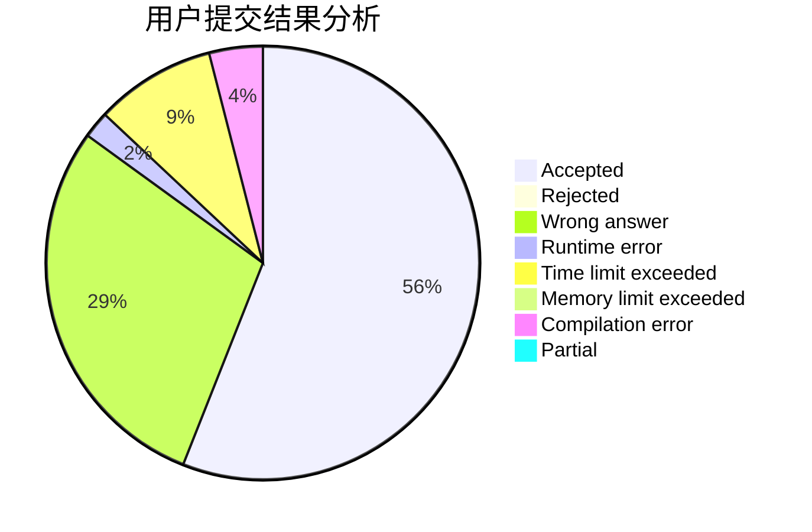
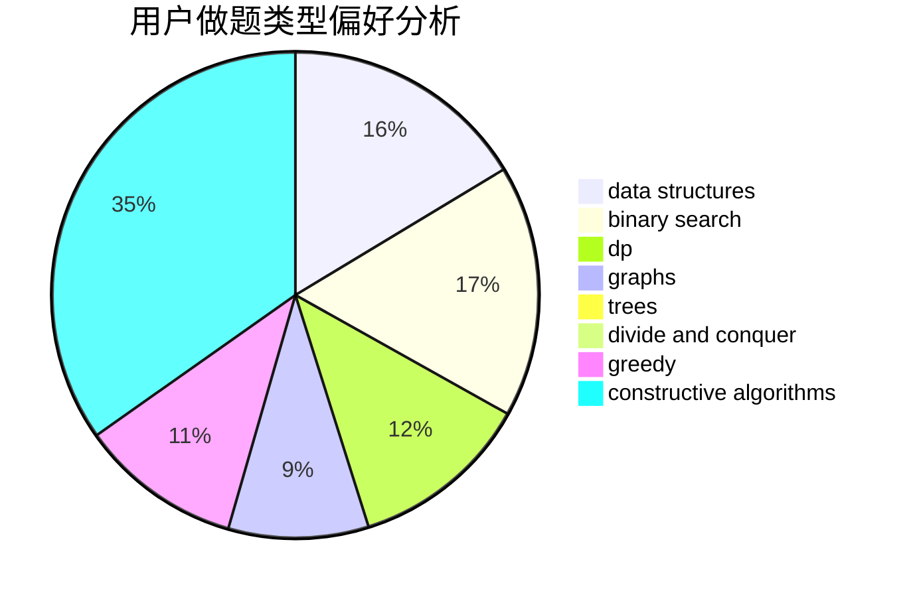
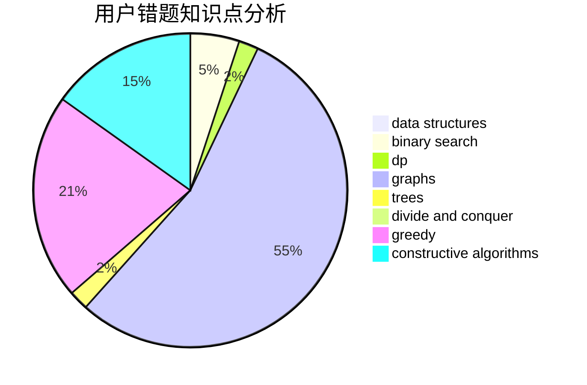

# VictorW

<!-- tabs:start -->

#### **用户提交结果分析**

#### **用户做题类型偏好分析**

#### **用户错题知识点分析**

<!-- tabs:end -->
# 推荐题目
[1479D](https://codeforces.com/contest/1479/problem/D)		binary search,
                        bitmasks,
                        brute force,
                        data structures,
                        probabilities,
                        trees		  
[1303G](https://codeforces.com/contest/1303/problem/G)		data structures,
                        divide and conquer,
                        geometry,
                        trees		  
[377A](https://codeforces.com/contest/377/problem/A)		dfs and similar		  
[848E](https://codeforces.com/contest/848/problem/E)		combinatorics,
                        divide and conquer,
                        dp,
                        fft,
                        math		  
[1109A](https://codeforces.com/contest/1109/problem/A)		dp,
                        implementation		  
[371E](https://codeforces.com/contest/371/problem/E)		greedy,
                        math,
                        two pointers		  
[101D](https://codeforces.com/contest/101/problem/D)		dp,
                        greedy,
                        probabilities,
                        sortings,
                        trees		  
[102B](https://codeforces.com/contest/102/problem/B)		implementation		  
[762C](https://codeforces.com/contest/762/problem/C)		binary search,
                        hashing,
                        strings,
                        two pointers		  
[621E](https://codeforces.com/contest/621/problem/E)		dp,
                        matrices		  
