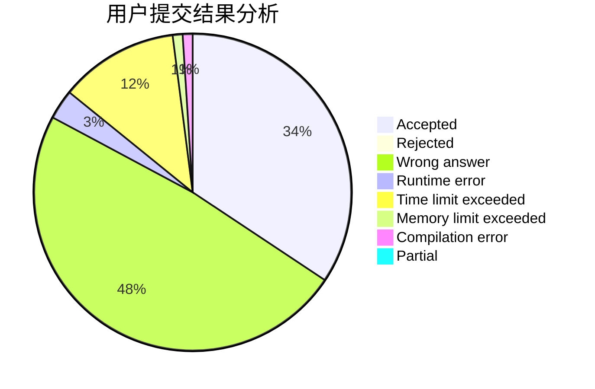
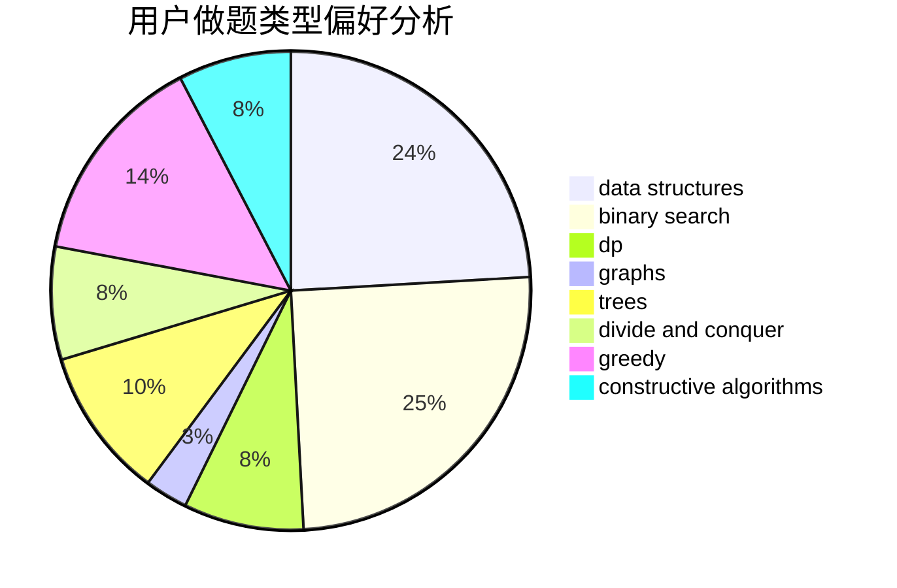
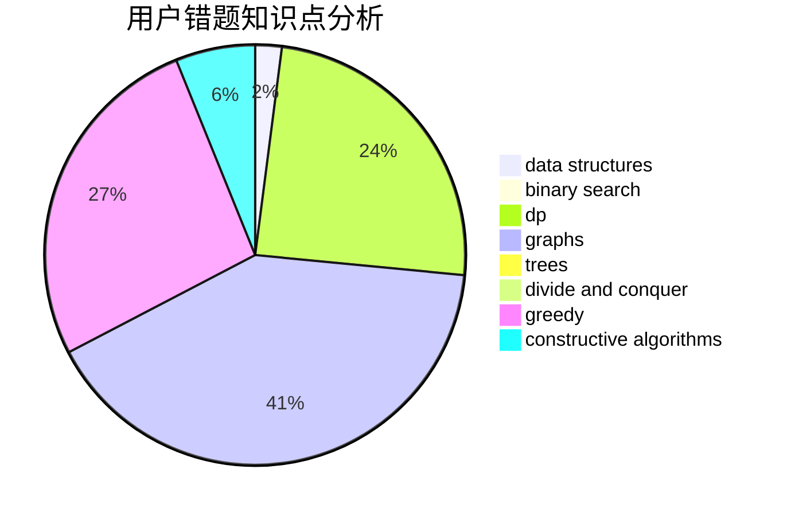

# Vingying0

<!-- tabs:start -->

#### **用户提交结果分析**

#### **用户做题类型偏好分析**

#### **用户错题知识点分析**

<!-- tabs:end -->
# 推荐题目
[160B](https://codeforces.com/contest/160/problem/B)		greedy,
                        sortings		  
[1267K](https://codeforces.com/contest/1267/problem/K)		combinatorics,
                        math		  
[1262A](https://codeforces.com/contest/1262/problem/A)		dsu,graphs,sortings,trees		  
[331C3](https://codeforces.com/contest/331C/problem/3)		dp		  
[616E](https://codeforces.com/contest/616/problem/E)		implementation,
                        math,
                        number theory		  
[920A](https://codeforces.com/contest/920/problem/A)		implementation		  
[793D](https://codeforces.com/contest/793/problem/D)		dp,
                        graphs,
                        shortest paths		  
[213E](https://codeforces.com/contest/213/problem/E)		data structures,
                        hashing,
                        strings		  
[1064E](https://codeforces.com/contest/1064/problem/E)		dsu,graphs,sortings,trees		  
[412D](https://codeforces.com/contest/412/problem/D)		dfs and similar		  
