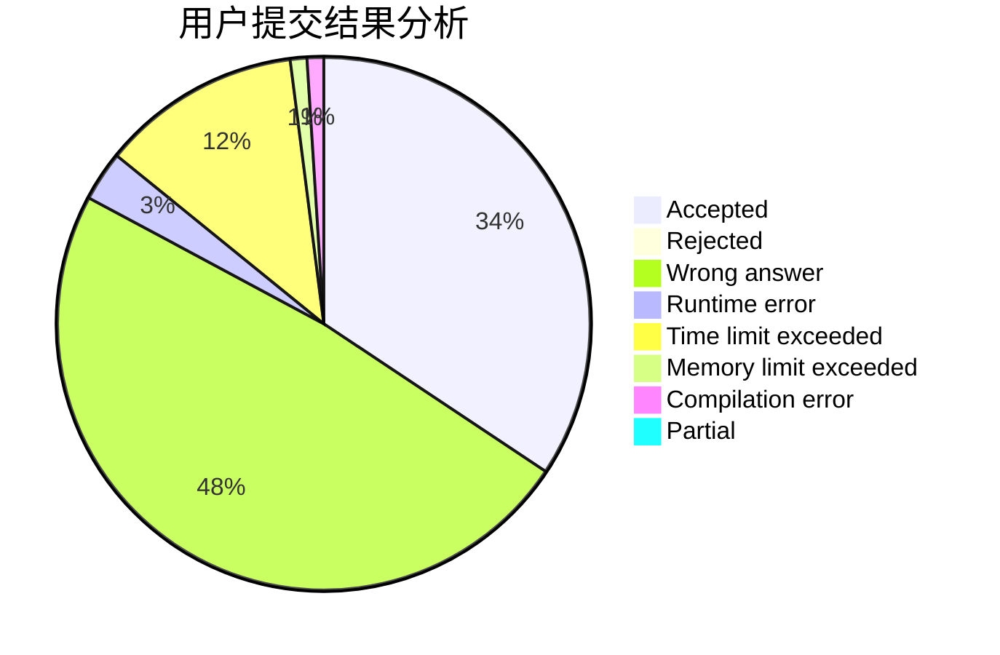
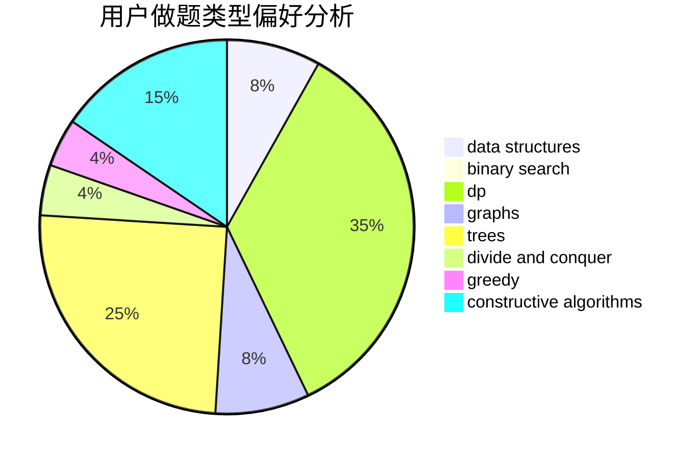
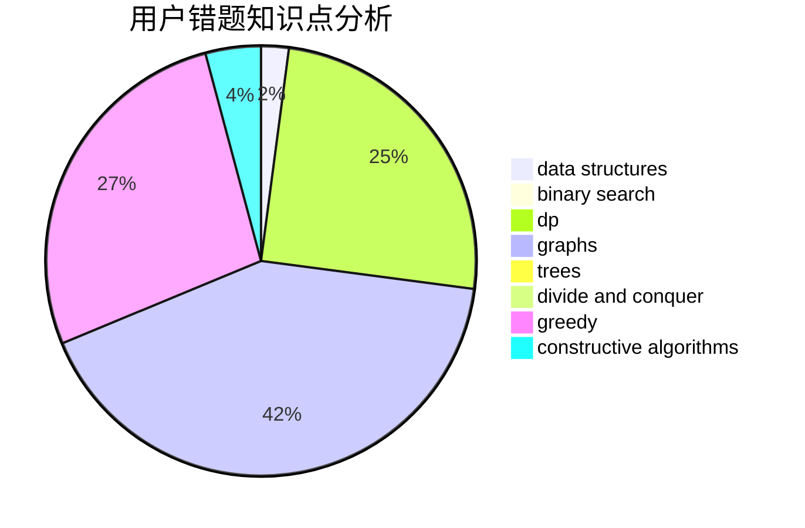

# Vingying0

<!-- tabs:start -->

#### **用户提交结果分析**

#### **用户做题类型偏好分析**

#### **用户错题知识点分析**

<!-- tabs:end -->
# 推荐题目
[185A](https://codeforces.com/contest/185/problem/A)		math		  
[1276F](https://codeforces.com/contest/1276/problem/F)		string suffix structures		  
[1267I](https://codeforces.com/contest/1267/problem/I)		brute force,
                        constructive algorithms,
                        implementation,
                        interactive,
                        sortings		  
[359C](https://codeforces.com/contest/359/problem/C)		math,
                        number theory		  
[634B](https://codeforces.com/contest/634/problem/B)		dsu,graphs,sortings,trees		  
[940A](https://codeforces.com/contest/940/problem/A)		brute force,
                        greedy,
                        sortings		  
[808F](https://codeforces.com/contest/808/problem/F)		binary search,
                        flows,
                        graphs		  
[233A](https://codeforces.com/contest/233/problem/A)		implementation,
                        math		  
[1065B](https://codeforces.com/contest/1065/problem/B)		constructive algorithms,
                        graphs		  
[438C](https://codeforces.com/contest/438/problem/C)		dsu,graphs,sortings,trees		  
