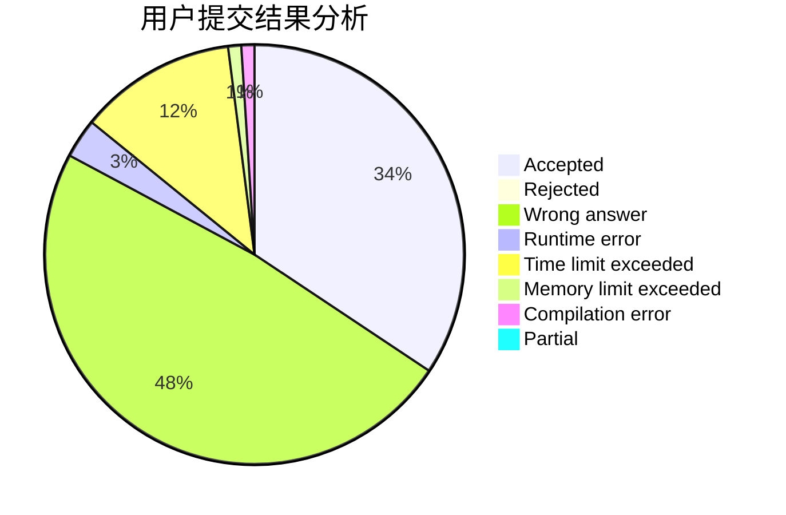
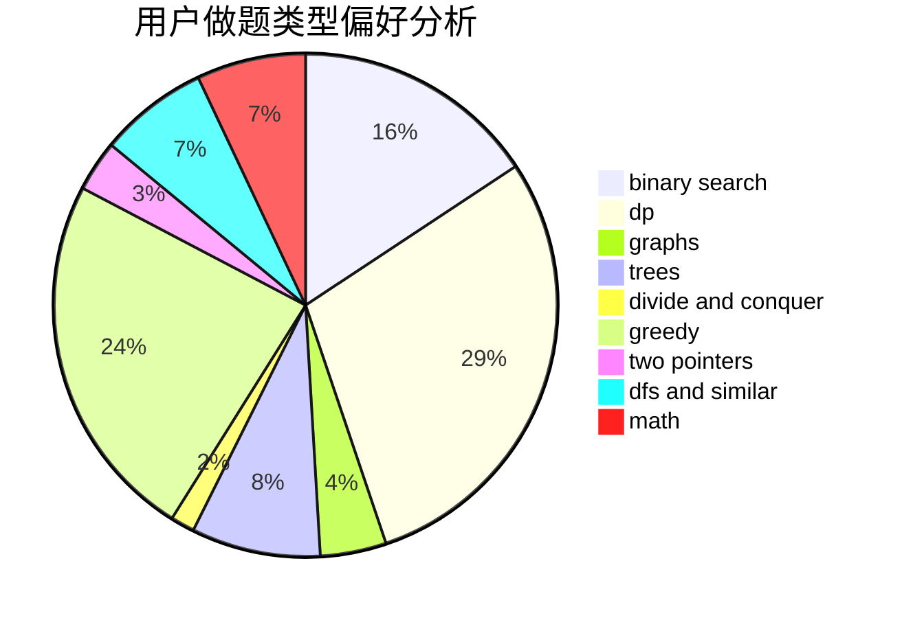

# Vingying0

<!-- tabs:start -->

#### **用户提交结果分析**

#### **用户做题类型偏好分析**

<!-- tabs:end -->
# 推荐题目
[185A](https://codeforces.com/contest/185/problem/A)
[1276F](https://codeforces.com/contest/1276/problem/F)
[1267I](https://codeforces.com/contest/1267/problem/I)
[359C](https://codeforces.com/contest/359/problem/C)
[634B](https://codeforces.com/contest/634/problem/B)
[940A](https://codeforces.com/contest/940/problem/A)
[808F](https://codeforces.com/contest/808/problem/F)
[233A](https://codeforces.com/contest/233/problem/A)
[1065B](https://codeforces.com/contest/1065/problem/B)
[438C](https://codeforces.com/contest/438/problem/C)
