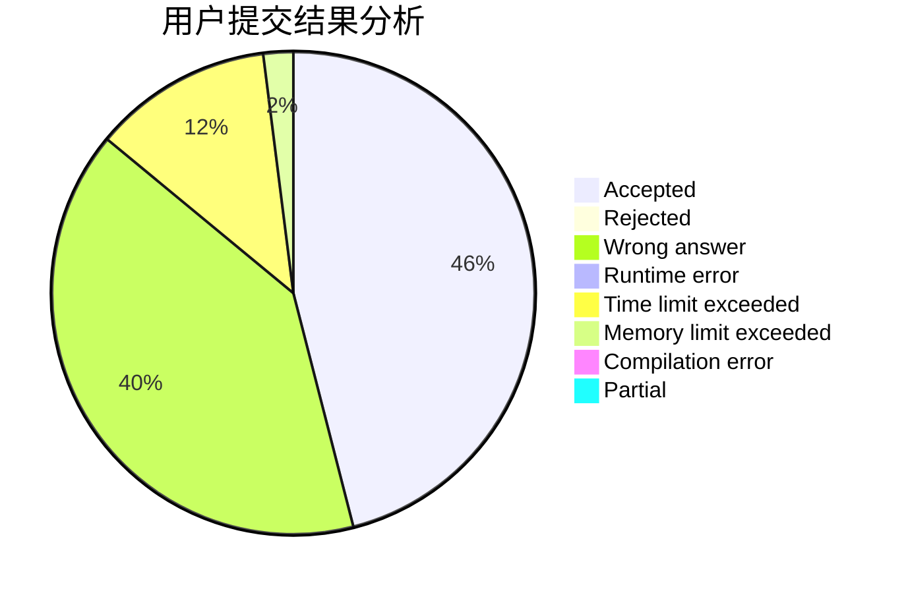
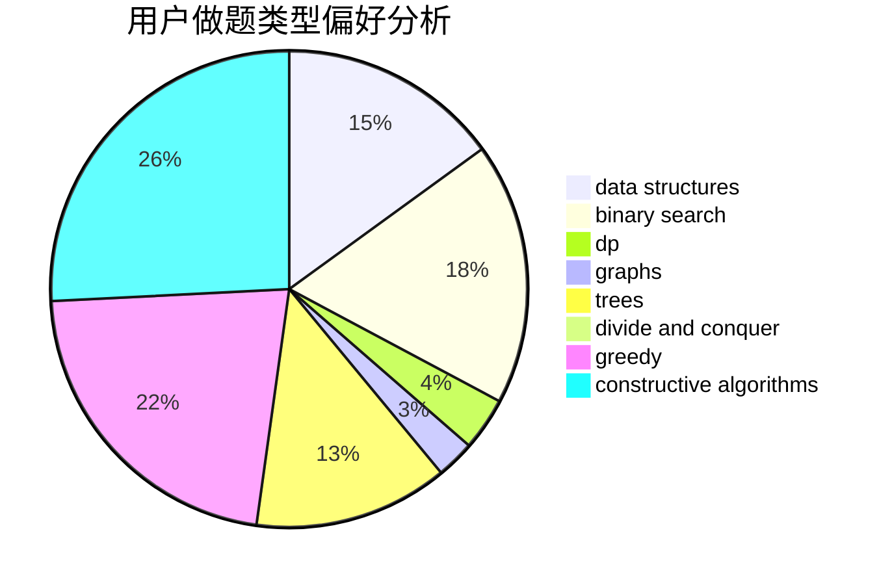

# Visors

<!-- tabs:start -->

#### **用户提交结果分析**

#### **用户做题类型偏好分析**

#### **用户错题知识点分析**

<!-- tabs:end -->
# 推荐题目
[229D](https://codeforces.com/contest/229/problem/D)		dp,
                        greedy,
                        two pointers		  
[1436F](https://codeforces.com/contest/1436/problem/F)		combinatorics,
                        math,
                        number theory		  
[1085G](https://codeforces.com/contest/1085/problem/G)		combinatorics,
                        data structures,
                        dp		  
[876F](https://codeforces.com/contest/876/problem/F)		dsu,graphs,sortings,trees		  
[611C](https://codeforces.com/contest/611/problem/C)		dp,
                        implementation		  
[721B](https://codeforces.com/contest/721/problem/B)		implementation,
                        math,
                        sortings,
                        strings		  
[1288B](https://codeforces.com/contest/1288/problem/B)		math		  
[316G3](https://codeforces.com/contest/316G/problem/3)		string suffix structures		  
[1249C1](https://codeforces.com/contest/1249C/problem/1)		brute force,
                        greedy,
                        implementation		  
[788E](https://codeforces.com/contest/788/problem/E)		data structures		  
