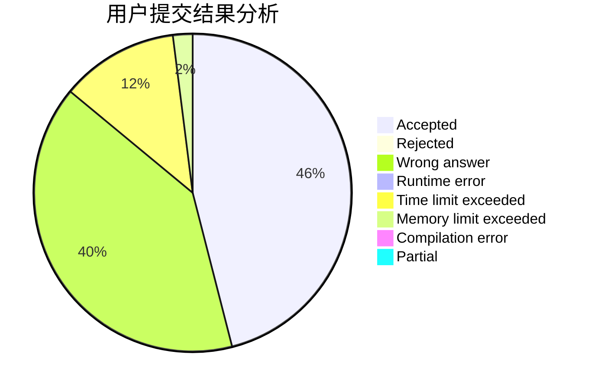
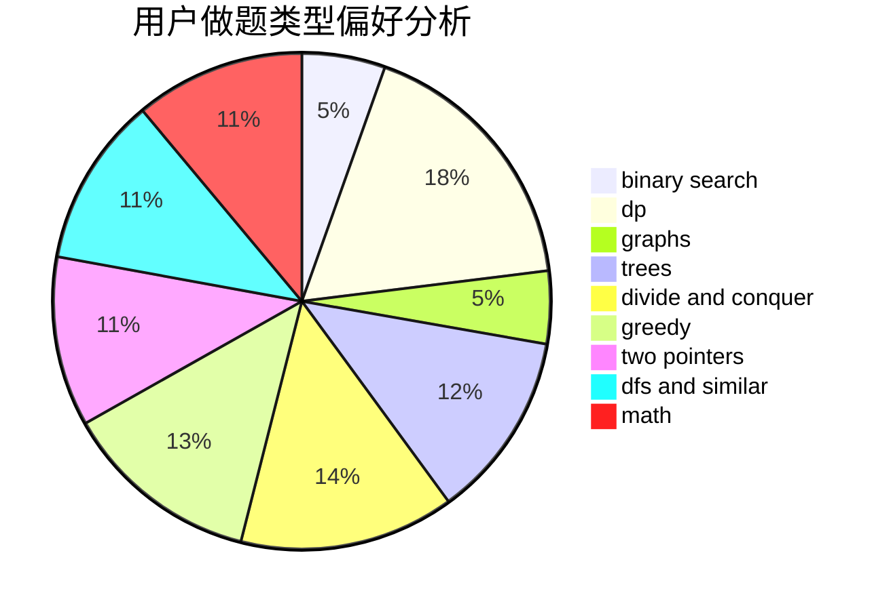

# Visors

<!-- tabs:start -->

#### **用户提交结果分析**

#### **用户做题类型偏好分析**

<!-- tabs:end -->
# 推荐题目
[249E](https://codeforces.com/contest/249/problem/E)
[1446E](https://codeforces.com/contest/1446/problem/E)
[1086C](https://codeforces.com/contest/1086/problem/C)
[897B](https://codeforces.com/contest/897/problem/B)
[630F](https://codeforces.com/contest/630/problem/F)
[738D](https://codeforces.com/contest/738/problem/D)
[1295D](https://codeforces.com/contest/1295/problem/D)
[346A](https://codeforces.com/contest/346/problem/A)
[1252L](https://codeforces.com/contest/1252/problem/L)
[804B](https://codeforces.com/contest/804/problem/B)
