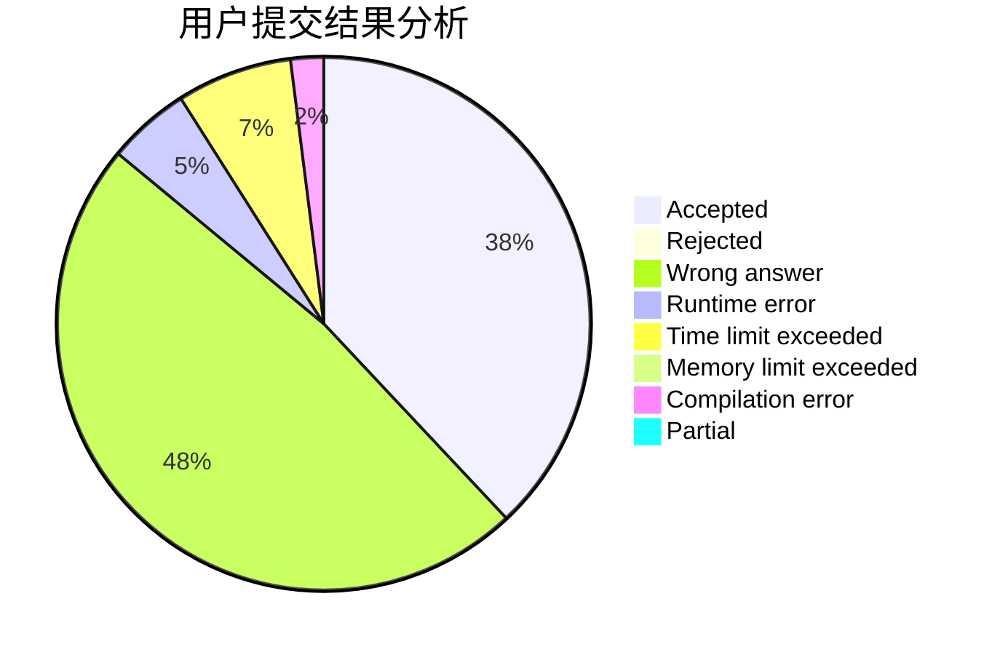
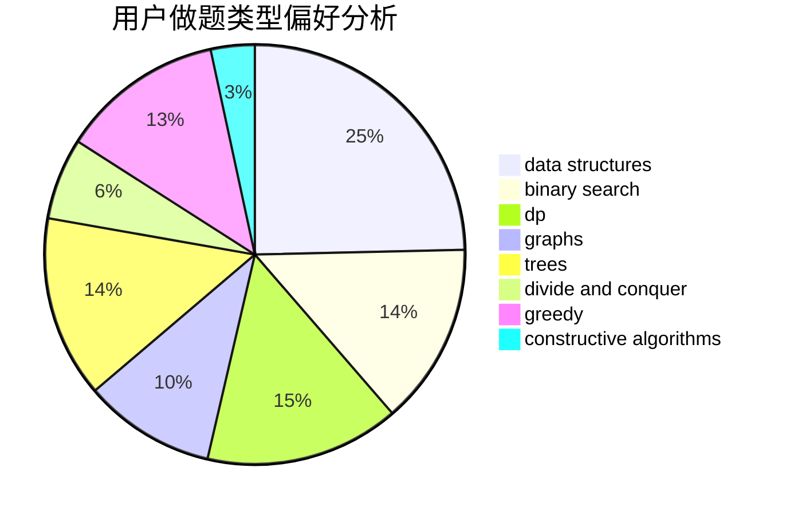
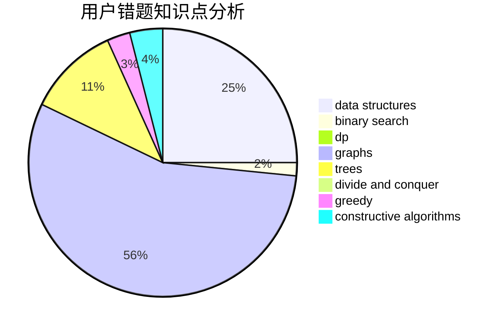

# Vixbob

<!-- tabs:start -->

#### **用户提交结果分析**

#### **用户做题类型偏好分析**

#### **用户错题知识点分析**

<!-- tabs:end -->
# 推荐题目
[1401E](https://codeforces.com/contest/1401/problem/E)		data structures,
                        geometry,
                        implementation,
                        sortings		  
[1342B](https://codeforces.com/contest/1342/problem/B)		constructive algorithms,
                        strings		  
[16E](https://codeforces.com/contest/16/problem/E)		bitmasks,
                        dp,
                        probabilities		  
[848B](https://codeforces.com/contest/848/problem/B)		constructive algorithms,
                        data structures,
                        geometry,
                        implementation,
                        sortings,
                        two pointers		  
[201C](https://codeforces.com/contest/201/problem/C)		dp		  
[845D](https://codeforces.com/contest/845/problem/D)		data structures,
                        dp,
                        greedy		  
[509C](https://codeforces.com/contest/509/problem/C)		dp,
                        greedy,
                        implementation		  
[559D](https://codeforces.com/contest/559/problem/D)		combinatorics,
                        geometry,
                        probabilities		  
[798B](https://codeforces.com/contest/798/problem/B)		brute force,
                        dp,
                        strings		  
[919E](https://codeforces.com/contest/919/problem/E)		chinese remainder theorem,
                        math,
                        number theory		  
