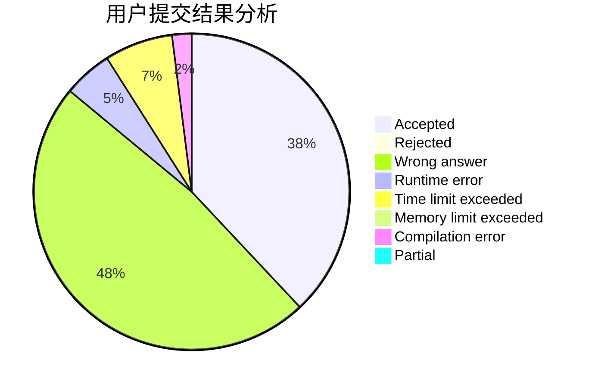
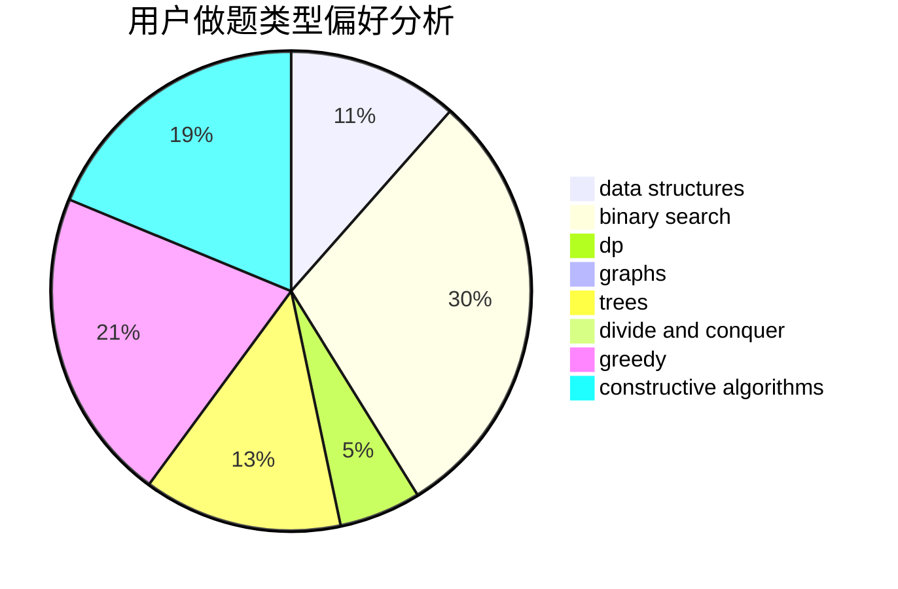
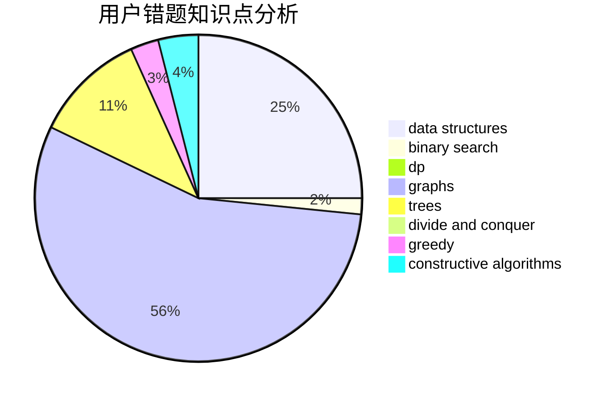

# Vixbob

<!-- tabs:start -->

#### **用户提交结果分析**

#### **用户做题类型偏好分析**

#### **用户错题知识点分析**

<!-- tabs:end -->
# 推荐题目
[1393E2](https://codeforces.com/contest/1393E/problem/2)		dp,
                        hashing,
                        implementation,
                        string suffix structures,
                        strings,
                        two pointers		  
[1335B](https://codeforces.com/contest/1335/problem/B)		constructive algorithms		  
[1511G](https://codeforces.com/contest/1511/problem/G)		bitmasks,
                        brute force,
                        data structures,
                        games,
                        two pointers		  
[830B](https://codeforces.com/contest/830/problem/B)		data structures,
                        implementation,
                        sortings		  
[176D](https://codeforces.com/contest/176/problem/D)		dp		  
[827A](https://codeforces.com/contest/827/problem/A)		data structures,
                        greedy,
                        sortings,
                        strings		  
[489B](https://codeforces.com/contest/489/problem/B)		dfs and similar,
                        dp,
                        graph matchings,
                        greedy,
                        sortings,
                        two pointers		  
[538C](https://codeforces.com/contest/538/problem/C)		binary search,
                        brute force,
                        greedy,
                        implementation,
                        math		  
[77B](https://codeforces.com/contest/77/problem/B)		math,
                        probabilities		  
[903E](https://codeforces.com/contest/903/problem/E)		brute force,
                        hashing,
                        implementation,
                        strings		  
