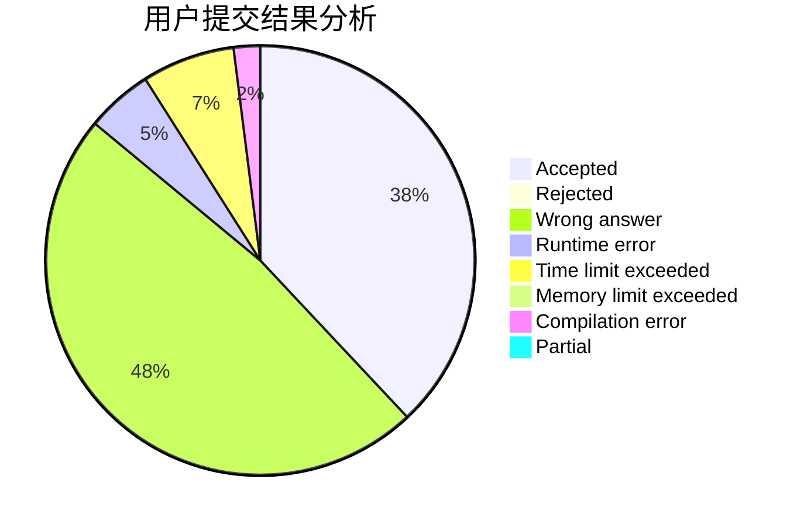
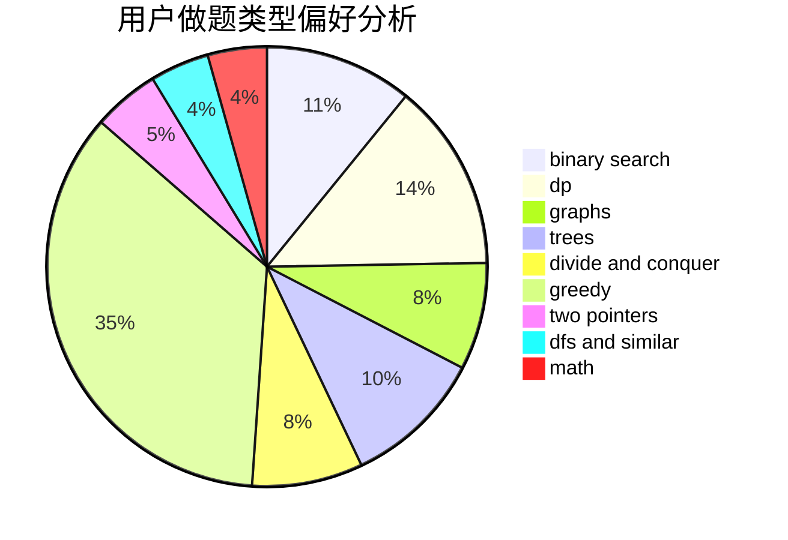

# Vixbob

<!-- tabs:start -->

#### **用户提交结果分析**

#### **用户做题类型偏好分析**

<!-- tabs:end -->
# 推荐题目
[1401E](https://codeforces.com/contest/1401/problem/E)
[1342B](https://codeforces.com/contest/1342/problem/B)
[16E](https://codeforces.com/contest/16/problem/E)
[848B](https://codeforces.com/contest/848/problem/B)
[201C](https://codeforces.com/contest/201/problem/C)
[845D](https://codeforces.com/contest/845/problem/D)
[509C](https://codeforces.com/contest/509/problem/C)
[559D](https://codeforces.com/contest/559/problem/D)
[798B](https://codeforces.com/contest/798/problem/B)
[919E](https://codeforces.com/contest/919/problem/E)
