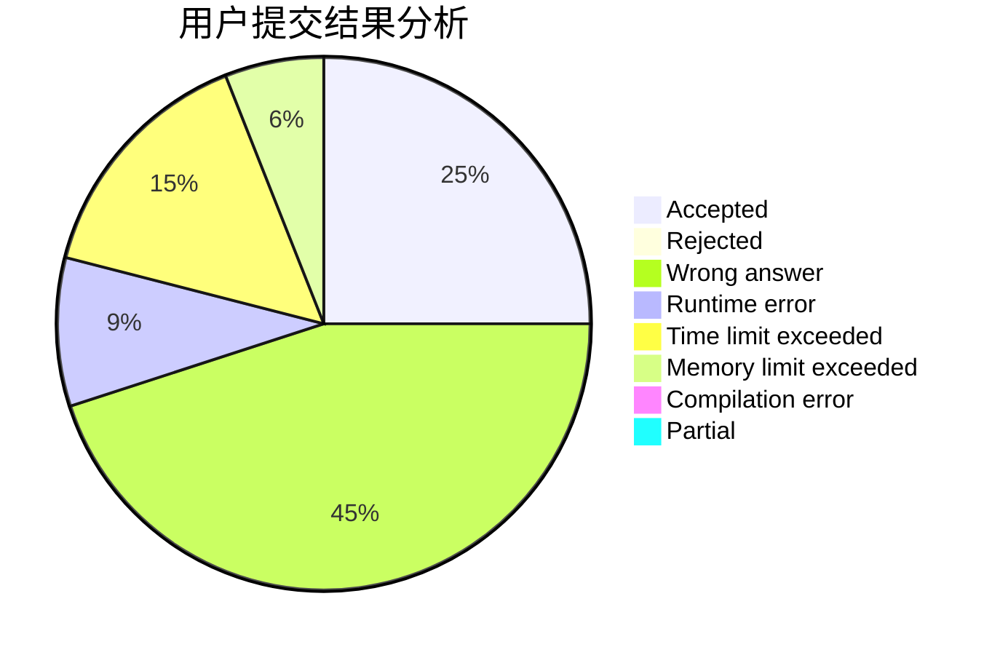
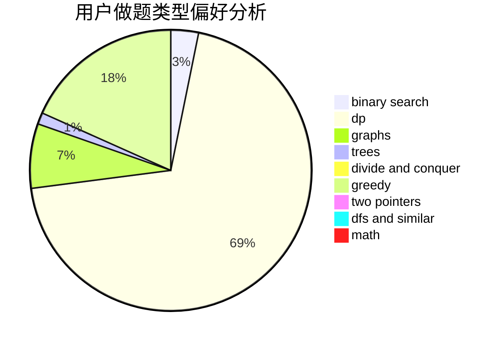

# Vxlimo

<!-- tabs:start -->

#### **用户提交结果分析**

#### **用户做题类型偏好分析**

<!-- tabs:end -->
# 推荐题目
[467A](https://codeforces.com/contest/467/problem/A)
[659G](https://codeforces.com/contest/659/problem/G)
[53D](https://codeforces.com/contest/53/problem/D)
[1314C](https://codeforces.com/contest/1314/problem/C)
[288C](https://codeforces.com/contest/288/problem/C)
[1350B](https://codeforces.com/contest/1350/problem/B)
[1054F](https://codeforces.com/contest/1054/problem/F)
[799F](https://codeforces.com/contest/799/problem/F)
[158A](https://codeforces.com/contest/158/problem/A)
[486A](https://codeforces.com/contest/486/problem/A)
