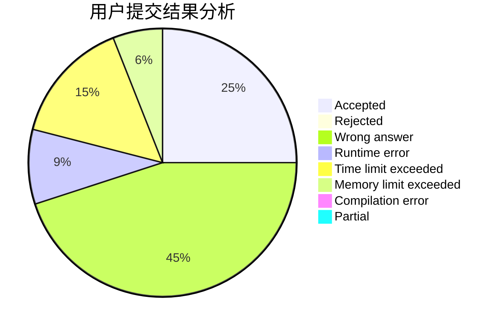
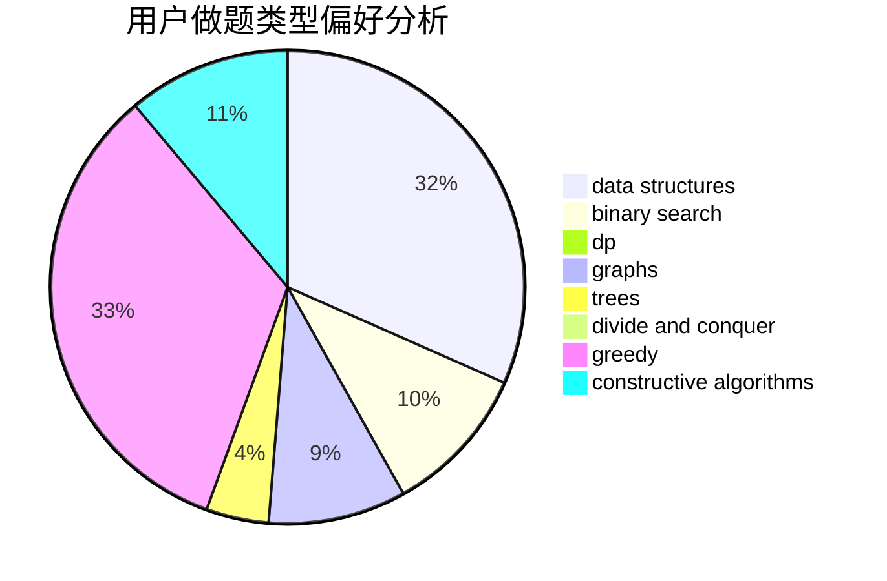
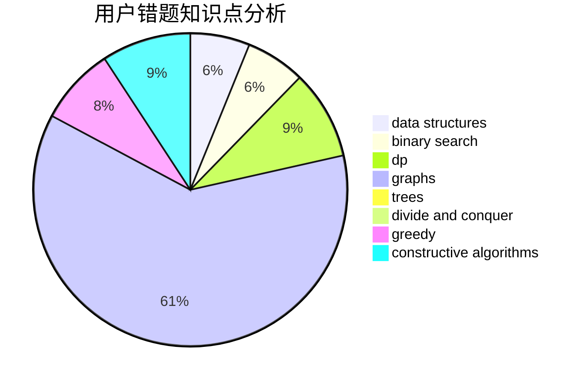

# Vxlimo

<!-- tabs:start -->

#### **用户提交结果分析**

#### **用户做题类型偏好分析**

#### **用户错题知识点分析**

<!-- tabs:end -->
# 推荐题目
[467A](https://codeforces.com/contest/467/problem/A)		implementation		  
[659G](https://codeforces.com/contest/659/problem/G)		combinatorics,
                        dp,
                        number theory		  
[53D](https://codeforces.com/contest/53/problem/D)		sortings		  
[1314C](https://codeforces.com/contest/1314/problem/C)		dsu,graphs,sortings,trees		  
[288C](https://codeforces.com/contest/288/problem/C)		implementation,
                        math		  
[1350B](https://codeforces.com/contest/1350/problem/B)		dp,
                        math,
                        number theory		  
[1054F](https://codeforces.com/contest/1054/problem/F)		flows,
                        graph matchings		  
[799F](https://codeforces.com/contest/799/problem/F)		data structures		  
[158A](https://codeforces.com/contest/158/problem/A)		*special problem,
                        implementation		  
[486A](https://codeforces.com/contest/486/problem/A)		implementation,
                        math		  
