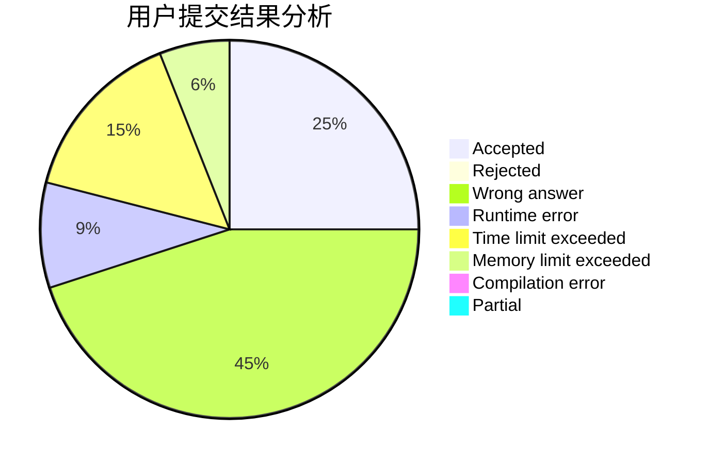
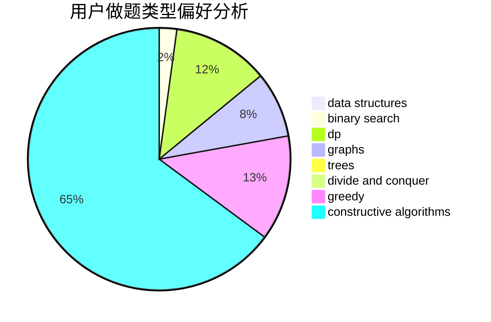
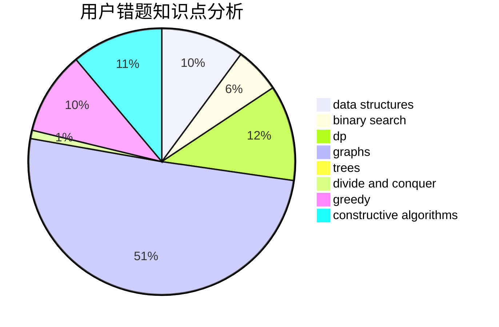

# Vxlimo

<!-- tabs:start -->

#### **用户提交结果分析**

#### **用户做题类型偏好分析**

#### **用户错题知识点分析**

<!-- tabs:end -->
# 推荐题目
[446E](https://codeforces.com/contest/446/problem/E)		math,
                        matrices		  
[62E](https://codeforces.com/contest/62/problem/E)		dp,
                        flows		  
[513G1](https://codeforces.com/contest/513G/problem/1)		brute force,
                        dfs and similar,
                        dp,
                        meet-in-the-middle		  
[1305D](https://codeforces.com/contest/1305/problem/D)		constructive algorithms,
                        dfs and similar,
                        interactive,
                        trees		  
[271E](https://codeforces.com/contest/271/problem/E)		constructive algorithms,
                        math,
                        number theory		  
[1343D](https://codeforces.com/contest/1343/problem/D)		brute force,
                        data structures,
                        greedy,
                        two pointers		  
[1054B](https://codeforces.com/contest/1054/problem/B)		implementation		  
[780G](https://codeforces.com/contest/780/problem/G)		data structures,
                        dp		  
[1506D](https://codeforces.com/contest/1506/problem/D)		constructive algorithms,
                        data structures,
                        greedy		  
[466C](https://codeforces.com/contest/466/problem/C)		binary search,
                        brute force,
                        data structures,
                        dp,
                        two pointers		  
