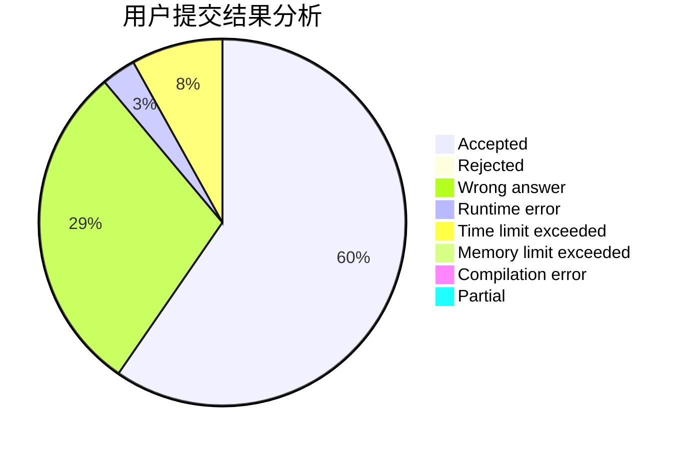
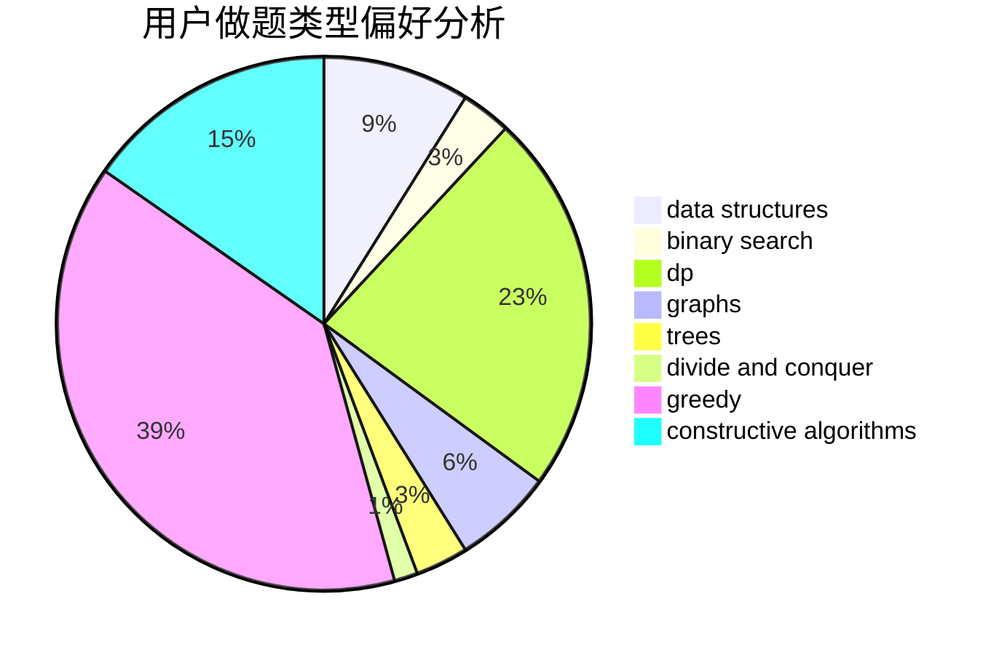
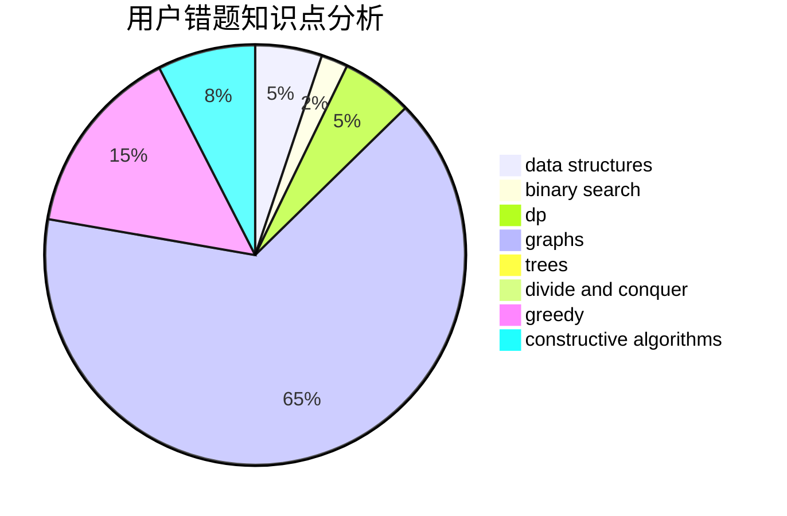

# WA_King
<!-- tabs:start -->
#### **用户提交结果分析**

#### **用户做题类型偏好分析**

#### **用户错题知识点分析**

<!-- tabs:end -->
# 推荐题目
[Triple](http://codeforces.com/problemset/problem/1119/H)		fft,
                        math		  
[Devu and Flowers](http://codeforces.com/problemset/problem/451/E)		bitmasks,
                        combinatorics,
                        number theory		  
[Array](http://codeforces.com/problemset/problem/300/A)		brute force,
                        constructive algorithms,
                        implementation		  
[Queue](http://codeforces.com/problemset/problem/490/B)		dsu,
                        implementation		  
[Subway Innovation](http://codeforces.com/problemset/problem/371/E)		greedy,
                        math,
                        two pointers		  
[Rosetta Problem](http://codeforces.com/problemset/problem/656/D)		*special problem		  
[Rational Resistance](http://codeforces.com/problemset/problem/343/A)		math,
                        number theory		  
[Axel and Marston in Bitland](https://codeforces.com/contest/781/problem/D)		bitmasks,
                        dp,
                        graphs,
                        matrices		  
[Add on a Tree: Revolution](https://codeforces.com/contest/1189/problem/D2)		constructive algorithms,
                        dfs and similar,
                        implementation,
                        trees		  
[Quick Tortoise](http://codeforces.com/problemset/problem/232/E)		bitmasks,
                        divide and conquer,
                        dp		  
<!-- tabs:start -->
#### **data structures**
[Triple](https://codeforces.com/contest/1501/problem/F)		data structures,
                        sortings,
                        two pointers		  
[Devu and Flowers](https://codeforces.com/contest/528/problem/B)		data structures,
                        dp,
                        greedy,
                        implementation,
                        sortings		  
[Array](http://codeforces.com/problemset/problem/954/G)		binary search,
                        data structures,
                        greedy,
                        two pointers		  
[Queue](http://codeforces.com/problemset/problem/1492/C)		binary search,
                        data structures,
                        dp,
                        greedy,
                        two pointers		  
[Subway Innovation](http://codeforces.com/problemset/problem/1490/G)		binary search,
                        data structures,
                        math		  
[Rosetta Problem](http://codeforces.com/problemset/problem/1479/D)		binary search,
                        bitmasks,
                        brute force,
                        data structures,
                        probabilities,
                        trees		  
[Rational Resistance](http://codeforces.com/problemset/problem/1497/A)		brute force,
                        data structures,
                        greedy,
                        sortings		  
[Axel and Marston in Bitland](http://codeforces.com/problemset/problem/1491/C)		brute force,
                        data structures,
                        dp,
                        greedy,
                        implementation		  
[Add on a Tree: Revolution](http://codeforces.com/problemset/problem/1492/B)		data structures,
                        greedy,
                        math		  
[Quick Tortoise](http://codeforces.com/problemset/problem/1436/E)		binary search,
                        data structures,
                        two pointers		  
#### **binary search**
[Triple](https://codeforces.com/contest/966/problem/A)		binary search		  
[Devu and Flowers](http://codeforces.com/problemset/problem/701/C)		binary search,
                        strings,
                        two pointers		  
[Array](http://codeforces.com/problemset/problem/348/A)		binary search,
                        math,
                        sortings		  
[Queue](https://codeforces.com/contest/614/problem/D)		binary search,
                        brute force,
                        dp,
                        greedy,
                        sortings,
                        two pointers		  
[Subway Innovation](http://codeforces.com/problemset/problem/932/D)		binary search,
                        dp,
                        trees		  
[Rosetta Problem](http://codeforces.com/problemset/problem/954/G)		binary search,
                        data structures,
                        greedy,
                        two pointers		  
[Rational Resistance](http://codeforces.com/problemset/problem/1476/B)		binary search,
                        brute force,
                        greedy,
                        math		  
[Axel and Marston in Bitland](http://codeforces.com/problemset/problem/1492/C)		binary search,
                        data structures,
                        dp,
                        greedy,
                        two pointers		  
[Add on a Tree: Revolution](http://codeforces.com/problemset/problem/1463/D)		binary search,
                        constructive algorithms,
                        greedy,
                        two pointers		  
[Quick Tortoise](http://codeforces.com/problemset/problem/1490/G)		binary search,
                        data structures,
                        math		  
#### **dp**
[Triple](https://codeforces.com/contest/781/problem/D)		bitmasks,
                        dp,
                        graphs,
                        matrices		  
[Devu and Flowers](http://codeforces.com/problemset/problem/232/E)		bitmasks,
                        divide and conquer,
                        dp		  
[Array](http://codeforces.com/problemset/problem/1185/G1)		bitmasks,
                        combinatorics,
                        dp		  
[Queue](http://codeforces.com/problemset/problem/264/C)		dp		  
[Subway Innovation](https://codeforces.com/contest/614/problem/D)		binary search,
                        brute force,
                        dp,
                        greedy,
                        sortings,
                        two pointers		  
[Rosetta Problem](http://codeforces.com/problemset/problem/1051/D)		bitmasks,
                        dp		  
[Rational Resistance](http://codeforces.com/problemset/problem/526/E)		dp,
                        implementation		  
[Axel and Marston in Bitland](http://codeforces.com/problemset/problem/747/D)		dp,
                        greedy,
                        sortings		  
[Add on a Tree: Revolution](http://codeforces.com/problemset/problem/855/G)		dfs and similar,
                        dp,
                        graphs,
                        trees		  
[Quick Tortoise](http://codeforces.com/problemset/problem/868/F)		divide and conquer,
                        dp		  
#### **graph**
[Triple](https://codeforces.com/contest/781/problem/D)		bitmasks,
                        dp,
                        graphs,
                        matrices		  
[Devu and Flowers](http://codeforces.com/problemset/problem/1437/D)		graphs,
                        greedy,
                        shortest paths,
                        trees		  
[Array](http://codeforces.com/problemset/problem/855/G)		dfs and similar,
                        dp,
                        graphs,
                        trees		  
[Queue](https://codeforces.com/contest/418/problem/A)		graphs		  
[Subway Innovation](http://codeforces.com/problemset/problem/160/D)		dfs and similar,
                        dsu,
                        graphs,
                        sortings		  
[Rosetta Problem](http://codeforces.com/problemset/problem/1472/C)		dp,
                        graphs		  
[Rational Resistance](http://codeforces.com/problemset/problem/1487/C)		brute force,
                        constructive algorithms,
                        dfs and similar,
                        graphs,
                        greedy,
                        implementation,
                        math		  
[Axel and Marston in Bitland](http://codeforces.com/problemset/problem/1437/C)		dp,
                        flows,
                        graph matchings,
                        greedy,
                        math,
                        sortings		  
[Add on a Tree: Revolution](http://codeforces.com/problemset/problem/1470/D)		constructive algorithms,
                        dfs and similar,
                        graph matchings,
                        graphs,
                        greedy		  
[Quick Tortoise](http://codeforces.com/problemset/problem/1476/C)		dp,
                        graphs,
                        greedy		  
#### **trees**
[Triple](https://codeforces.com/contest/1189/problem/D2)		constructive algorithms,
                        dfs and similar,
                        implementation,
                        trees		  
[Devu and Flowers](http://codeforces.com/problemset/problem/1437/D)		graphs,
                        greedy,
                        shortest paths,
                        trees		  
[Array](http://codeforces.com/problemset/problem/855/G)		dfs and similar,
                        dp,
                        graphs,
                        trees		  
[Queue](http://codeforces.com/problemset/problem/932/D)		binary search,
                        dp,
                        trees		  
[Subway Innovation](http://codeforces.com/problemset/problem/86/C)		dp,
                        string suffix structures,
                        trees		  
[Rosetta Problem](http://codeforces.com/problemset/problem/1479/D)		binary search,
                        bitmasks,
                        brute force,
                        data structures,
                        probabilities,
                        trees		  
[Rational Resistance](http://codeforces.com/problemset/problem/1511/C)		brute force,
                        data structures,
                        implementation,
                        trees		  
[Axel and Marston in Bitland](http://codeforces.com/problemset/problem/1499/F)		combinatorics,
                        dfs and similar,
                        dp,
                        trees		  
[Add on a Tree: Revolution](http://codeforces.com/problemset/problem/1491/E)		brute force,
                        dfs and similar,
                        divide and conquer,
                        number theory,
                        trees		  
[Quick Tortoise](http://codeforces.com/problemset/problem/1466/D)		data structures,
                        greedy,
                        sortings,
                        trees		  
#### **divide and conquer**
[Triple](http://codeforces.com/problemset/problem/232/E)		bitmasks,
                        divide and conquer,
                        dp		  
[Devu and Flowers](http://codeforces.com/problemset/problem/868/F)		divide and conquer,
                        dp		  
[Array](http://codeforces.com/problemset/problem/1461/D)		binary search,
                        brute force,
                        data structures,
                        divide and conquer,
                        implementation,
                        sortings		  
[Queue](http://codeforces.com/problemset/problem/1466/G)		combinatorics,
                        divide and conquer,
                        hashing,
                        math,
                        string suffix structures,
                        strings		  
[Subway Innovation](http://codeforces.com/problemset/problem/1490/D)		dfs and similar,
                        divide and conquer,
                        implementation		  
[Rosetta Problem](https://codeforces.com/contest/1483/problem/C)		data structures,
                        divide and conquer,
                        dp		  
[Rational Resistance](http://codeforces.com/problemset/problem/1491/E)		brute force,
                        dfs and similar,
                        divide and conquer,
                        number theory,
                        trees		  
[Axel and Marston in Bitland](http://codeforces.com/problemset/problem/1303/G)		data structures,
                        divide and conquer,
                        geometry,
                        trees		  
[Add on a Tree: Revolution](http://codeforces.com/problemset/problem/1494/D)		constructive algorithms,
                        data structures,
                        dfs and similar,
                        divide and conquer,
                        dsu,
                        greedy,
                        sortings,
                        trees		  
[Quick Tortoise](http://codeforces.com/problemset/problem/1482/E)		data structures,
                        divide and conquer,
                        dp		  
#### **greedy**
[Triple](http://codeforces.com/problemset/problem/371/E)		greedy,
                        math,
                        two pointers		  
[Devu and Flowers](http://codeforces.com/problemset/problem/333/B)		greedy		  
[Array](http://codeforces.com/problemset/problem/1107/A)		greedy,
                        strings		  
[Queue](http://codeforces.com/problemset/problem/1437/D)		graphs,
                        greedy,
                        shortest paths,
                        trees		  
[Subway Innovation](https://codeforces.com/contest/614/problem/D)		binary search,
                        brute force,
                        dp,
                        greedy,
                        sortings,
                        two pointers		  
[Rosetta Problem](http://codeforces.com/problemset/problem/747/D)		dp,
                        greedy,
                        sortings		  
[Rational Resistance](https://codeforces.com/contest/1293/problem/D)		brute force,
                        constructive algorithms,
                        geometry,
                        greedy,
                        implementation		  
[Axel and Marston in Bitland](http://codeforces.com/problemset/problem/1152/A)		greedy,
                        implementation,
                        math		  
[Add on a Tree: Revolution](http://codeforces.com/problemset/problem/1417/B)		greedy,
                        math,
                        sortings		  
[Quick Tortoise](http://codeforces.com/problemset/problem/1163/A)		greedy,
                        math		  
#### **constructive algorithms**
[Triple](http://codeforces.com/problemset/problem/300/A)		brute force,
                        constructive algorithms,
                        implementation		  
[Devu and Flowers](https://codeforces.com/contest/1189/problem/D2)		constructive algorithms,
                        dfs and similar,
                        implementation,
                        trees		  
[Array](http://codeforces.com/problemset/problem/421/A)		constructive algorithms,
                        implementation		  
[Queue](http://codeforces.com/problemset/problem/42/D)		constructive algorithms,
                        math		  
[Subway Innovation](https://codeforces.com/contest/668/problem/B)		brute force,
                        constructive algorithms,
                        implementation		  
[Rosetta Problem](https://codeforces.com/contest/1293/problem/D)		brute force,
                        constructive algorithms,
                        geometry,
                        greedy,
                        implementation		  
[Rational Resistance](http://codeforces.com/problemset/problem/1108/D)		constructive algorithms,
                        dp,
                        greedy		  
[Axel and Marston in Bitland](http://codeforces.com/problemset/problem/1493/A)		constructive algorithms,
                        greedy		  
[Add on a Tree: Revolution](http://codeforces.com/problemset/problem/1463/D)		binary search,
                        constructive algorithms,
                        greedy,
                        two pointers		  
[Quick Tortoise](https://codeforces.com/contest/1456/problem/B)		bitmasks,
                        brute force,
                        constructive algorithms		  
#### **sortings**
[Triple](http://codeforces.com/problemset/problem/291/A)		*special problem,
                        implementation,
                        sortings		  
[Devu and Flowers](http://codeforces.com/problemset/problem/348/A)		binary search,
                        math,
                        sortings		  
[Array](https://codeforces.com/contest/614/problem/D)		binary search,
                        brute force,
                        dp,
                        greedy,
                        sortings,
                        two pointers		  
[Queue](https://codeforces.com/contest/1501/problem/F)		data structures,
                        sortings,
                        two pointers		  
[Subway Innovation](http://codeforces.com/problemset/problem/747/D)		dp,
                        greedy,
                        sortings		  
[Rosetta Problem](http://codeforces.com/problemset/problem/1417/B)		greedy,
                        math,
                        sortings		  
[Rational Resistance](https://codeforces.com/contest/528/problem/B)		data structures,
                        dp,
                        greedy,
                        implementation,
                        sortings		  
[Axel and Marston in Bitland](http://codeforces.com/problemset/problem/160/D)		dfs and similar,
                        dsu,
                        graphs,
                        sortings		  
[Add on a Tree: Revolution](https://codeforces.com/contest/1496/problem/C)		geometry,
                        greedy,
                        math,
                        sortings		  
[Quick Tortoise](http://codeforces.com/problemset/problem/1495/A)		geometry,
                        greedy,
                        math,
                        sortings		  
<!-- tabs:end -->
