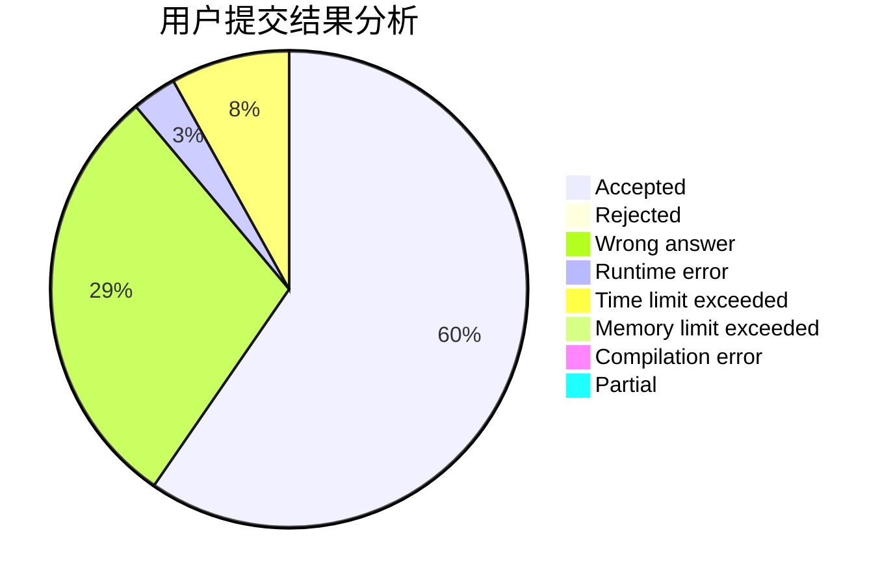
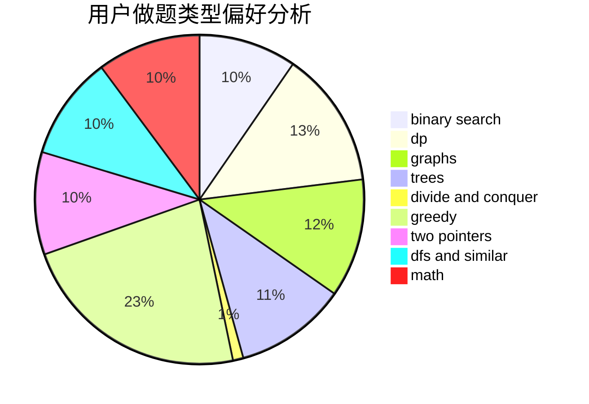

# WA_King

<!-- tabs:start -->

#### **用户提交结果分析**

#### **用户做题类型偏好分析**

<!-- tabs:end -->
# 推荐题目
[1129D](https://codeforces.com/contest/1129/problem/D)
[318C](https://codeforces.com/contest/318/problem/C)
[36B](https://codeforces.com/contest/36/problem/B)
[472G](https://codeforces.com/contest/472/problem/G)
[157B](https://codeforces.com/contest/157/problem/B)
[767A](https://codeforces.com/contest/767/problem/A)
[987F](https://codeforces.com/contest/987/problem/F)
[11951](https://codeforces.com/contest/1195/problem/1)
[401D](https://codeforces.com/contest/401/problem/D)
[1033A](https://codeforces.com/contest/1033/problem/A)
