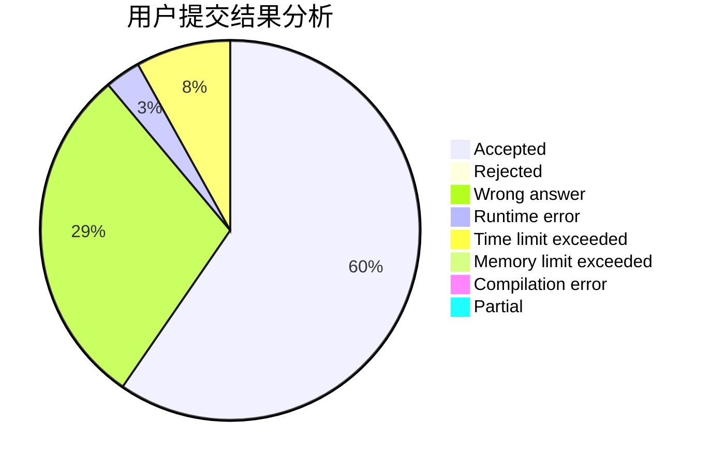
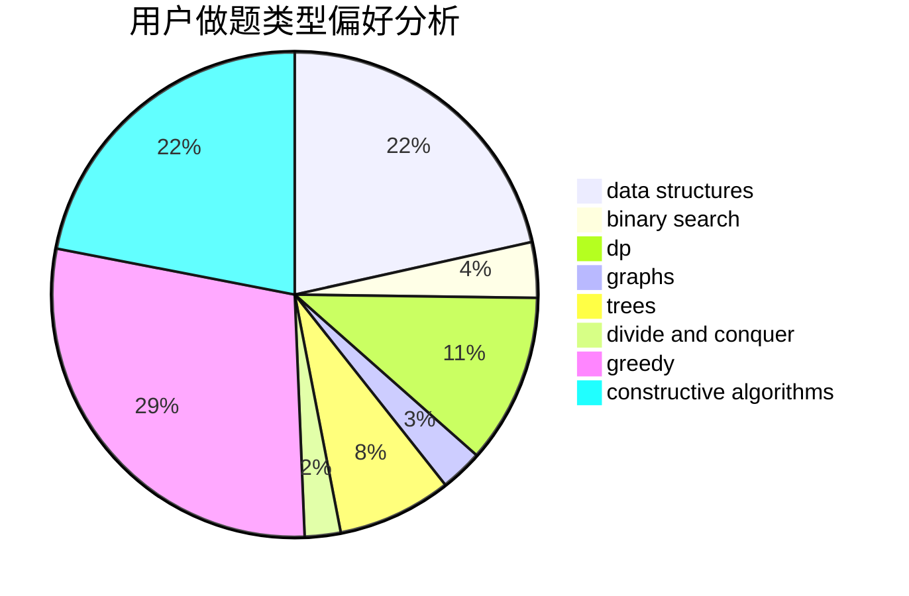
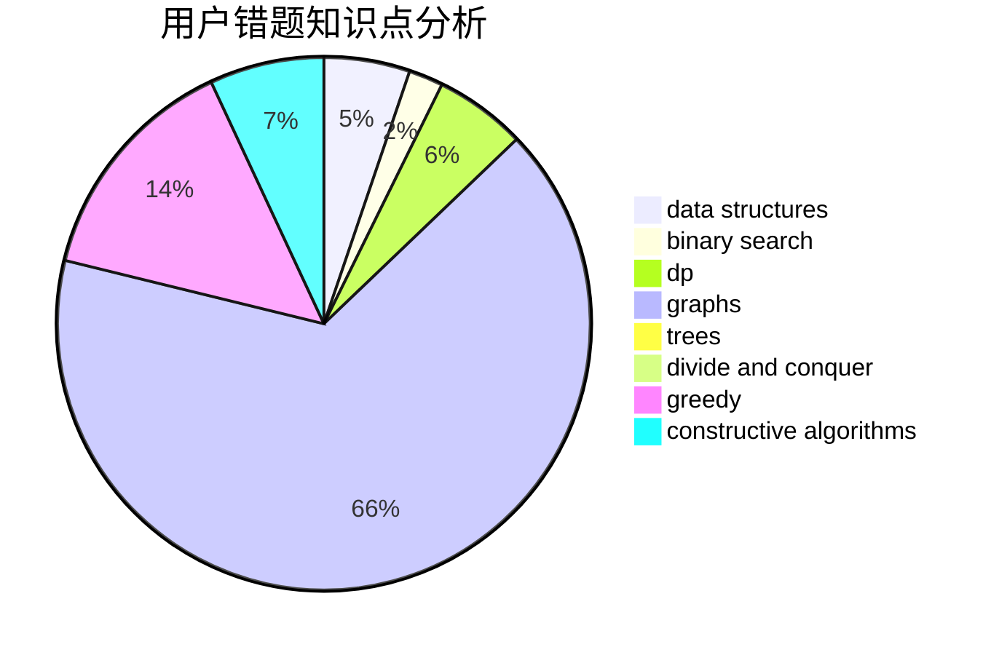

# WA_King

<!-- tabs:start -->

#### **用户提交结果分析**

#### **用户做题类型偏好分析**

#### **用户错题知识点分析**

<!-- tabs:end -->
# 推荐题目
[1129D](https://codeforces.com/contest/1129/problem/D)		data structures,
                        dp		  
[318C](https://codeforces.com/contest/318/problem/C)		dsu,graphs,sortings,trees		  
[36B](https://codeforces.com/contest/36/problem/B)		implementation		  
[472G](https://codeforces.com/contest/472/problem/G)		bitmasks,
                        data structures,
                        fft		  
[157B](https://codeforces.com/contest/157/problem/B)		geometry,
                        sortings		  
[767A](https://codeforces.com/contest/767/problem/A)		data structures,
                        implementation		  
[987F](https://codeforces.com/contest/987/problem/F)		dsu,graphs,sortings,trees		  
[11951](https://codeforces.com/contest/1195/problem/1)		dsu,graphs,sortings,trees		  
[401D](https://codeforces.com/contest/401/problem/D)		bitmasks,
                        brute force,
                        combinatorics,
                        dp,
                        number theory		  
[1033A](https://codeforces.com/contest/1033/problem/A)		dfs and similar,
                        graphs,
                        implementation		  
