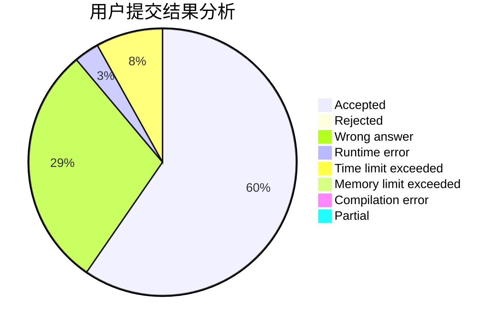
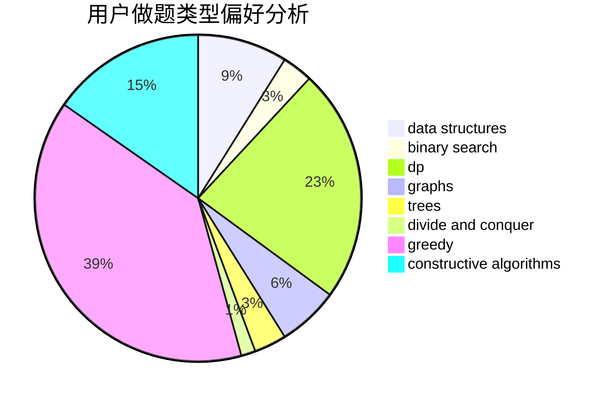
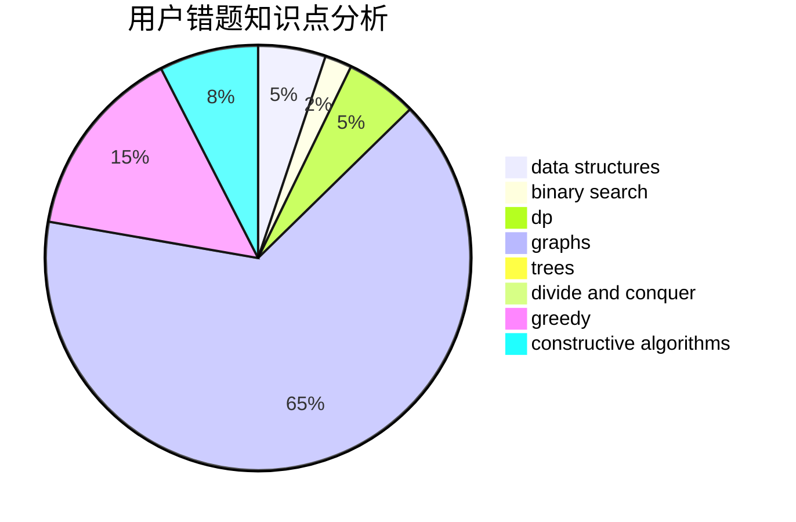

# WA_King

<!-- tabs:start -->

#### **用户提交结果分析**

#### **用户做题类型偏好分析**

#### **用户错题知识点分析**

<!-- tabs:end -->
# 推荐题目
[1119H](https://codeforces.com/contest/1119/problem/H)		fft,
                        math		  
[300A](https://codeforces.com/contest/300/problem/A)		brute force,
                        constructive algorithms,
                        implementation		  
[343A](https://codeforces.com/contest/343/problem/A)		math,
                        number theory		  
[451E](https://codeforces.com/contest/451/problem/E)		bitmasks,
                        combinatorics,
                        number theory		  
[1506A](https://codeforces.com/contest/1506/problem/A)		math		  
[747D](https://codeforces.com/contest/747/problem/D)		dp,
                        greedy,
                        sortings		  
[966A](https://codeforces.com/contest/966/problem/A)		dsu,graphs,sortings,trees		  
[1189D2](https://codeforces.com/contest/1189D/problem/2)		dsu,graphs,sortings,trees		  
[371E](https://codeforces.com/contest/371/problem/E)		greedy,
                        math,
                        two pointers		  
[1032D](https://codeforces.com/contest/1032/problem/D)		geometry,
                        implementation		  
