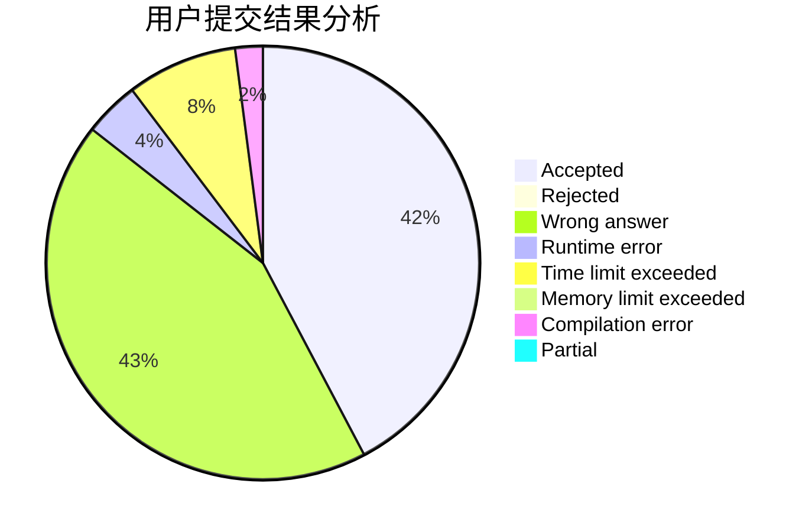
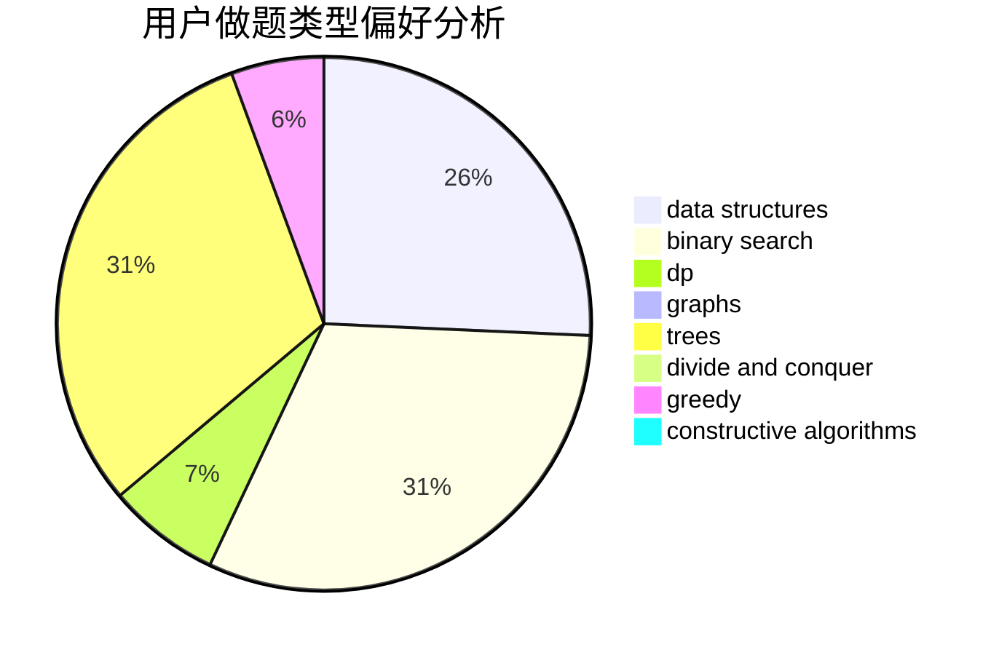

# WA_auto_machine

<!-- tabs:start -->

#### **用户提交结果分析**

#### **用户做题类型偏好分析**

#### **用户错题知识点分析**

<!-- tabs:end -->
# 推荐题目
[612C](https://codeforces.com/contest/612/problem/C)		data structures,
                        expression parsing,
                        math		  
[323B](https://codeforces.com/contest/323/problem/B)		constructive algorithms,
                        graphs		  
[723C](https://codeforces.com/contest/723/problem/C)		greedy		  
[1234D](https://codeforces.com/contest/1234/problem/D)		data structures		  
[1269B](https://codeforces.com/contest/1269/problem/B)		brute force,
                        sortings		  
[183A](https://codeforces.com/contest/183/problem/A)		constructive algorithms,
                        math		  
[1389A](https://codeforces.com/contest/1389/problem/A)		constructive algorithms,
                        greedy,
                        math,
                        number theory		  
[1442E](https://codeforces.com/contest/1442/problem/E)		binary search,
                        constructive algorithms,
                        dfs and similar,
                        dp,
                        greedy,
                        trees		  
[1445E](https://codeforces.com/contest/1445/problem/E)		dsu,graphs,sortings,trees		  
[1482E](https://codeforces.com/contest/1482/problem/E)		data structures,
                        divide and conquer,
                        dp		  
