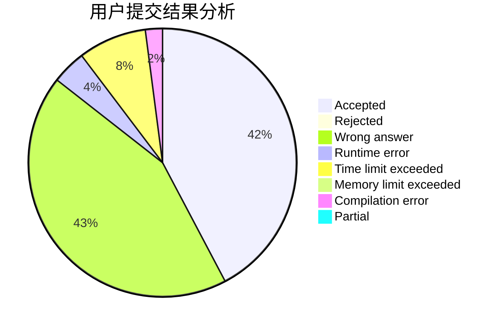
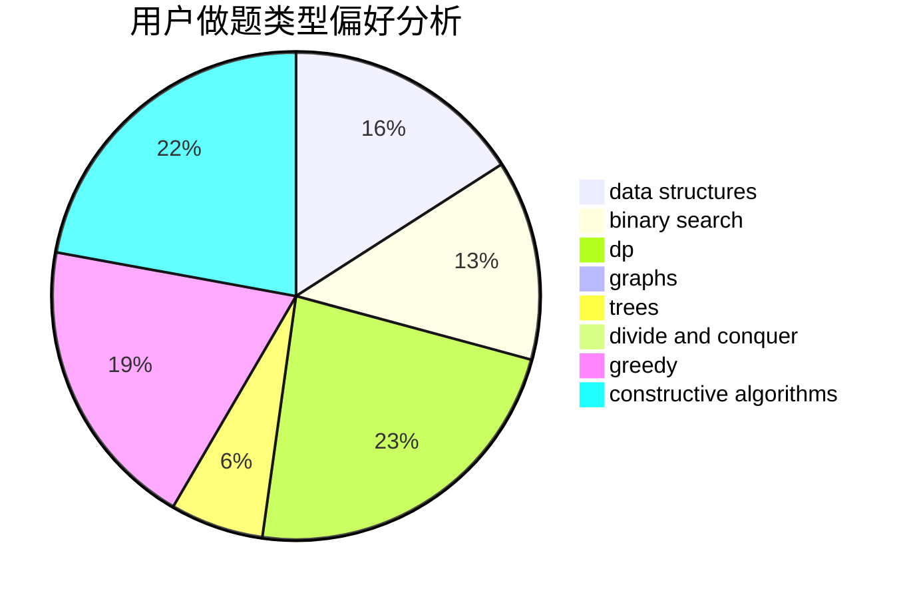

# WA_auto_machine

<!-- tabs:start -->

#### **用户提交结果分析**

#### **用户做题类型偏好分析**

#### **用户错题知识点分析**

<!-- tabs:end -->
# 推荐题目
[631E](https://codeforces.com/contest/631/problem/E)		data structures,
                        dp,
                        geometry		  
[353E](https://codeforces.com/contest/353/problem/E)		dp,
                        graph matchings,
                        greedy		  
[740D](https://codeforces.com/contest/740/problem/D)		dsu,graphs,sortings,trees		  
[1240A](https://codeforces.com/contest/1240/problem/A)		dsu,graphs,sortings,trees		  
[1278B](https://codeforces.com/contest/1278/problem/B)		greedy,
                        math		  
[209C](https://codeforces.com/contest/209/problem/C)		constructive algorithms,
                        dsu,
                        graphs,
                        greedy		  
[1398D](https://codeforces.com/contest/1398/problem/D)		dp,
                        greedy,
                        sortings		  
[1452D](https://codeforces.com/contest/1452/problem/D)		combinatorics,
                        dp,
                        math		  
[1455B](https://codeforces.com/contest/1455/problem/B)		constructive algorithms,
                        math		  
[1490C](https://codeforces.com/contest/1490/problem/C)		binary search,
                        brute force,
                        brute force,
                        math		  
