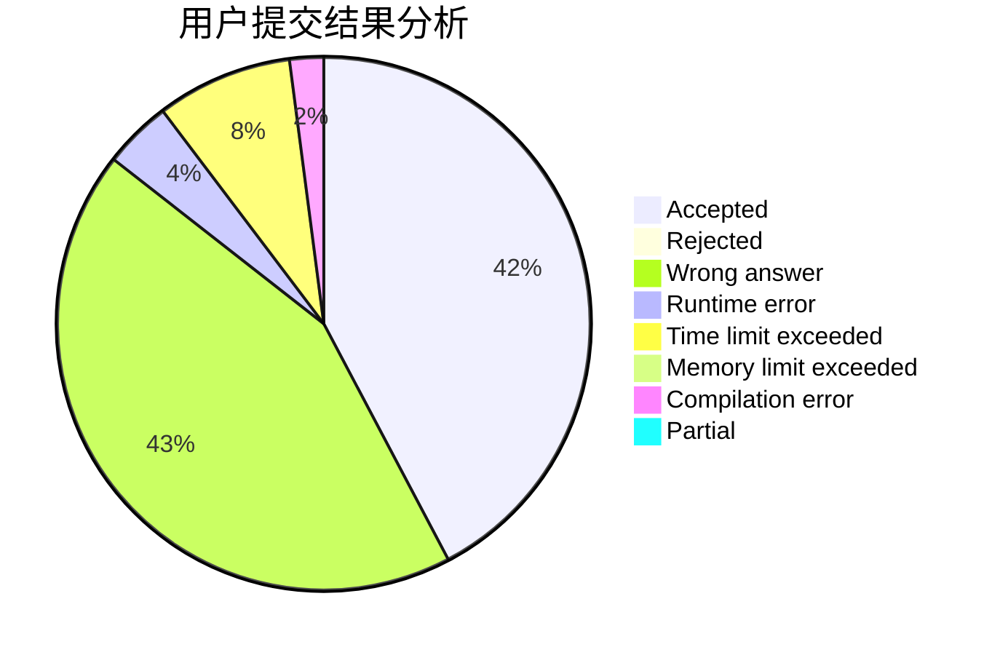
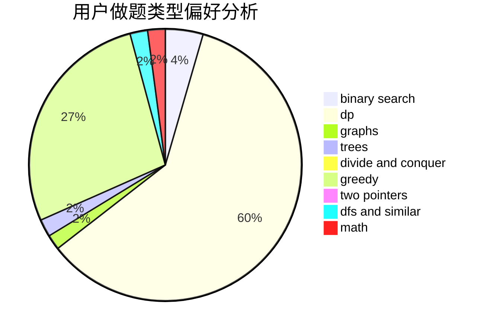

# WA_auto_machine

<!-- tabs:start -->

#### **用户提交结果分析**

#### **用户做题类型偏好分析**

<!-- tabs:end -->
# 推荐题目
[631E](https://codeforces.com/contest/631/problem/E)
[353E](https://codeforces.com/contest/353/problem/E)
[740D](https://codeforces.com/contest/740/problem/D)
[1240A](https://codeforces.com/contest/1240/problem/A)
[1278B](https://codeforces.com/contest/1278/problem/B)
[209C](https://codeforces.com/contest/209/problem/C)
[1398D](https://codeforces.com/contest/1398/problem/D)
[1452D](https://codeforces.com/contest/1452/problem/D)
[1455B](https://codeforces.com/contest/1455/problem/B)
[1490C](https://codeforces.com/contest/1490/problem/C)
