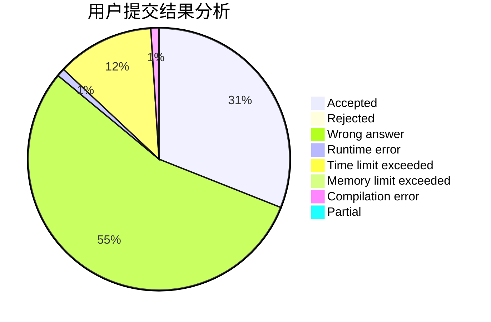
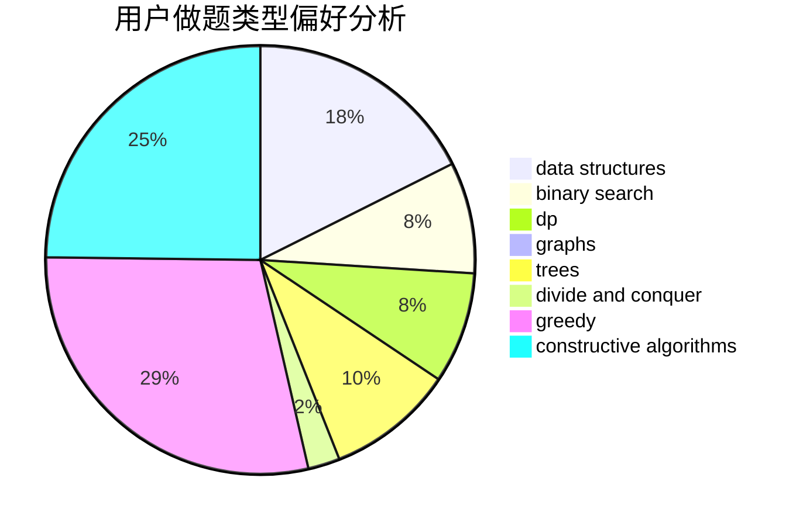
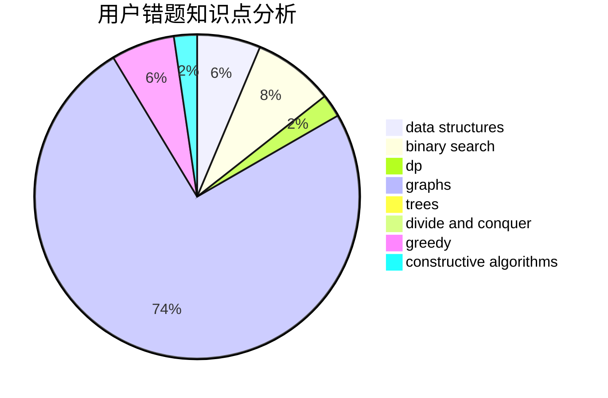

# WCmidschool

<!-- tabs:start -->

#### **用户提交结果分析**

#### **用户做题类型偏好分析**

#### **用户错题知识点分析**

<!-- tabs:end -->
# 推荐题目
[957B](https://codeforces.com/contest/957/problem/B)		dsu,graphs,sortings,trees		  
[1300D](https://codeforces.com/contest/1300/problem/D)		dsu,graphs,sortings,trees		  
[1139C](https://codeforces.com/contest/1139/problem/C)		dfs and similar,
                        dsu,
                        graphs,
                        math,
                        trees		  
[238C](https://codeforces.com/contest/238/problem/C)		dfs and similar,
                        dp,
                        greedy,
                        trees		  
[670F](https://codeforces.com/contest/670/problem/F)		brute force,
                        constructive algorithms,
                        strings		  
[667B](https://codeforces.com/contest/667/problem/B)		constructive algorithms,
                        geometry		  
[220B](https://codeforces.com/contest/220/problem/B)		constructive algorithms,
                        data structures		  
[652A](https://codeforces.com/contest/652/problem/A)		implementation,
                        math		  
[1116D2](https://codeforces.com/contest/1116D/problem/2)		nan		  
[1147D](https://codeforces.com/contest/1147/problem/D)		dfs and similar,
                        graphs		  
