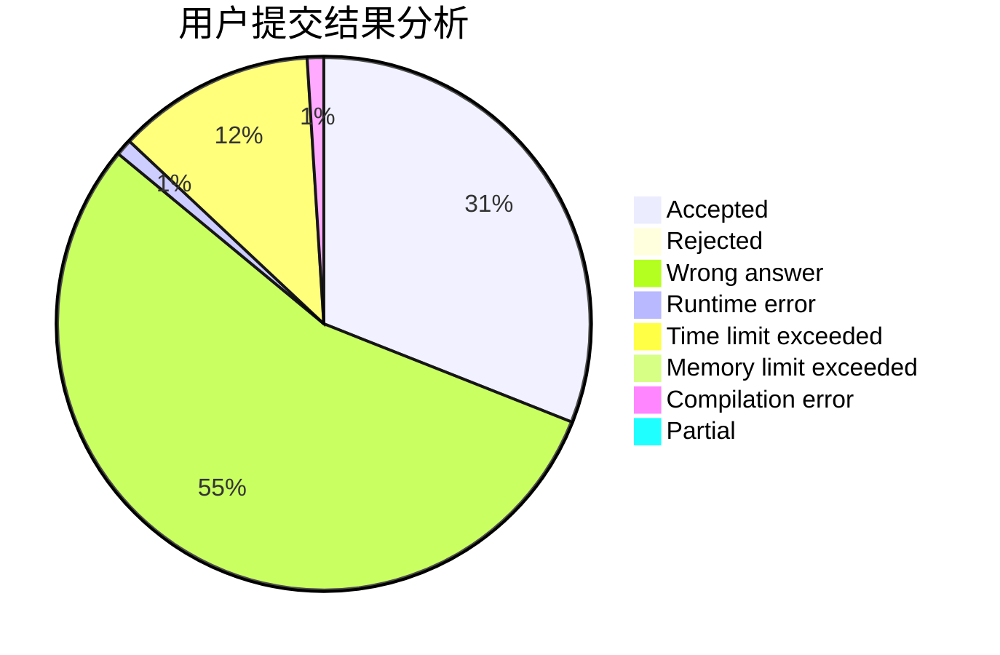
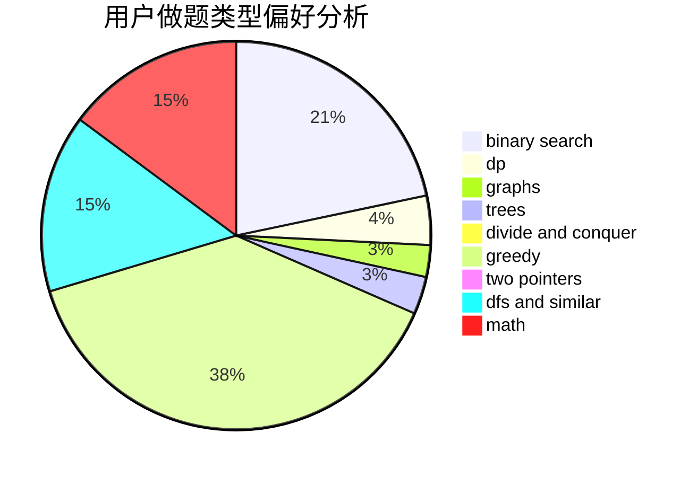

# WCmidschool

<!-- tabs:start -->

#### **用户提交结果分析**

#### **用户做题类型偏好分析**

<!-- tabs:end -->
# 推荐题目
[978E](https://codeforces.com/contest/978/problem/E)
[1310B](https://codeforces.com/contest/1310/problem/B)
[1140G](https://codeforces.com/contest/1140/problem/G)
[25E](https://codeforces.com/contest/25/problem/E)
[696D](https://codeforces.com/contest/696/problem/D)
[689B](https://codeforces.com/contest/689/problem/B)
[23C](https://codeforces.com/contest/23/problem/C)
[675E](https://codeforces.com/contest/675/problem/E)
[1118B](https://codeforces.com/contest/1118/problem/B)
[1149C](https://codeforces.com/contest/1149/problem/C)
