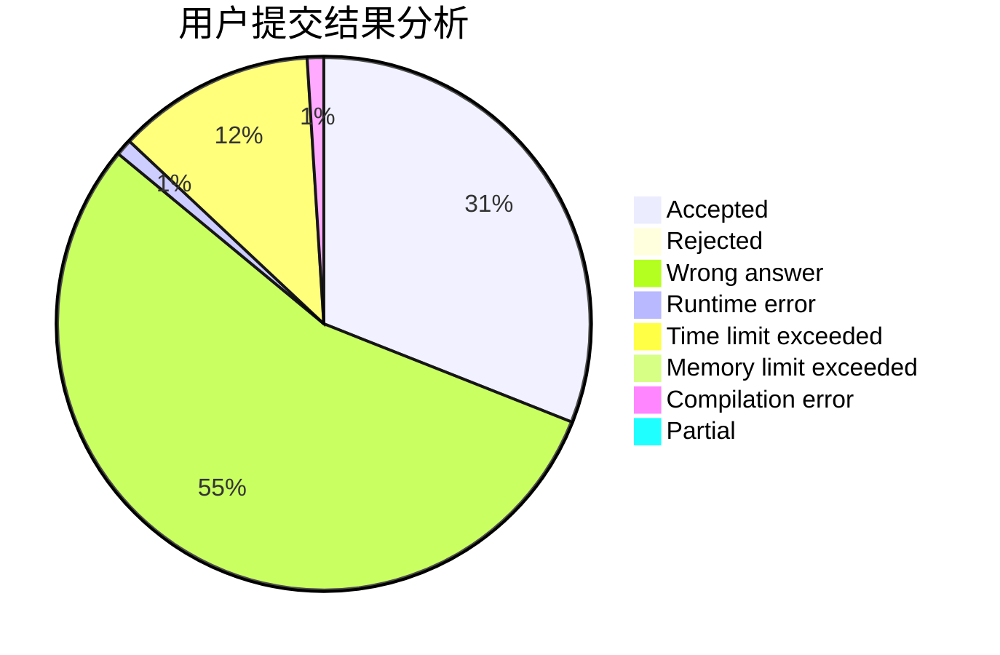
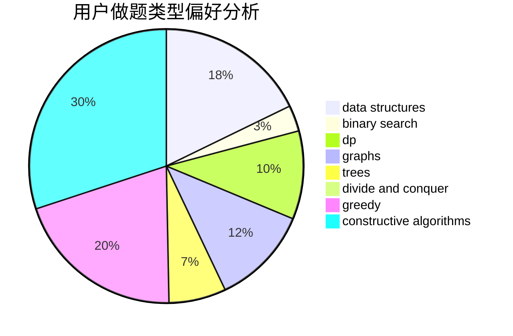
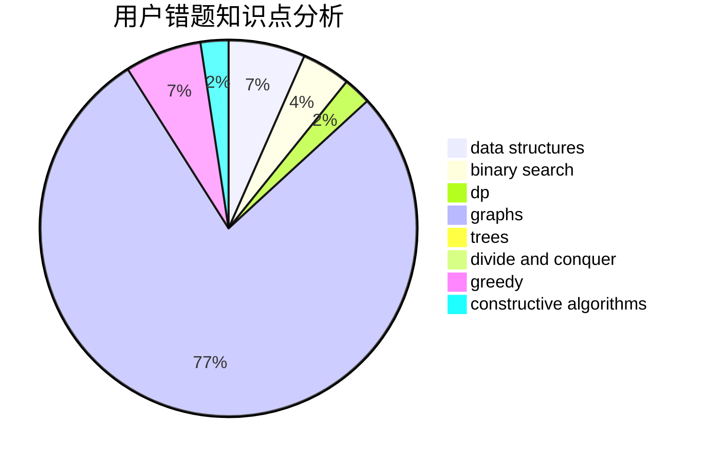

# WCmidschool

<!-- tabs:start -->

#### **用户提交结果分析**

#### **用户做题类型偏好分析**

#### **用户错题知识点分析**

<!-- tabs:end -->
# 推荐题目
[978E](https://codeforces.com/contest/978/problem/E)		combinatorics,
                        math		  
[1310B](https://codeforces.com/contest/1310/problem/B)		dp,
                        implementation		  
[1140G](https://codeforces.com/contest/1140/problem/G)		data structures,
                        divide and conquer,
                        shortest paths,
                        trees		  
[25E](https://codeforces.com/contest/25/problem/E)		hashing,
                        strings		  
[696D](https://codeforces.com/contest/696/problem/D)		data structures,
                        dp,
                        matrices,
                        strings		  
[689B](https://codeforces.com/contest/689/problem/B)		dfs and similar,
                        graphs,
                        greedy,
                        shortest paths		  
[23C](https://codeforces.com/contest/23/problem/C)		constructive algorithms,
                        sortings		  
[675E](https://codeforces.com/contest/675/problem/E)		data structures,
                        dp,
                        greedy		  
[1118B](https://codeforces.com/contest/1118/problem/B)		implementation		  
[1149C](https://codeforces.com/contest/1149/problem/C)		data structures,
                        implementation,
                        trees		  
