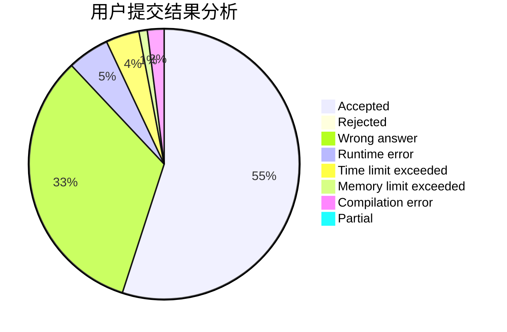
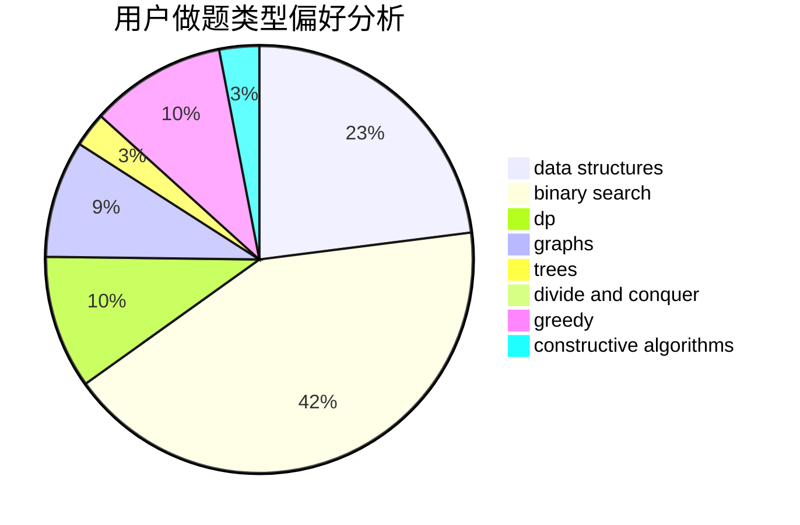

# WGYHMFkZyA02

<!-- tabs:start -->

#### **用户提交结果分析**

#### **用户做题类型偏好分析**

#### **用户错题知识点分析**

<!-- tabs:end -->
# 推荐题目
[1321B](https://codeforces.com/contest/1321/problem/B)		dsu,graphs,sortings,trees		  
[780F](https://codeforces.com/contest/780/problem/F)		bitmasks,
                        dp,
                        graphs,
                        matrices		  
[198C](https://codeforces.com/contest/198/problem/C)		binary search,
                        geometry		  
[727E](https://codeforces.com/contest/727/problem/E)		data structures,
                        hashing,
                        string suffix structures,
                        strings		  
[464C](https://codeforces.com/contest/464/problem/C)		dp		  
[273D](https://codeforces.com/contest/273/problem/D)		dp		  
[551E](https://codeforces.com/contest/551/problem/E)		binary search,
                        data structures,
                        implementation		  
[1017F](https://codeforces.com/contest/1017/problem/F)		brute force,
                        math		  
[600C](https://codeforces.com/contest/600/problem/C)		constructive algorithms,
                        greedy,
                        strings		  
[1178C](https://codeforces.com/contest/1178/problem/C)		combinatorics,
                        greedy,
                        math		  
