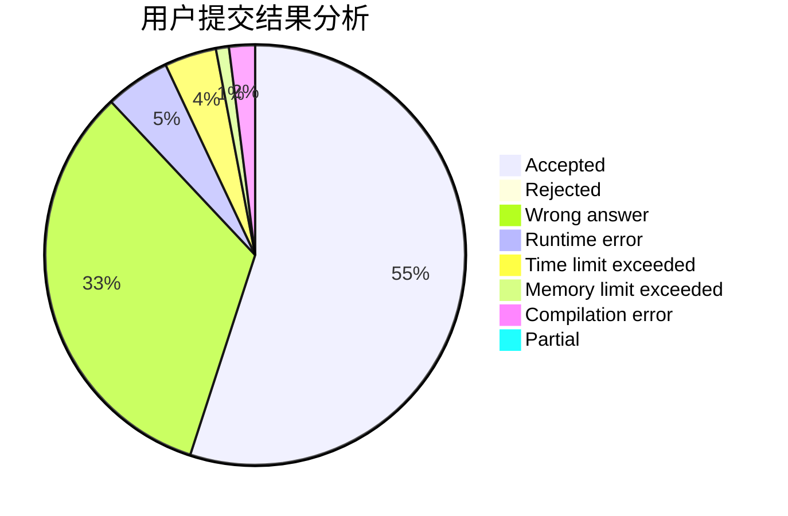
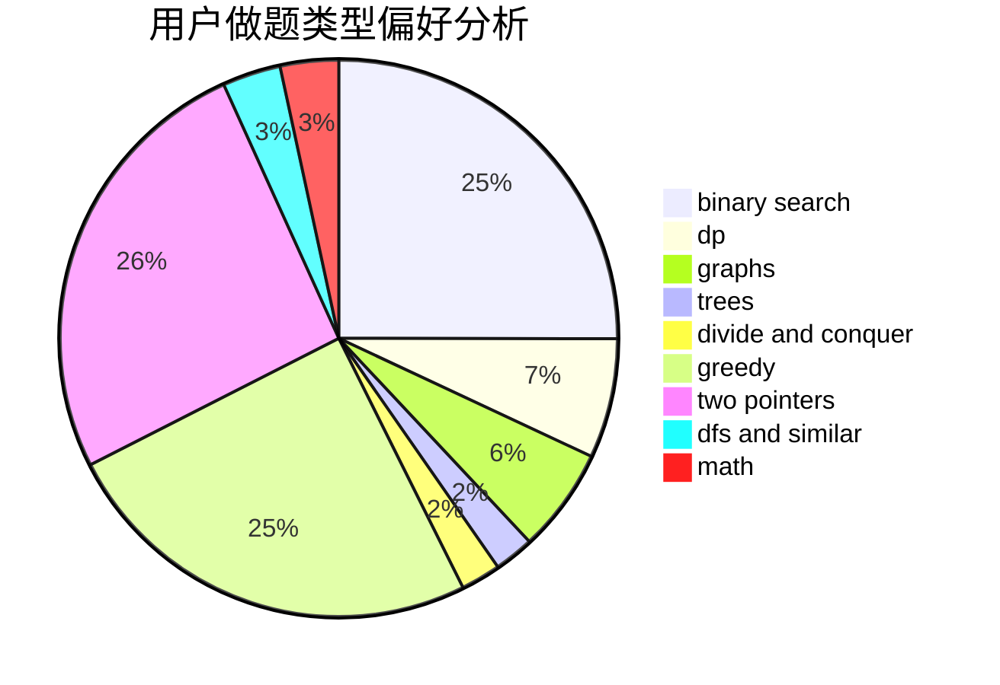

# WGYHMFkZyA02

<!-- tabs:start -->

#### **用户提交结果分析**

#### **用户做题类型偏好分析**

<!-- tabs:end -->
# 推荐题目
[1321B](https://codeforces.com/contest/1321/problem/B)
[780F](https://codeforces.com/contest/780/problem/F)
[198C](https://codeforces.com/contest/198/problem/C)
[727E](https://codeforces.com/contest/727/problem/E)
[464C](https://codeforces.com/contest/464/problem/C)
[273D](https://codeforces.com/contest/273/problem/D)
[551E](https://codeforces.com/contest/551/problem/E)
[1017F](https://codeforces.com/contest/1017/problem/F)
[600C](https://codeforces.com/contest/600/problem/C)
[1178C](https://codeforces.com/contest/1178/problem/C)
