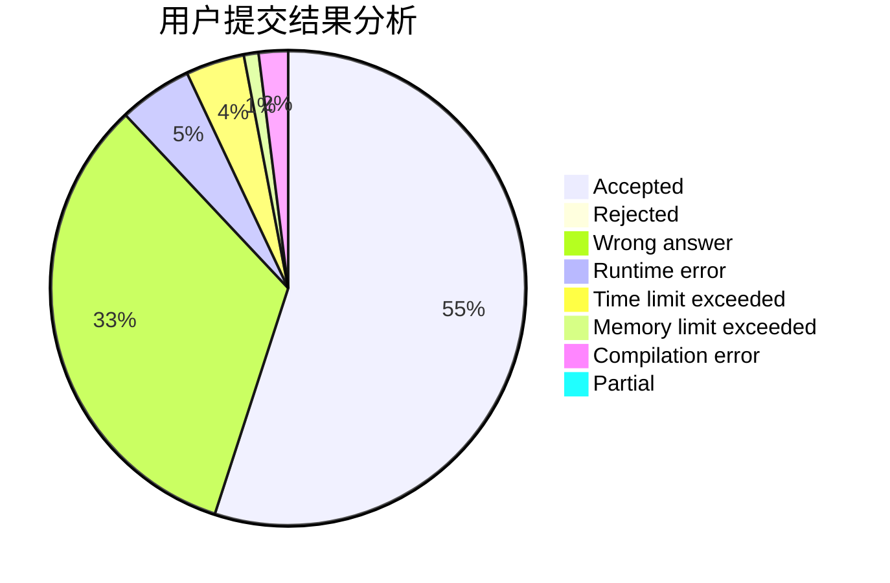
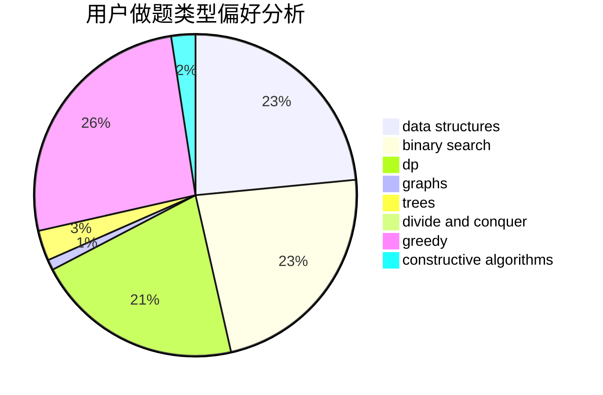
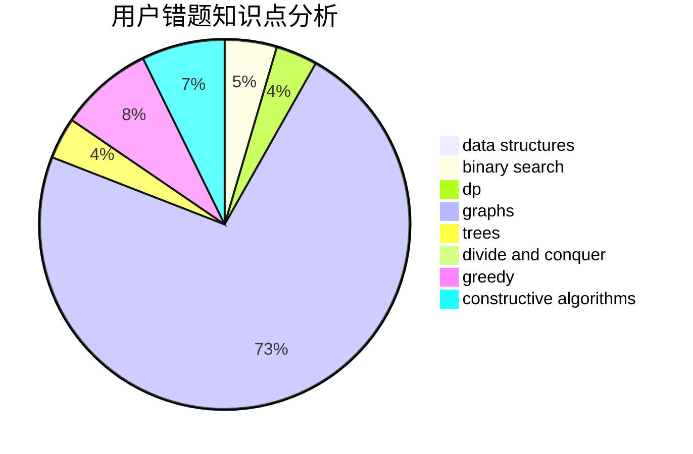

# WGYHMFkZyA02

<!-- tabs:start -->

#### **用户提交结果分析**

#### **用户做题类型偏好分析**

#### **用户错题知识点分析**

<!-- tabs:end -->
# 推荐题目
[1311F](https://codeforces.com/contest/1311/problem/F)		data structures,
                        divide and conquer,
                        implementation,
                        sortings		  
[762B](https://codeforces.com/contest/762/problem/B)		greedy,
                        implementation,
                        sortings,
                        two pointers		  
[171C](https://codeforces.com/contest/171/problem/C)		*special problem,
                        implementation		  
[708C](https://codeforces.com/contest/708/problem/C)		data structures,
                        dfs and similar,
                        dp,
                        graphs,
                        greedy,
                        trees		  
[444D](https://codeforces.com/contest/444/problem/D)		binary search,
                        hashing,
                        strings,
                        two pointers		  
[254D](https://codeforces.com/contest/254/problem/D)		brute force,
                        dfs and similar,
                        graphs,
                        implementation,
                        shortest paths		  
[527E](https://codeforces.com/contest/527/problem/E)		dfs and similar,
                        graphs		  
[1017C](https://codeforces.com/contest/1017/problem/C)		constructive algorithms,
                        greedy		  
[580A](https://codeforces.com/contest/580/problem/A)		brute force,
                        dp,
                        implementation		  
[1175C](https://codeforces.com/contest/1175/problem/C)		binary search,
                        brute force,
                        greedy		  
