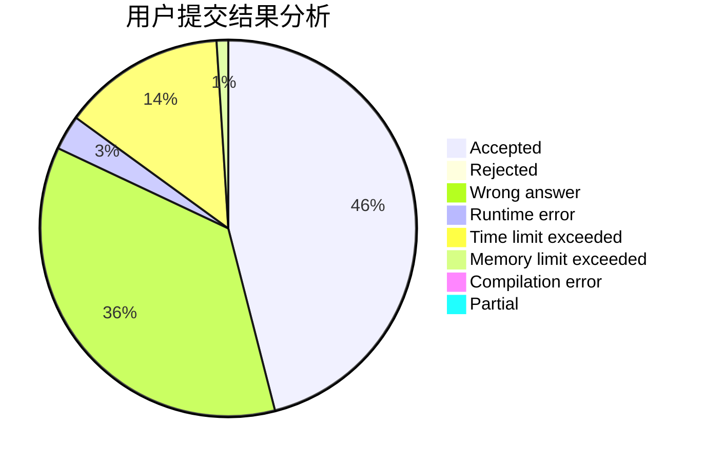
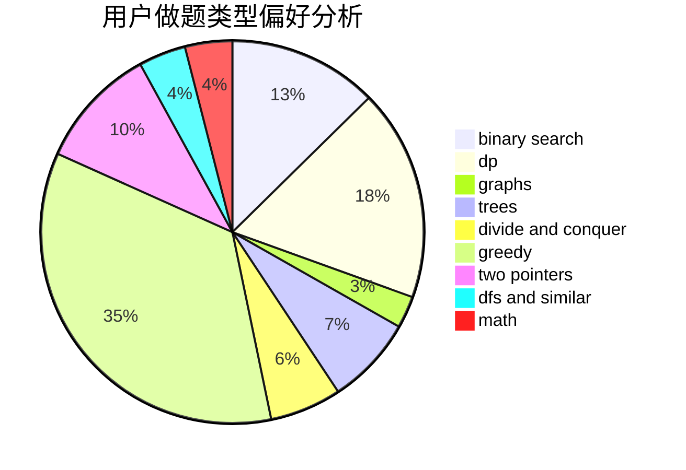

# Aiharashiro

<!-- tabs:start -->

#### **用户提交结果分析**

#### **用户做题类型偏好分析**

<!-- tabs:end -->
# 推荐题目
[1422B](https://codeforces.com/contest/1422/problem/B)
[231A](https://codeforces.com/contest/231/problem/A)
[1342F](https://codeforces.com/contest/1342/problem/F)
[232C](https://codeforces.com/contest/232/problem/C)
[231C](https://codeforces.com/contest/231/problem/C)
[1413D](https://codeforces.com/contest/1413/problem/D)
[1153D](https://codeforces.com/contest/1153/problem/D)
[234C](https://codeforces.com/contest/234/problem/C)
[234A](https://codeforces.com/contest/234/problem/A)
[235E](https://codeforces.com/contest/235/problem/E)
