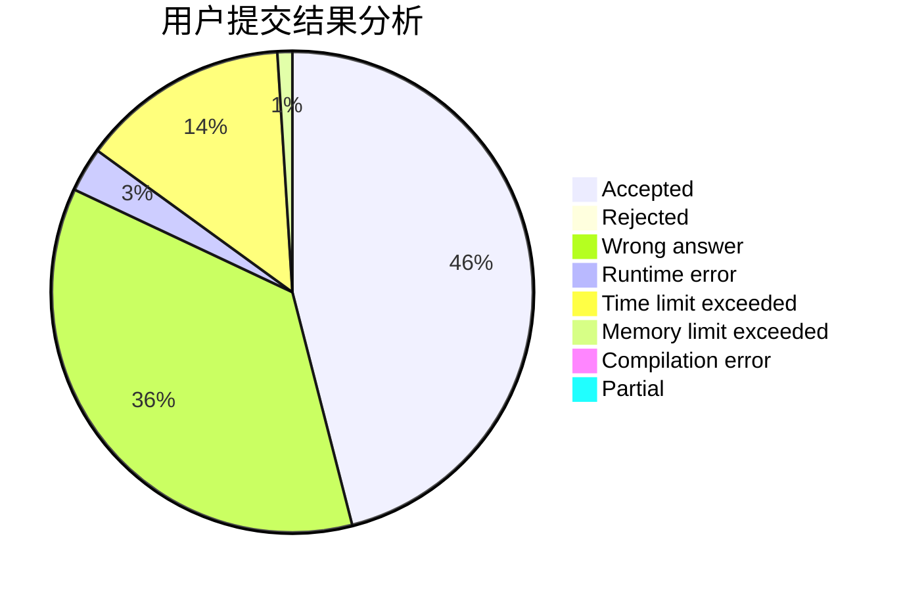
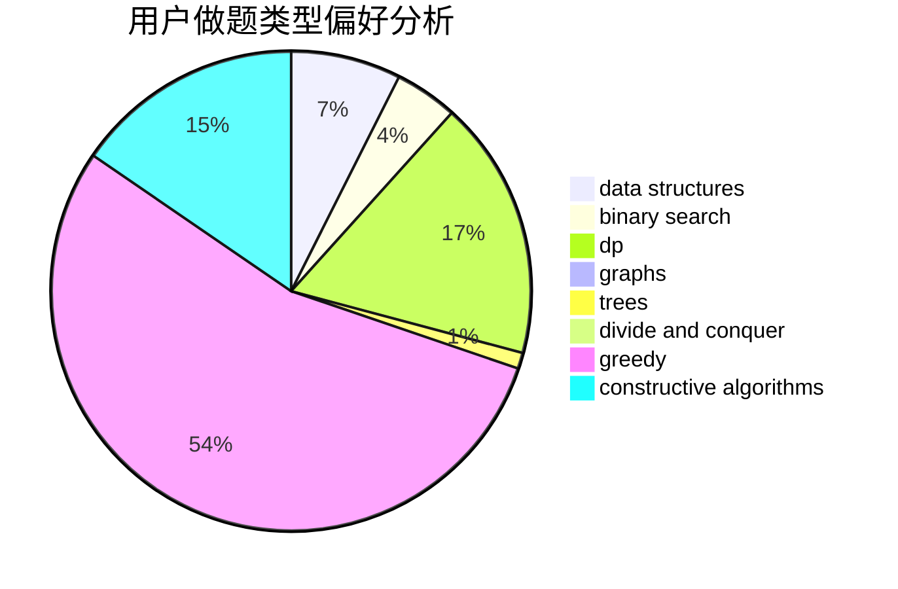
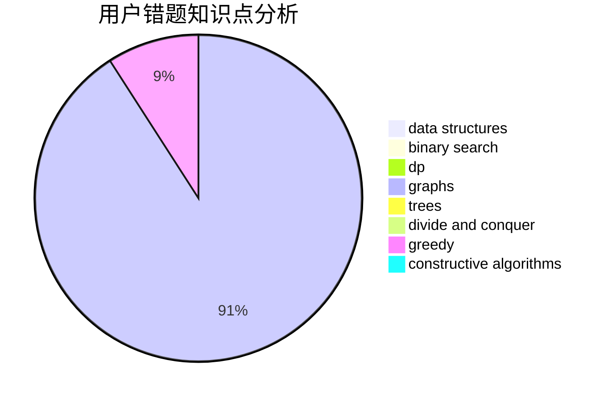

# Aiharashiro

<!-- tabs:start -->

#### **用户提交结果分析**

#### **用户做题类型偏好分析**

#### **用户错题知识点分析**

<!-- tabs:end -->
# 推荐题目
[1411G](https://codeforces.com/contest/1411/problem/G)		bitmasks,
                        games,
                        math,
                        matrices		  
[208E](https://codeforces.com/contest/208/problem/E)		binary search,
                        data structures,
                        dfs and similar,
                        trees		  
[1335E2](https://codeforces.com/contest/1335E/problem/2)		brute force,
                        data structures,
                        dp,
                        two pointers		  
[212D](https://codeforces.com/contest/212/problem/D)		binary search,
                        data structures,
                        dsu		  
[20A](https://codeforces.com/contest/20/problem/A)		implementation		  
[1402B](https://codeforces.com/contest/1402/problem/B)		*special problem,
                        geometry,
                        sortings		  
[1151D](https://codeforces.com/contest/1151/problem/D)		greedy,
                        math,
                        sortings		  
[215C](https://codeforces.com/contest/215/problem/C)		brute force,
                        implementation		  
[215B](https://codeforces.com/contest/215/problem/B)		greedy,
                        math		  
[216C](https://codeforces.com/contest/216/problem/C)		greedy		  
