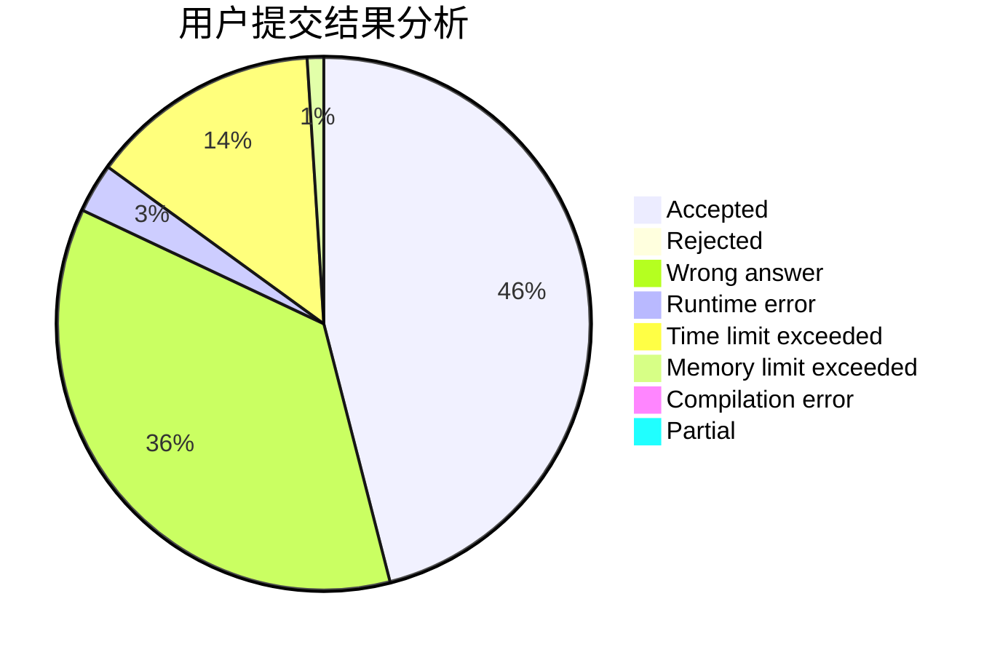
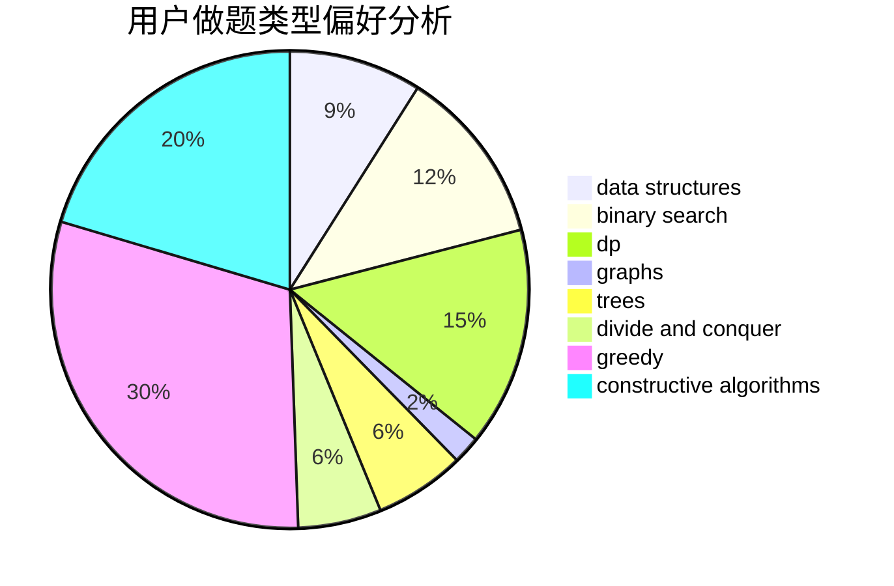
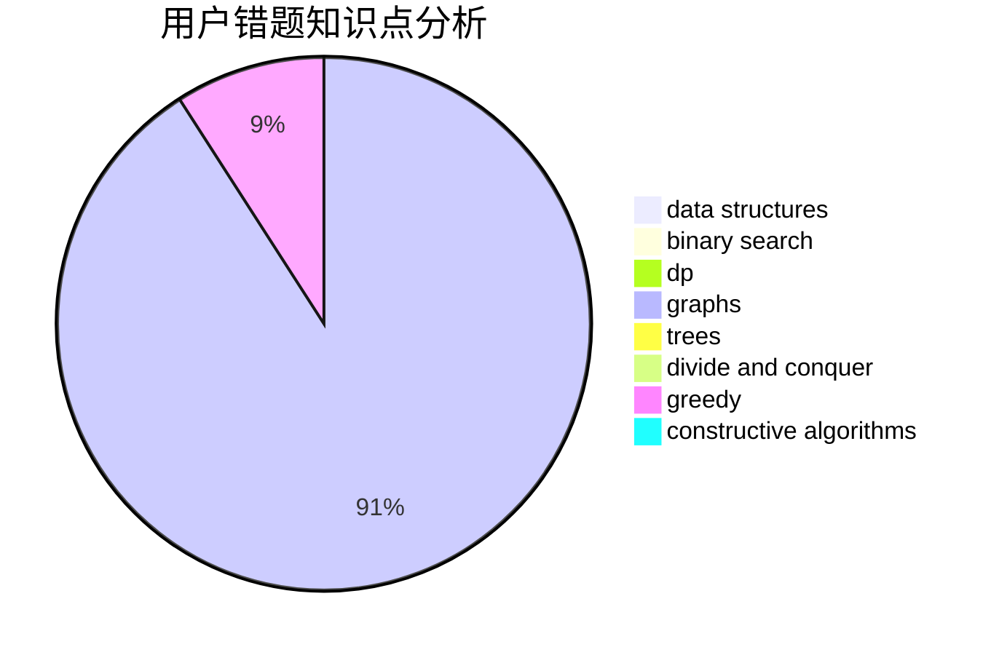

# Aiharashiro

<!-- tabs:start -->

#### **用户提交结果分析**

#### **用户做题类型偏好分析**

#### **用户错题知识点分析**

<!-- tabs:end -->
# 推荐题目
[1422B](https://codeforces.com/contest/1422/problem/B)		greedy,
                        implementation,
                        math		  
[231A](https://codeforces.com/contest/231/problem/A)		brute force,
                        greedy		  
[1342F](https://codeforces.com/contest/1342/problem/F)		bitmasks,
                        brute force,
                        dp		  
[232C](https://codeforces.com/contest/232/problem/C)		constructive algorithms,
                        divide and conquer,
                        dp,
                        graphs,
                        shortest paths		  
[231C](https://codeforces.com/contest/231/problem/C)		binary search,
                        sortings,
                        two pointers		  
[1413D](https://codeforces.com/contest/1413/problem/D)		data structures,
                        greedy,
                        implementation		  
[1153D](https://codeforces.com/contest/1153/problem/D)		binary search,
                        dfs and similar,
                        dp,
                        greedy,
                        trees		  
[234C](https://codeforces.com/contest/234/problem/C)		dp,
                        implementation		  
[234A](https://codeforces.com/contest/234/problem/A)		implementation		  
[235E](https://codeforces.com/contest/235/problem/E)		combinatorics,
                        dp,
                        implementation,
                        math,
                        number theory		  
