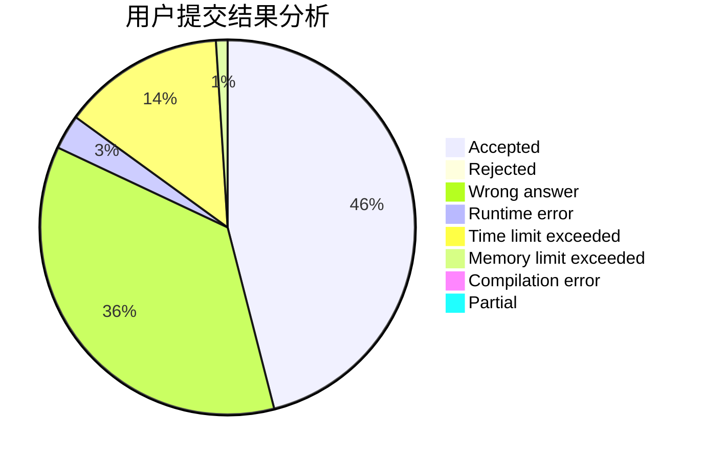
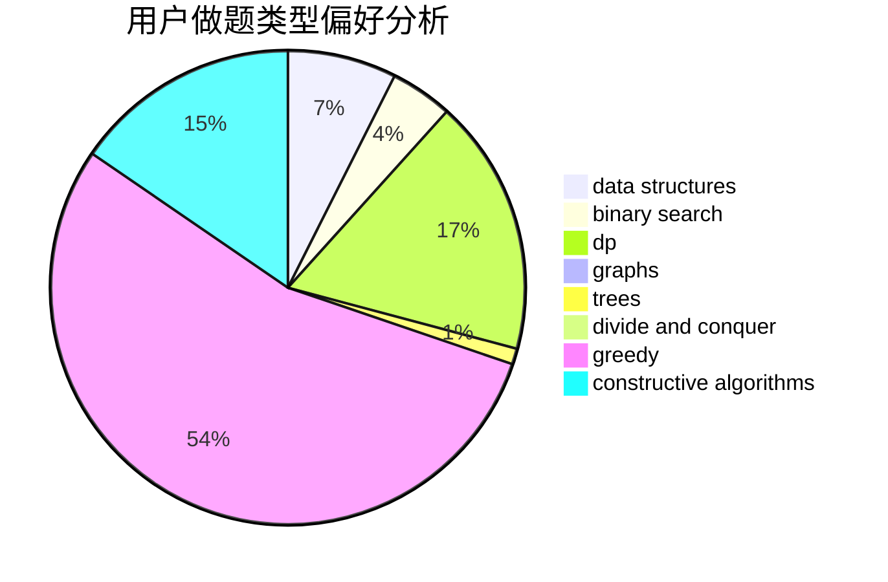
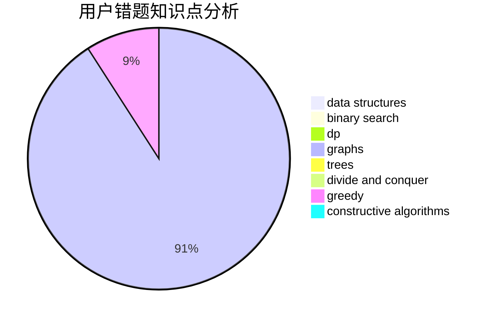

# Aiharashiro
<!-- tabs:start -->
#### **用户提交结果分析**

#### **用户做题类型偏好分析**

#### **用户错题知识点分析**

<!-- tabs:end -->
# 推荐题目
[Trails and Glades](http://codeforces.com/problemset/problem/209/C)		constructive algorithms,
                        dsu,
                        graphs,
                        greedy		  
[No Game No Life](http://codeforces.com/problemset/problem/1411/G)		bitmasks,
                        games,
                        math,
                        matrices		  
[BerOS file system](http://codeforces.com/problemset/problem/20/A)		implementation		  
[Olympic Medal](http://codeforces.com/problemset/problem/215/B)		greedy,
                        math		  
[k-String](http://codeforces.com/problemset/problem/219/A)		implementation,
                        strings		  
[Roads](http://codeforces.com/problemset/problem/1402/B)		*special problem,
                        geometry,
                        sortings		  
[Forming Teams](http://codeforces.com/problemset/problem/216/B)		dfs and similar,
                        implementation		  
[Dijkstra?](http://codeforces.com/problemset/problem/20/C)		graphs,
                        shortest paths		  
[Relay Race](http://codeforces.com/problemset/problem/213/C)		dp		  
[Periodical Numbers](http://codeforces.com/problemset/problem/215/E)		combinatorics,
                        dp,
                        number theory		  
<!-- tabs:start -->
#### **data structures**
[Trails and Glades](http://codeforces.com/problemset/problem/1154/E)		data structures,
                        implementation,
                        sortings		  
[No Game No Life](https://codeforces.com/contest/1269/problem/E)		binary search,
                        data structures		  
[BerOS file system](http://codeforces.com/problemset/problem/212/D)		binary search,
                        data structures,
                        dsu		  
[Olympic Medal](http://codeforces.com/problemset/problem/213/E)		data structures,
                        hashing,
                        strings		  
[k-String](http://codeforces.com/problemset/problem/1335/E2)		brute force,
                        data structures,
                        dp,
                        two pointers		  
[Roads](http://codeforces.com/problemset/problem/1109/E)		data structures,
                        number theory		  
[Forming Teams](http://codeforces.com/problemset/problem/1151/E)		combinatorics,
                        data structures,
                        dp,
                        math		  
[Dijkstra?](http://codeforces.com/problemset/problem/208/E)		binary search,
                        data structures,
                        dfs and similar,
                        trees		  
[Relay Race](http://codeforces.com/problemset/problem/1492/C)		binary search,
                        data structures,
                        dp,
                        greedy,
                        two pointers		  
[Periodical Numbers](http://codeforces.com/problemset/problem/1490/G)		binary search,
                        data structures,
                        math		  
#### **binary search**
[Trails and Glades](https://codeforces.com/contest/1269/problem/E)		binary search,
                        data structures		  
[No Game No Life](http://codeforces.com/problemset/problem/212/D)		binary search,
                        data structures,
                        dsu		  
[BerOS file system](http://codeforces.com/problemset/problem/1244/E)		binary search,
                        constructive algorithms,
                        greedy,
                        sortings,
                        ternary search,
                        two pointers		  
[Olympic Medal](http://codeforces.com/problemset/problem/216/D)		binary search,
                        sortings,
                        two pointers		  
[k-String](http://codeforces.com/problemset/problem/208/E)		binary search,
                        data structures,
                        dfs and similar,
                        trees		  
[Roads](http://codeforces.com/problemset/problem/1492/C)		binary search,
                        data structures,
                        dp,
                        greedy,
                        two pointers		  
[Forming Teams](http://codeforces.com/problemset/problem/1463/D)		binary search,
                        constructive algorithms,
                        greedy,
                        two pointers		  
[Dijkstra?](http://codeforces.com/problemset/problem/1490/G)		binary search,
                        data structures,
                        math		  
[Relay Race](http://codeforces.com/problemset/problem/1479/D)		binary search,
                        bitmasks,
                        brute force,
                        data structures,
                        probabilities,
                        trees		  
[Periodical Numbers](http://codeforces.com/problemset/problem/1436/E)		binary search,
                        data structures,
                        two pointers		  
#### **dp**
[Trails and Glades](http://codeforces.com/problemset/problem/213/C)		dp		  
[No Game No Life](http://codeforces.com/problemset/problem/215/E)		combinatorics,
                        dp,
                        number theory		  
[BerOS file system](http://codeforces.com/problemset/problem/212/E)		dfs and similar,
                        dp,
                        trees		  
[Olympic Medal](http://codeforces.com/problemset/problem/1335/E2)		brute force,
                        data structures,
                        dp,
                        two pointers		  
[k-String](http://codeforces.com/problemset/problem/212/C)		combinatorics,
                        dp,
                        math		  
[Roads](http://codeforces.com/problemset/problem/1151/B)		bitmasks,
                        brute force,
                        constructive algorithms,
                        dp		  
[Forming Teams](http://codeforces.com/problemset/problem/1153/F)		combinatorics,
                        dp,
                        math,
                        probabilities		  
[Dijkstra?](http://codeforces.com/problemset/problem/1151/E)		combinatorics,
                        data structures,
                        dp,
                        math		  
[Relay Race](http://codeforces.com/problemset/problem/1007/E)		dp		  
[Periodical Numbers](http://codeforces.com/problemset/problem/1492/C)		binary search,
                        data structures,
                        dp,
                        greedy,
                        two pointers		  
#### **graph**
[Trails and Glades](http://codeforces.com/problemset/problem/209/C)		constructive algorithms,
                        dsu,
                        graphs,
                        greedy		  
[No Game No Life](http://codeforces.com/problemset/problem/20/C)		graphs,
                        shortest paths		  
[BerOS file system](http://codeforces.com/problemset/problem/212/A)		flows,
                        graphs		  
[Olympic Medal](https://codeforces.com/contest/218/problem/C)		brute force,
                        dfs and similar,
                        dsu,
                        graphs		  
[k-String](http://codeforces.com/problemset/problem/1019/C)		constructive algorithms,
                        graphs		  
[Roads](http://codeforces.com/problemset/problem/1487/C)		brute force,
                        constructive algorithms,
                        dfs and similar,
                        graphs,
                        greedy,
                        implementation,
                        math		  
[Forming Teams](http://codeforces.com/problemset/problem/1437/C)		dp,
                        flows,
                        graph matchings,
                        greedy,
                        math,
                        sortings		  
[Dijkstra?](http://codeforces.com/problemset/problem/1470/D)		constructive algorithms,
                        dfs and similar,
                        graph matchings,
                        graphs,
                        greedy		  
[Relay Race](http://codeforces.com/problemset/problem/1476/C)		dp,
                        graphs,
                        greedy		  
[Periodical Numbers](http://codeforces.com/problemset/problem/1304/D)		constructive algorithms,
                        graphs,
                        greedy,
                        two pointers		  
#### **trees**
[Trails and Glades](http://codeforces.com/problemset/problem/212/E)		dfs and similar,
                        dp,
                        trees		  
[No Game No Life](http://codeforces.com/problemset/problem/1254/E)		combinatorics,
                        dfs and similar,
                        dsu,
                        trees		  
[BerOS file system](http://codeforces.com/problemset/problem/208/E)		binary search,
                        data structures,
                        dfs and similar,
                        trees		  
[Olympic Medal](http://codeforces.com/problemset/problem/1479/D)		binary search,
                        bitmasks,
                        brute force,
                        data structures,
                        probabilities,
                        trees		  
[k-String](http://codeforces.com/problemset/problem/1511/C)		brute force,
                        data structures,
                        implementation,
                        trees		  
[Roads](http://codeforces.com/problemset/problem/1499/F)		combinatorics,
                        dfs and similar,
                        dp,
                        trees		  
[Forming Teams](http://codeforces.com/problemset/problem/1491/E)		brute force,
                        dfs and similar,
                        divide and conquer,
                        number theory,
                        trees		  
[Dijkstra?](http://codeforces.com/problemset/problem/1466/D)		data structures,
                        greedy,
                        sortings,
                        trees		  
[Relay Race](http://codeforces.com/problemset/problem/1495/D)		combinatorics,
                        dfs and similar,
                        graphs,
                        math,
                        shortest paths,
                        trees		  
[Periodical Numbers](http://codeforces.com/problemset/problem/1303/G)		data structures,
                        divide and conquer,
                        geometry,
                        trees		  
#### **divide and conquer**
[Trails and Glades](http://codeforces.com/problemset/problem/1461/D)		binary search,
                        brute force,
                        data structures,
                        divide and conquer,
                        implementation,
                        sortings		  
[No Game No Life](http://codeforces.com/problemset/problem/1466/G)		combinatorics,
                        divide and conquer,
                        hashing,
                        math,
                        string suffix structures,
                        strings		  
[BerOS file system](http://codeforces.com/problemset/problem/1490/D)		dfs and similar,
                        divide and conquer,
                        implementation		  
[Olympic Medal](https://codeforces.com/contest/1483/problem/C)		data structures,
                        divide and conquer,
                        dp		  
[k-String](http://codeforces.com/problemset/problem/1491/E)		brute force,
                        dfs and similar,
                        divide and conquer,
                        number theory,
                        trees		  
[Roads](http://codeforces.com/problemset/problem/1303/G)		data structures,
                        divide and conquer,
                        geometry,
                        trees		  
[Forming Teams](http://codeforces.com/problemset/problem/1494/D)		constructive algorithms,
                        data structures,
                        dfs and similar,
                        divide and conquer,
                        dsu,
                        greedy,
                        sortings,
                        trees		  
[Dijkstra?](http://codeforces.com/problemset/problem/1482/E)		data structures,
                        divide and conquer,
                        dp		  
[Relay Race](http://codeforces.com/problemset/problem/566/C)		dfs and similar,
                        divide and conquer,
                        trees		  
[Periodical Numbers](http://codeforces.com/problemset/problem/1428/F)		binary search,
                        data structures,
                        divide and conquer,
                        dp,
                        two pointers		  
#### **greedy**
[Trails and Glades](http://codeforces.com/problemset/problem/209/C)		constructive algorithms,
                        dsu,
                        graphs,
                        greedy		  
[No Game No Life](http://codeforces.com/problemset/problem/215/B)		greedy,
                        math		  
[BerOS file system](http://codeforces.com/problemset/problem/1244/E)		binary search,
                        constructive algorithms,
                        greedy,
                        sortings,
                        ternary search,
                        two pointers		  
[Olympic Medal](http://codeforces.com/problemset/problem/216/C)		greedy		  
[k-String](http://codeforces.com/problemset/problem/215/D)		greedy		  
[Roads](http://codeforces.com/problemset/problem/1151/D)		greedy,
                        math,
                        sortings		  
[Forming Teams](http://codeforces.com/problemset/problem/1150/B)		greedy,
                        implementation		  
[Dijkstra?](http://codeforces.com/problemset/problem/1418/B)		greedy,
                        sortings		  
[Relay Race](http://codeforces.com/problemset/problem/1091/F)		constructive algorithms,
                        greedy		  
[Periodical Numbers](http://codeforces.com/problemset/problem/1492/C)		binary search,
                        data structures,
                        dp,
                        greedy,
                        two pointers		  
#### **constructive algorithms**
[Trails and Glades](http://codeforces.com/problemset/problem/209/C)		constructive algorithms,
                        dsu,
                        graphs,
                        greedy		  
[No Game No Life](http://codeforces.com/problemset/problem/1244/E)		binary search,
                        constructive algorithms,
                        greedy,
                        sortings,
                        ternary search,
                        two pointers		  
[BerOS file system](http://codeforces.com/problemset/problem/218/A)		brute force,
                        constructive algorithms,
                        implementation		  
[Olympic Medal](http://codeforces.com/problemset/problem/1109/B)		constructive algorithms,
                        hashing,
                        strings		  
[k-String](http://codeforces.com/problemset/problem/1151/B)		bitmasks,
                        brute force,
                        constructive algorithms,
                        dp		  
[Roads](http://codeforces.com/problemset/problem/1019/C)		constructive algorithms,
                        graphs		  
[Forming Teams](http://codeforces.com/problemset/problem/1091/F)		constructive algorithms,
                        greedy		  
[Dijkstra?](http://codeforces.com/problemset/problem/1059/C)		constructive algorithms,
                        math		  
[Relay Race](http://codeforces.com/problemset/problem/1493/A)		constructive algorithms,
                        greedy		  
[Periodical Numbers](http://codeforces.com/problemset/problem/1463/D)		binary search,
                        constructive algorithms,
                        greedy,
                        two pointers		  
#### **sortings**
[Trails and Glades](http://codeforces.com/problemset/problem/1402/B)		*special problem,
                        geometry,
                        sortings		  
[No Game No Life](http://codeforces.com/problemset/problem/1154/E)		data structures,
                        implementation,
                        sortings		  
[BerOS file system](http://codeforces.com/problemset/problem/1244/E)		binary search,
                        constructive algorithms,
                        greedy,
                        sortings,
                        ternary search,
                        two pointers		  
[Olympic Medal](http://codeforces.com/problemset/problem/216/D)		binary search,
                        sortings,
                        two pointers		  
[k-String](http://codeforces.com/problemset/problem/1151/D)		greedy,
                        math,
                        sortings		  
[Roads](http://codeforces.com/problemset/problem/1418/B)		greedy,
                        sortings		  
[Forming Teams](https://codeforces.com/contest/1496/problem/C)		geometry,
                        greedy,
                        math,
                        sortings		  
[Dijkstra?](http://codeforces.com/problemset/problem/1495/A)		geometry,
                        greedy,
                        math,
                        sortings		  
[Relay Race](http://codeforces.com/problemset/problem/1497/A)		brute force,
                        data structures,
                        greedy,
                        sortings		  
[Periodical Numbers](http://codeforces.com/problemset/problem/1427/A)		math,
                        sortings		  
<!-- tabs:end -->
