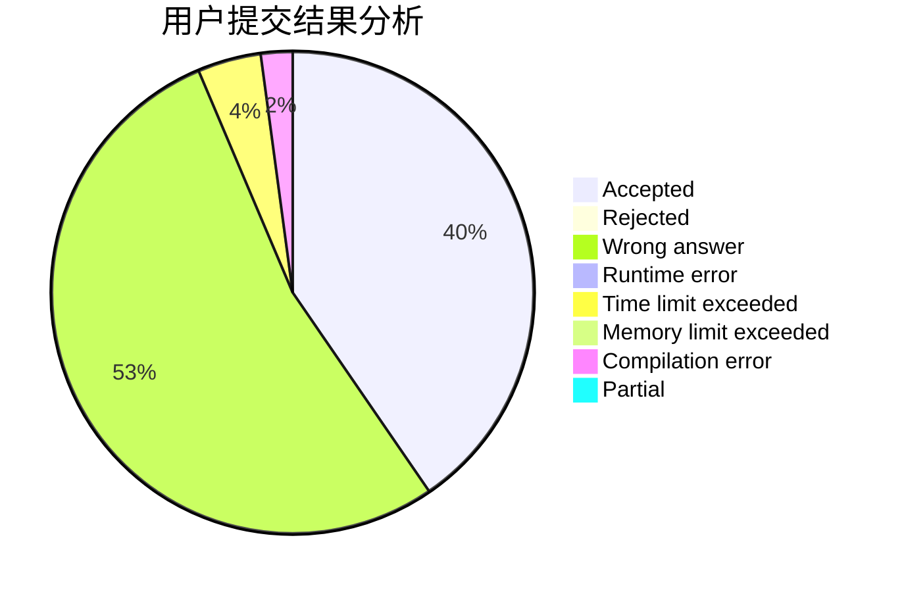
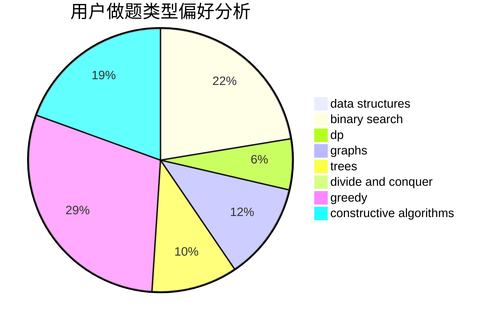
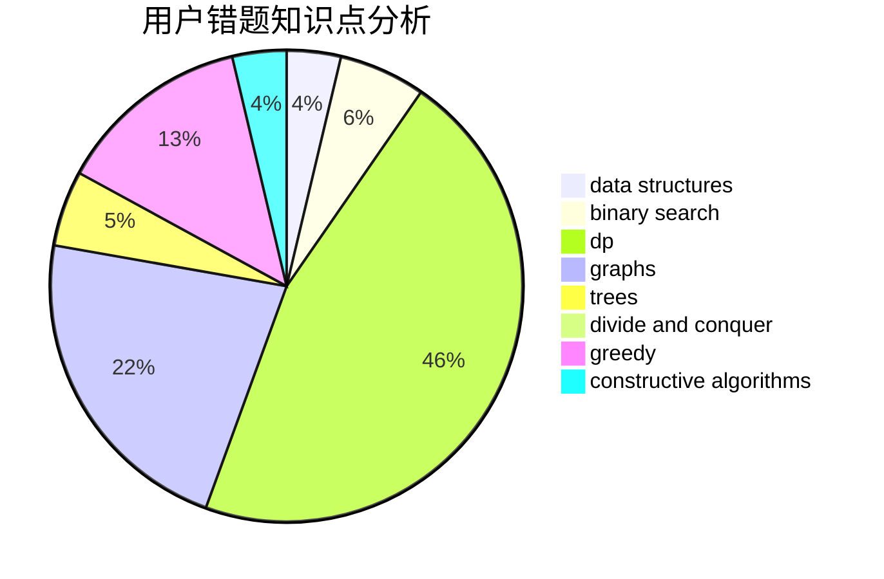

# WH6BNNS

<!-- tabs:start -->

#### **用户提交结果分析**

#### **用户做题类型偏好分析**

#### **用户错题知识点分析**

<!-- tabs:end -->
# 推荐题目
[938B](https://codeforces.com/contest/938/problem/B)		brute force,
                        greedy		  
[479E](https://codeforces.com/contest/479/problem/E)		combinatorics,
                        dp		  
[417C](https://codeforces.com/contest/417/problem/C)		constructive algorithms,
                        graphs,
                        implementation		  
[812C](https://codeforces.com/contest/812/problem/C)		binary search,
                        sortings		  
[19E](https://codeforces.com/contest/19/problem/E)		dfs and similar,
                        divide and conquer,
                        dsu		  
[258D](https://codeforces.com/contest/258/problem/D)		dp,
                        math,
                        probabilities		  
[815D](https://codeforces.com/contest/815/problem/D)		binary search,
                        combinatorics,
                        data structures,
                        geometry		  
[1156F](https://codeforces.com/contest/1156/problem/F)		dp,
                        math,
                        probabilities		  
[813F](https://codeforces.com/contest/813/problem/F)		data structures,
                        dsu,
                        graphs		  
[761F](https://codeforces.com/contest/761/problem/F)		brute force,
                        data structures,
                        dp,
                        implementation		  
