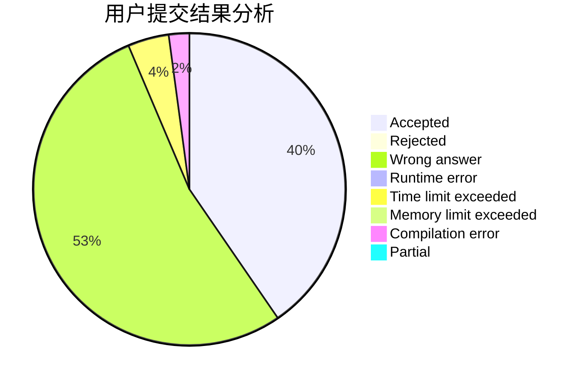
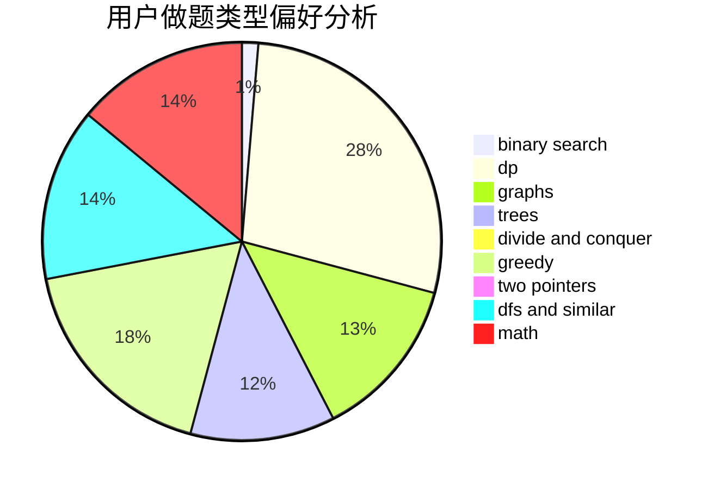

# WH6BNNS

<!-- tabs:start -->

#### **用户提交结果分析**

#### **用户做题类型偏好分析**

<!-- tabs:end -->
# 推荐题目
[95A](https://codeforces.com/contest/95/problem/A)
[4A](https://codeforces.com/contest/4/problem/A)
[442B](https://codeforces.com/contest/442/problem/B)
[831A](https://codeforces.com/contest/831/problem/A)
[223C](https://codeforces.com/contest/223/problem/C)
[276C](https://codeforces.com/contest/276/problem/C)
[834D](https://codeforces.com/contest/834/problem/D)
[1158D](https://codeforces.com/contest/1158/problem/D)
[832B](https://codeforces.com/contest/832/problem/B)
[780D](https://codeforces.com/contest/780/problem/D)
