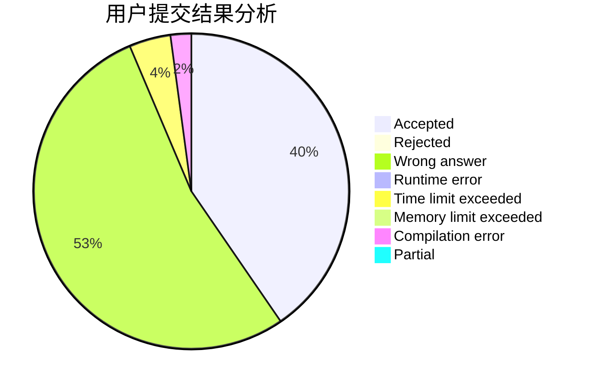
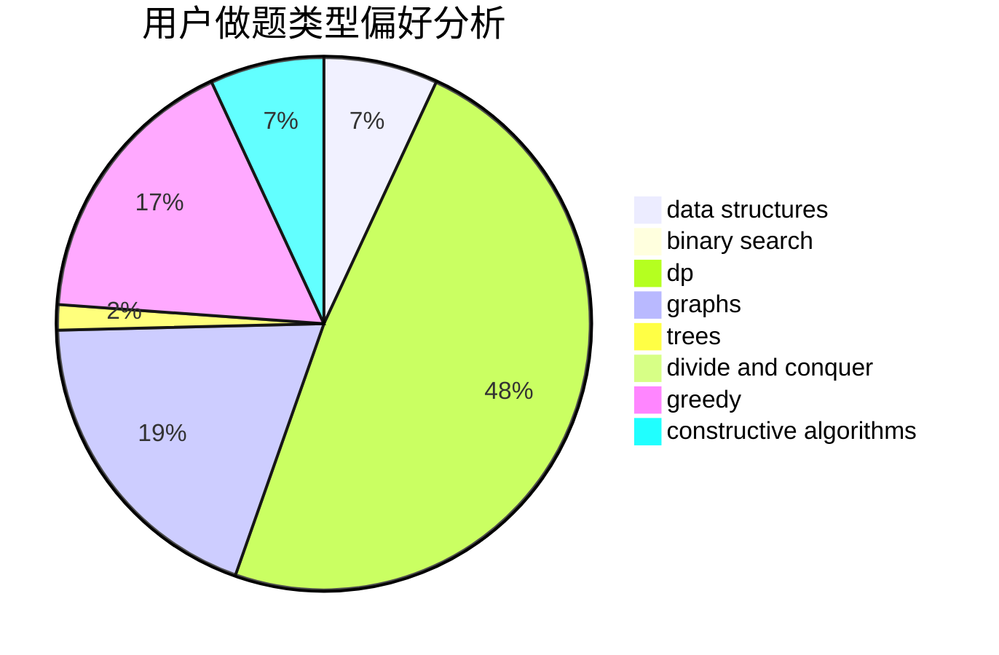
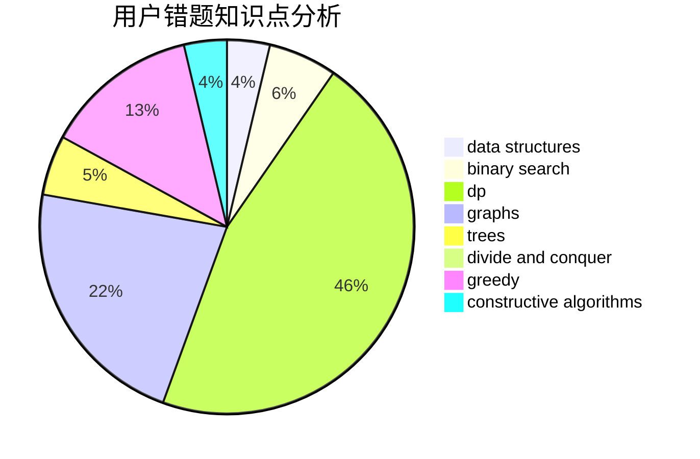

# WH6BNNS

<!-- tabs:start -->

#### **用户提交结果分析**

#### **用户做题类型偏好分析**

#### **用户错题知识点分析**

<!-- tabs:end -->
# 推荐题目
[95A](https://codeforces.com/contest/95/problem/A)		implementation,
                        strings		  
[4A](https://codeforces.com/contest/4/problem/A)		brute force,
                        math		  
[442B](https://codeforces.com/contest/442/problem/B)		greedy,
                        math,
                        probabilities		  
[831A](https://codeforces.com/contest/831/problem/A)		implementation		  
[223C](https://codeforces.com/contest/223/problem/C)		combinatorics,
                        math,
                        number theory		  
[276C](https://codeforces.com/contest/276/problem/C)		data structures,
                        greedy,
                        implementation,
                        sortings		  
[834D](https://codeforces.com/contest/834/problem/D)		dsu,graphs,sortings,trees		  
[1158D](https://codeforces.com/contest/1158/problem/D)		constructive algorithms,
                        geometry,
                        greedy,
                        math		  
[832B](https://codeforces.com/contest/832/problem/B)		implementation,
                        strings		  
[780D](https://codeforces.com/contest/780/problem/D)		2-sat,
                        graphs,
                        greedy,
                        implementation,
                        shortest paths,
                        strings		  
