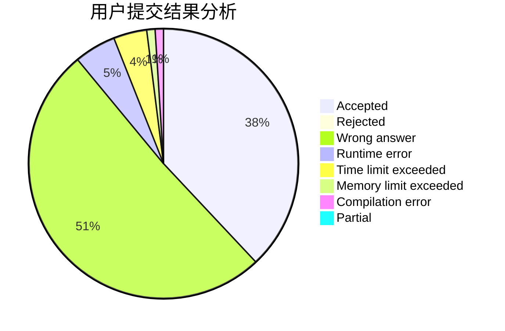
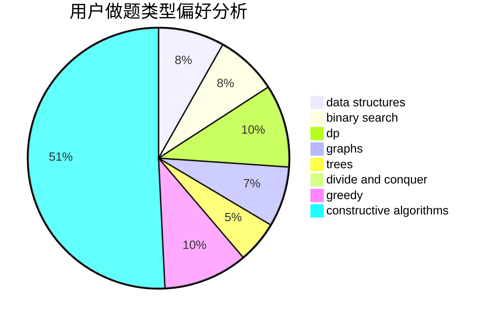
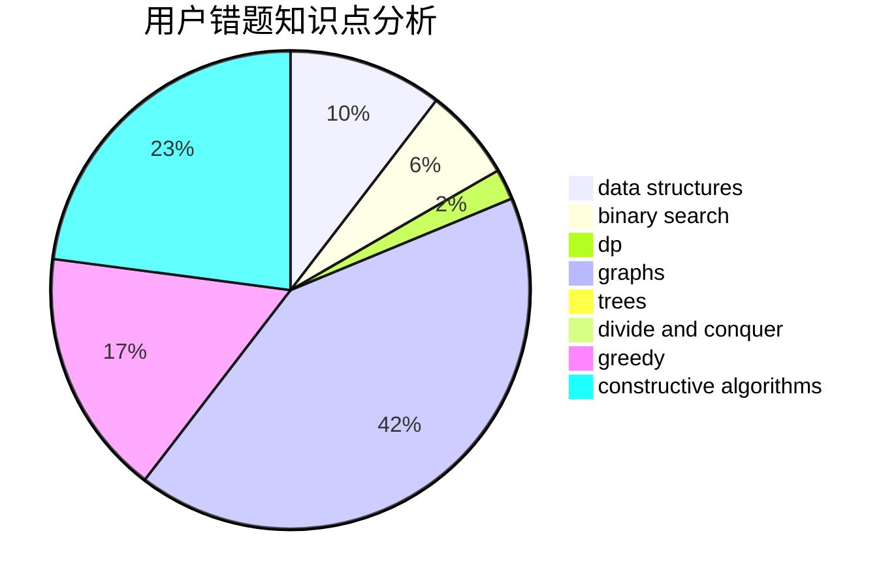

# WH_

<!-- tabs:start -->

#### **用户提交结果分析**

#### **用户做题类型偏好分析**

#### **用户错题知识点分析**

<!-- tabs:end -->
# 推荐题目
[45G](https://codeforces.com/contest/45/problem/G)		number theory		  
[1423C](https://codeforces.com/contest/1423/problem/C)		divide and conquer,
                        graphs,
                        trees		  
[1425B](https://codeforces.com/contest/1425/problem/B)		divide and conquer,
                        dp		  
[20A](https://codeforces.com/contest/20/problem/A)		implementation		  
[1041C](https://codeforces.com/contest/1041/problem/C)		binary search,
                        data structures,
                        greedy,
                        two pointers		  
[1023C](https://codeforces.com/contest/1023/problem/C)		greedy		  
[894D](https://codeforces.com/contest/894/problem/D)		brute force,
                        data structures,
                        trees		  
[453C](https://codeforces.com/contest/453/problem/C)		constructive algorithms,
                        dfs and similar,
                        graphs		  
[706A](https://codeforces.com/contest/706/problem/A)		brute force,
                        geometry,
                        implementation		  
[224A](https://codeforces.com/contest/224/problem/A)		brute force,
                        geometry,
                        math		  
