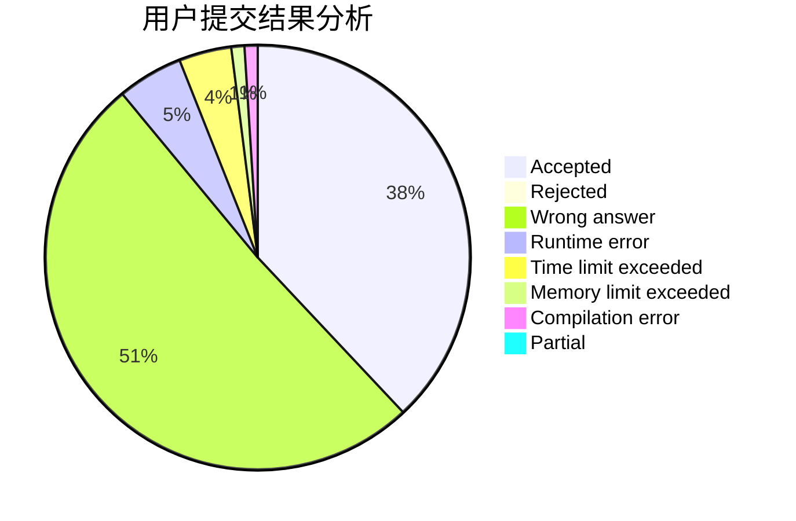
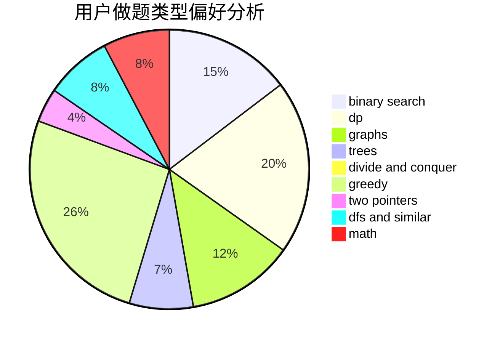

# WH_

<!-- tabs:start -->

#### **用户提交结果分析**

#### **用户做题类型偏好分析**

<!-- tabs:end -->
# 推荐题目
[45G](https://codeforces.com/contest/45/problem/G)
[1423C](https://codeforces.com/contest/1423/problem/C)
[1425B](https://codeforces.com/contest/1425/problem/B)
[20A](https://codeforces.com/contest/20/problem/A)
[1041C](https://codeforces.com/contest/1041/problem/C)
[1023C](https://codeforces.com/contest/1023/problem/C)
[894D](https://codeforces.com/contest/894/problem/D)
[453C](https://codeforces.com/contest/453/problem/C)
[706A](https://codeforces.com/contest/706/problem/A)
[224A](https://codeforces.com/contest/224/problem/A)
