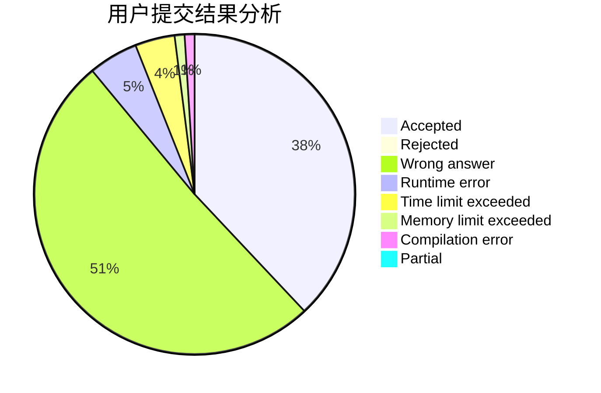
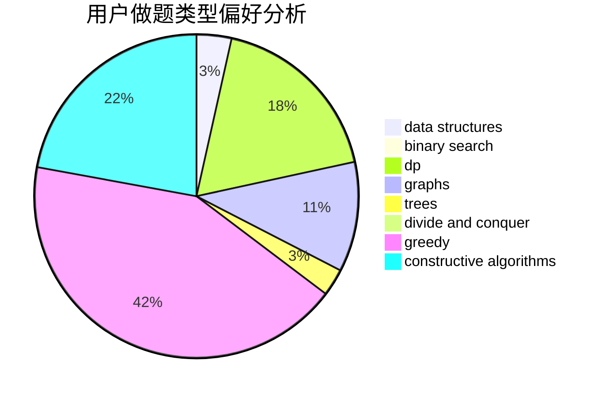
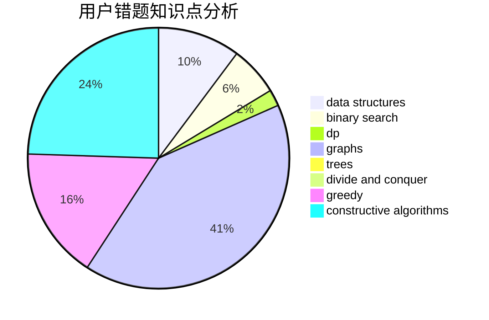

# WH_

<!-- tabs:start -->

#### **用户提交结果分析**

#### **用户做题类型偏好分析**

#### **用户错题知识点分析**

<!-- tabs:end -->
# 推荐题目
[438B](https://codeforces.com/contest/438/problem/B)		dsu,graphs,sortings,trees		  
[1413F](https://codeforces.com/contest/1413/problem/F)		data structures,
                        trees		  
[1417E](https://codeforces.com/contest/1417/problem/E)		dsu,graphs,sortings,trees		  
[183D](https://codeforces.com/contest/183/problem/D)		dp,
                        greedy,
                        probabilities		  
[1040D](https://codeforces.com/contest/1040/problem/D)		dsu,graphs,sortings,trees		  
[1020E](https://codeforces.com/contest/1020/problem/E)		dsu,graphs,sortings,trees		  
[873F](https://codeforces.com/contest/873/problem/F)		dsu,
                        string suffix structures,
                        strings		  
[431E](https://codeforces.com/contest/431/problem/E)		binary search,
                        data structures,
                        ternary search		  
[682A](https://codeforces.com/contest/682/problem/A)		constructive algorithms,
                        math,
                        number theory		  
[1B](https://codeforces.com/contest/1/problem/B)		implementation,
                        math		  
