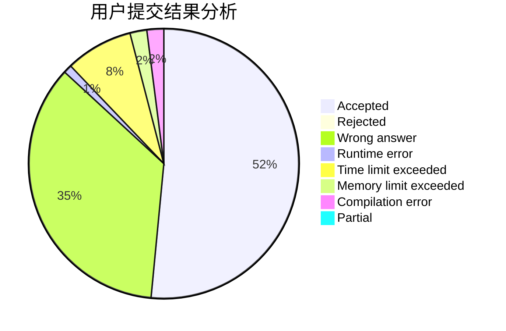
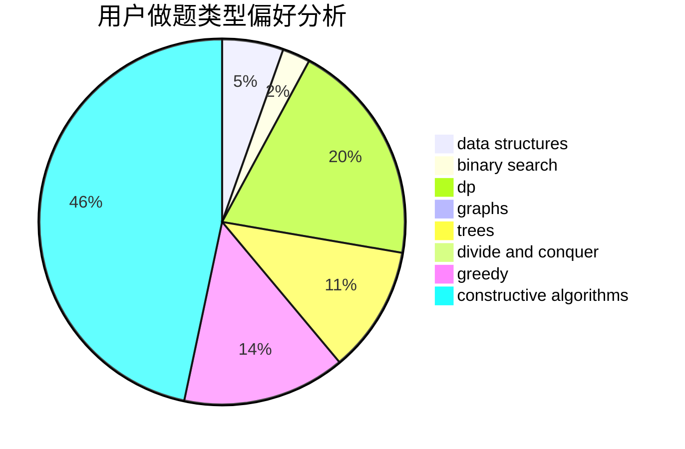
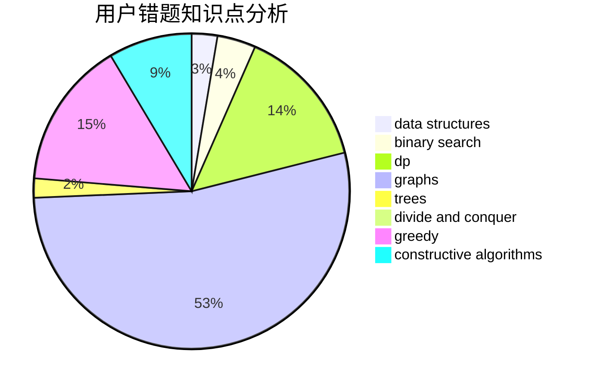

# WIZeaz

<!-- tabs:start -->

#### **用户提交结果分析**

#### **用户做题类型偏好分析**

#### **用户错题知识点分析**

<!-- tabs:end -->
# 推荐题目
[77E](https://codeforces.com/contest/77/problem/E)		geometry		  
[1416F](https://codeforces.com/contest/1416/problem/F)		flows,
                        graph matchings,
                        greedy,
                        implementation		  
[863A](https://codeforces.com/contest/863/problem/A)		brute force,
                        implementation		  
[343E](https://codeforces.com/contest/343/problem/E)		brute force,
                        dfs and similar,
                        divide and conquer,
                        flows,
                        graphs,
                        greedy,
                        trees		  
[1283F](https://codeforces.com/contest/1283/problem/F)		constructive algorithms,
                        greedy,
                        trees		  
[1354E](https://codeforces.com/contest/1354/problem/E)		dfs and similar,
                        dp,
                        graphs		  
[1141G](https://codeforces.com/contest/1141/problem/G)		binary search,
                        constructive algorithms,
                        dfs and similar,
                        graphs,
                        greedy,
                        trees		  
[1375F](https://codeforces.com/contest/1375/problem/F)		constructive algorithms,
                        games,
                        interactive,
                        math		  
[841B](https://codeforces.com/contest/841/problem/B)		games,
                        math		  
[300A](https://codeforces.com/contest/300/problem/A)		brute force,
                        constructive algorithms,
                        implementation		  
