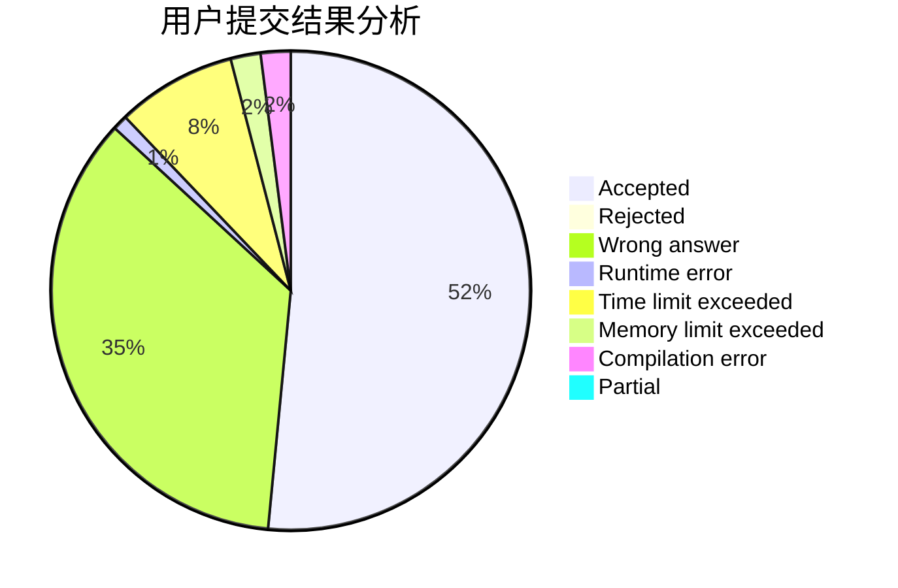
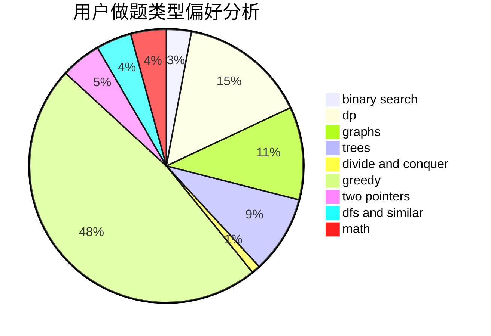

# WIZeaz

<!-- tabs:start -->

#### **用户提交结果分析**

#### **用户做题类型偏好分析**

<!-- tabs:end -->
# 推荐题目
[798C](https://codeforces.com/contest/798/problem/C)
[1424G](https://codeforces.com/contest/1424/problem/G)
[883C](https://codeforces.com/contest/883/problem/C)
[370A](https://codeforces.com/contest/370/problem/A)
[1290F](https://codeforces.com/contest/1290/problem/F)
[1361B](https://codeforces.com/contest/1361/problem/B)
[1144B](https://codeforces.com/contest/1144/problem/B)
[1384E](https://codeforces.com/contest/1384/problem/E)
[860B](https://codeforces.com/contest/860/problem/B)
[318C](https://codeforces.com/contest/318/problem/C)
