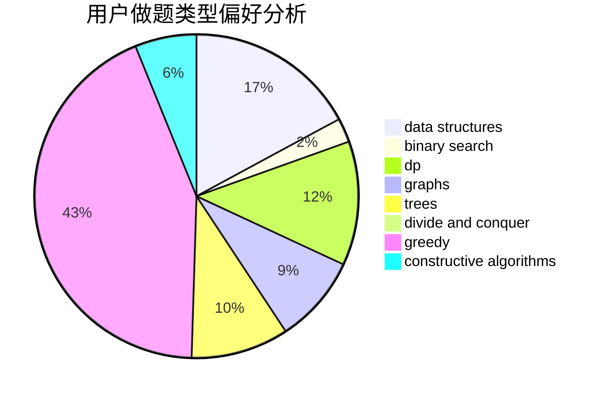
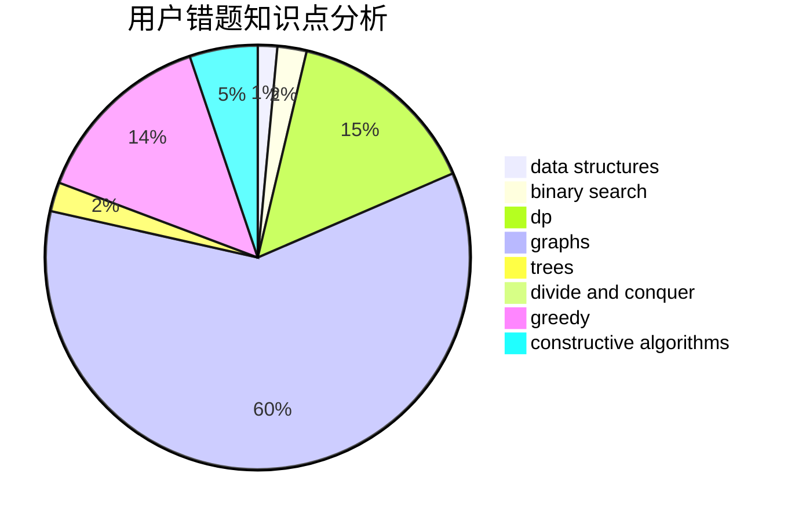

# WIZeaz

<!-- tabs:start -->

#### **用户提交结果分析**

#### **用户做题类型偏好分析**

#### **用户错题知识点分析**

<!-- tabs:end -->
# 推荐题目
[798C](https://codeforces.com/contest/798/problem/C)		dp,
                        greedy,
                        number theory		  
[1424G](https://codeforces.com/contest/1424/problem/G)		data structures,
                        sortings		  
[883C](https://codeforces.com/contest/883/problem/C)		binary search,
                        implementation		  
[370A](https://codeforces.com/contest/370/problem/A)		graphs,
                        math,
                        shortest paths		  
[1290F](https://codeforces.com/contest/1290/problem/F)		dp		  
[1361B](https://codeforces.com/contest/1361/problem/B)		greedy,
                        implementation,
                        math,
                        sortings		  
[1144B](https://codeforces.com/contest/1144/problem/B)		greedy,
                        implementation,
                        sortings		  
[1384E](https://codeforces.com/contest/1384/problem/E)		dsu,graphs,sortings,trees		  
[860B](https://codeforces.com/contest/860/problem/B)		dsu,graphs,sortings,trees		  
[318C](https://codeforces.com/contest/318/problem/C)		dsu,graphs,sortings,trees		  
