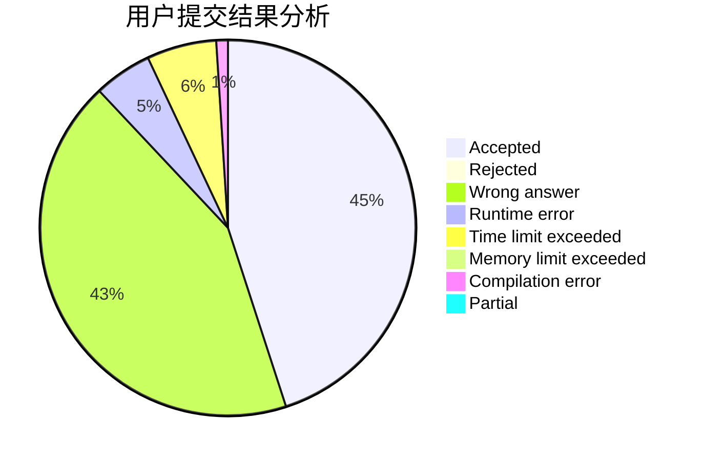
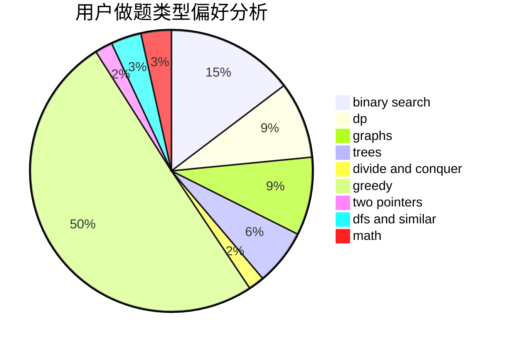

# WJMDBMR

<!-- tabs:start -->

#### **用户提交结果分析**

#### **用户做题类型偏好分析**

<!-- tabs:end -->
# 推荐题目
[1464C](https://codeforces.com/contest/1464/problem/C)
[519D](https://codeforces.com/contest/519/problem/D)
[13764](https://codeforces.com/contest/1376/problem/4)
[986F](https://codeforces.com/contest/986/problem/F)
[1333D](https://codeforces.com/contest/1333/problem/D)
[1092E](https://codeforces.com/contest/1092/problem/E)
[13781](https://codeforces.com/contest/1378/problem/1)
[1065B](https://codeforces.com/contest/1065/problem/B)
[1460A](https://codeforces.com/contest/1460/problem/A)
[318D](https://codeforces.com/contest/318/problem/D)
