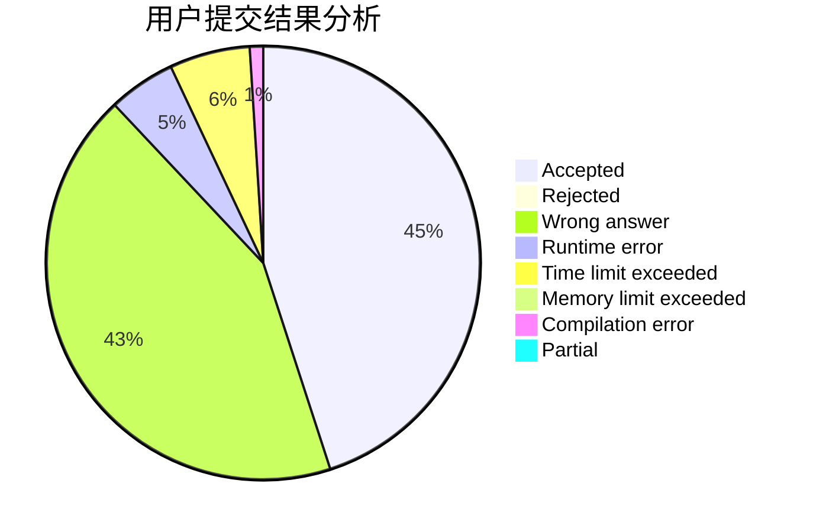
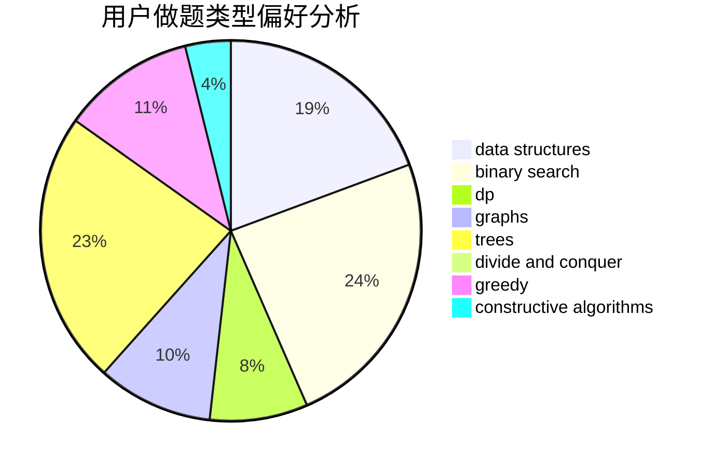

# WJMDBMR

<!-- tabs:start -->

#### **用户提交结果分析**

#### **用户做题类型偏好分析**

#### **用户错题知识点分析**

<!-- tabs:end -->
# 推荐题目
[1454F](https://codeforces.com/contest/1454/problem/F)		binary search,
                        data structures,
                        greedy,
                        two pointers		  
[498D](https://codeforces.com/contest/498/problem/D)		data structures,
                        dp,
                        number theory		  
[1369E](https://codeforces.com/contest/1369/problem/E)		data structures,
                        dfs and similar,
                        greedy,
                        implementation,
                        sortings		  
[964C](https://codeforces.com/contest/964/problem/C)		dsu,graphs,sortings,trees		  
[1327A](https://codeforces.com/contest/1327/problem/A)		math		  
[1092B](https://codeforces.com/contest/1092/problem/B)		sortings		  
[136C](https://codeforces.com/contest/136/problem/C)		dsu,graphs,sortings,trees		  
[1064E](https://codeforces.com/contest/1064/problem/E)		dsu,graphs,sortings,trees		  
[1451D](https://codeforces.com/contest/1451/problem/D)		games,
                        geometry,
                        math		  
[300B](https://codeforces.com/contest/300/problem/B)		brute force,
                        dfs and similar,
                        graphs		  
