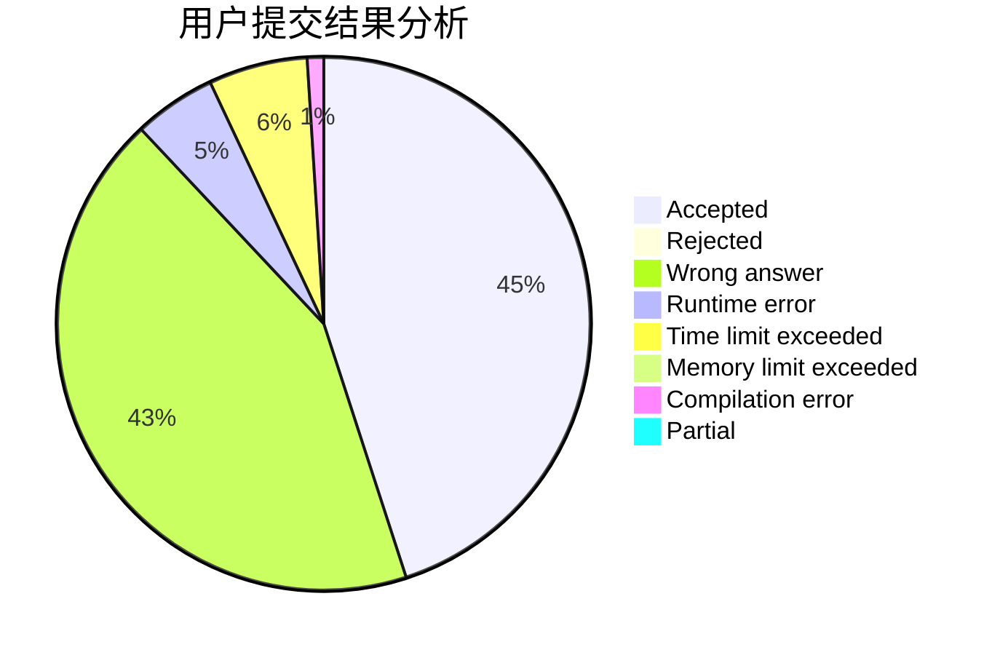
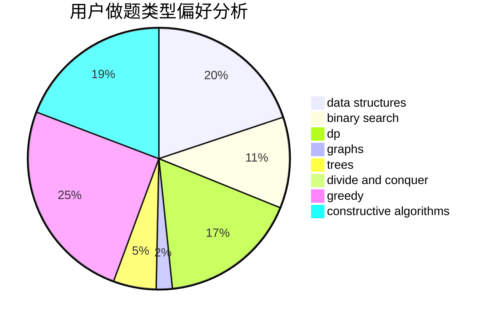
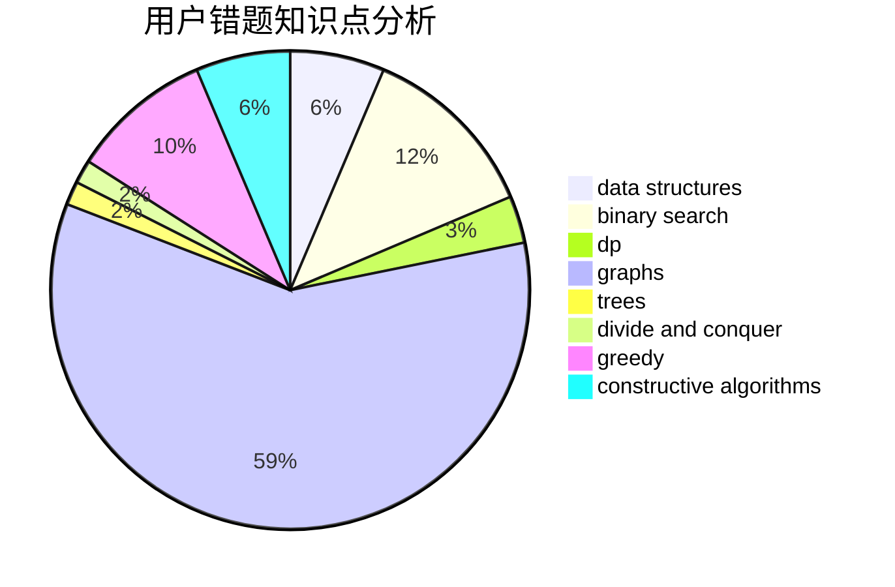

# WJMDBMR

<!-- tabs:start -->

#### **用户提交结果分析**

#### **用户做题类型偏好分析**

#### **用户错题知识点分析**

<!-- tabs:end -->
# 推荐题目
[1464C](https://codeforces.com/contest/1464/problem/C)		dsu,graphs,sortings,trees		  
[519D](https://codeforces.com/contest/519/problem/D)		data structures,
                        dp,
                        two pointers		  
[13764](https://codeforces.com/contest/1376/problem/4)		dsu,graphs,sortings,trees		  
[986F](https://codeforces.com/contest/986/problem/F)		graphs,
                        math,
                        number theory,
                        shortest paths		  
[1333D](https://codeforces.com/contest/1333/problem/D)		brute force,
                        constructive algorithms,
                        games,
                        graphs,
                        greedy,
                        implementation,
                        sortings		  
[1092E](https://codeforces.com/contest/1092/problem/E)		constructive algorithms,
                        dfs and similar,
                        greedy,
                        trees		  
[13781](https://codeforces.com/contest/1378/problem/1)		dsu,graphs,sortings,trees		  
[1065B](https://codeforces.com/contest/1065/problem/B)		constructive algorithms,
                        graphs		  
[1460A](https://codeforces.com/contest/1460/problem/A)		dsu,graphs,sortings,trees		  
[318D](https://codeforces.com/contest/318/problem/D)		dsu,graphs,sortings,trees		  
