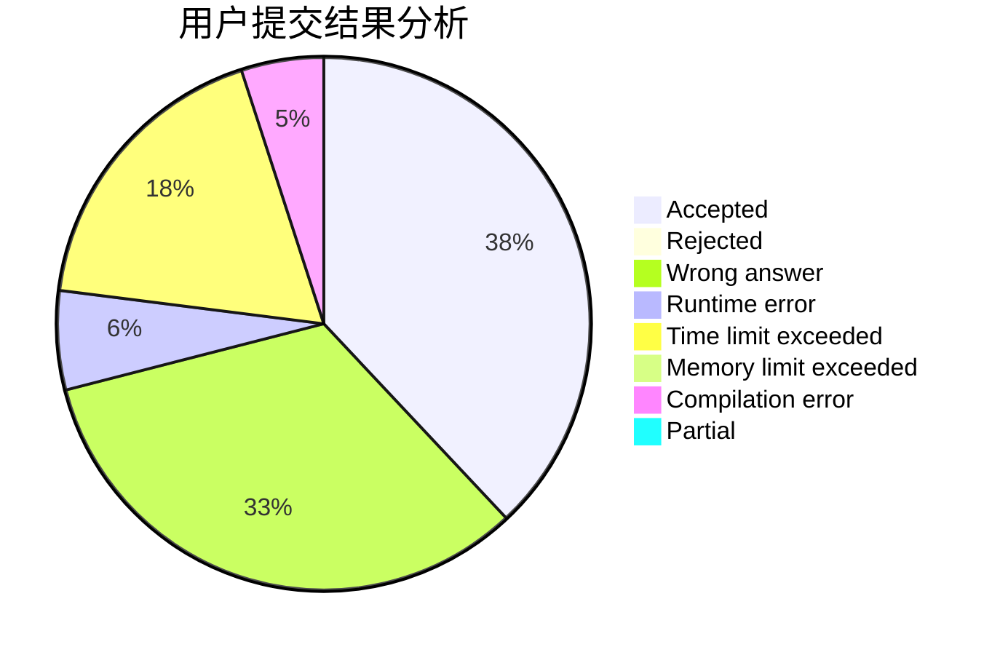
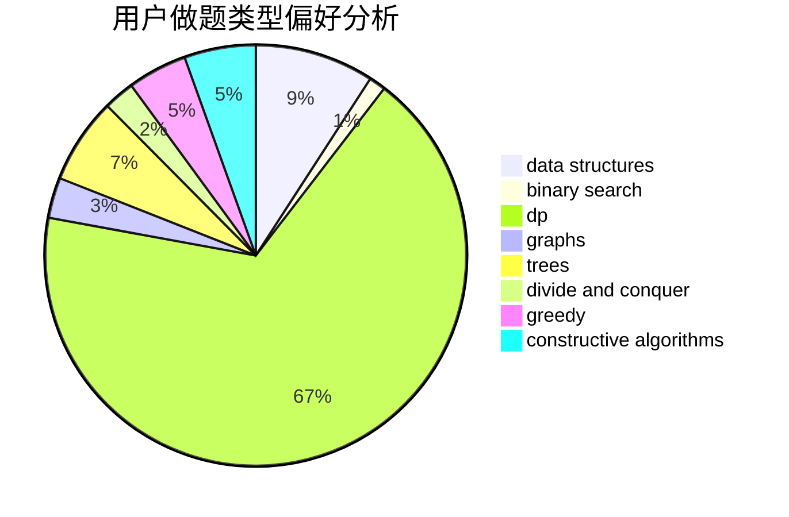

# WSJYQ

<!-- tabs:start -->

#### **用户提交结果分析**

#### **用户做题类型偏好分析**

#### **用户错题知识点分析**

<!-- tabs:end -->
# 推荐题目
[1480A](https://codeforces.com/contest/1480/problem/A)		games,
                        greedy,
                        strings		  
[396C](https://codeforces.com/contest/396/problem/C)		data structures,
                        graphs,
                        trees		  
[1220E](https://codeforces.com/contest/1220/problem/E)		dfs and similar,
                        dp,
                        dsu,
                        graphs,
                        greedy,
                        trees		  
[304C](https://codeforces.com/contest/304/problem/C)		dsu,graphs,sortings,trees		  
[540B](https://codeforces.com/contest/540/problem/B)		greedy,
                        implementation		  
[150A](https://codeforces.com/contest/150/problem/A)		games,
                        math,
                        number theory		  
[528A](https://codeforces.com/contest/528/problem/A)		dsu,graphs,sortings,trees		  
[681B](https://codeforces.com/contest/681/problem/B)		brute force		  
[1322E](https://codeforces.com/contest/1322/problem/E)		data structures		  
[989A](https://codeforces.com/contest/989/problem/A)		implementation,
                        strings		  
