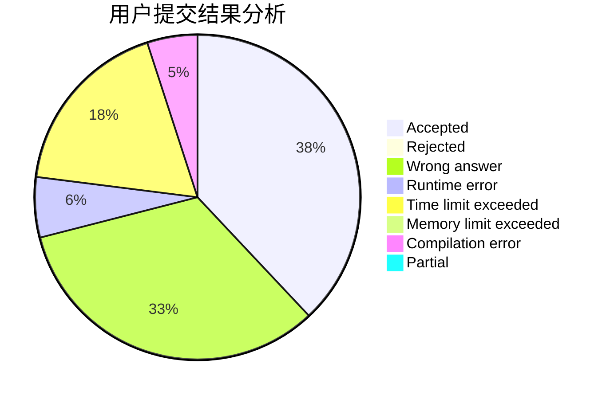
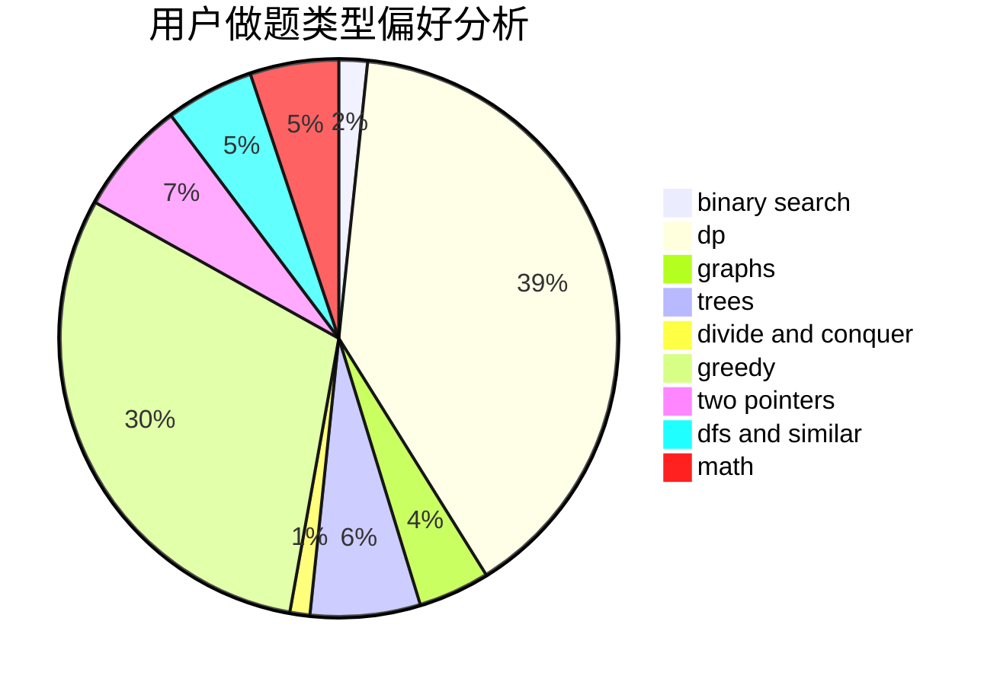

# WSJYQ

<!-- tabs:start -->

#### **用户提交结果分析**

#### **用户做题类型偏好分析**

<!-- tabs:end -->
# 推荐题目
[1480A](https://codeforces.com/contest/1480/problem/A)
[396C](https://codeforces.com/contest/396/problem/C)
[1220E](https://codeforces.com/contest/1220/problem/E)
[304C](https://codeforces.com/contest/304/problem/C)
[540B](https://codeforces.com/contest/540/problem/B)
[150A](https://codeforces.com/contest/150/problem/A)
[528A](https://codeforces.com/contest/528/problem/A)
[681B](https://codeforces.com/contest/681/problem/B)
[1322E](https://codeforces.com/contest/1322/problem/E)
[989A](https://codeforces.com/contest/989/problem/A)
