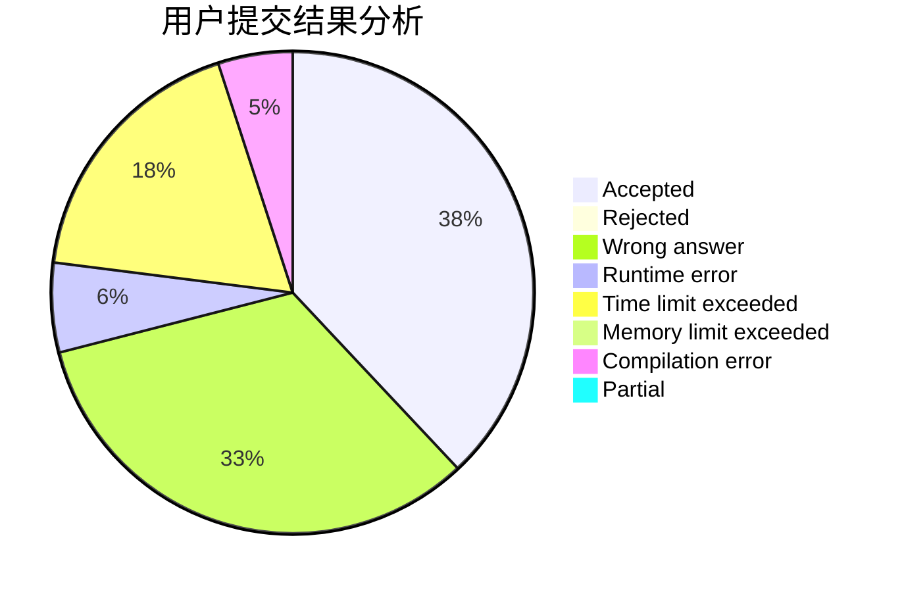
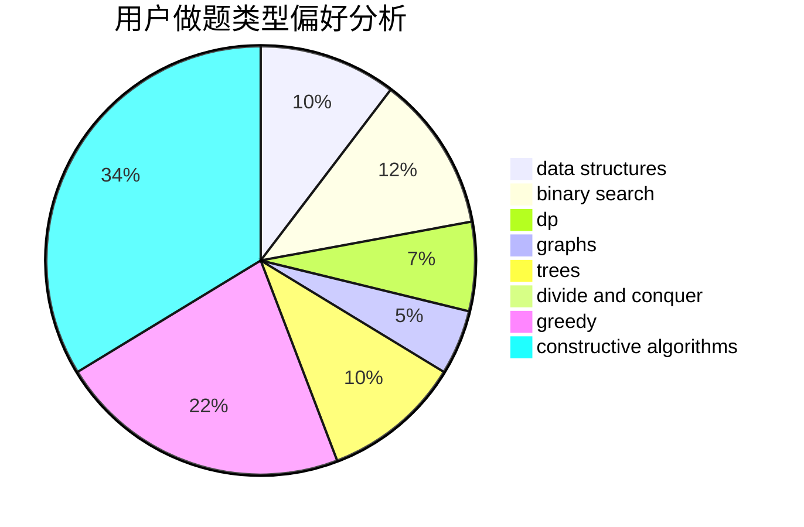

# WSJYQ

<!-- tabs:start -->

#### **用户提交结果分析**

#### **用户做题类型偏好分析**

#### **用户错题知识点分析**

<!-- tabs:end -->
# 推荐题目
[1472A](https://codeforces.com/contest/1472/problem/A)		greedy,
                        math		  
[366D](https://codeforces.com/contest/366/problem/D)		binary search,
                        data structures,
                        dfs and similar,
                        dsu,
                        shortest paths,
                        two pointers		  
[1215A](https://codeforces.com/contest/1215/problem/A)		greedy,
                        implementation,
                        math		  
[28C](https://codeforces.com/contest/28/problem/C)		combinatorics,
                        dp,
                        probabilities		  
[514D](https://codeforces.com/contest/514/problem/D)		binary search,
                        data structures,
                        two pointers		  
[1499G](https://codeforces.com/contest/1499/problem/G)		data structures,
                        graphs,
                        interactive		  
[508A](https://codeforces.com/contest/508/problem/A)		brute force		  
[660D](https://codeforces.com/contest/660/problem/D)		geometry		  
[1313B](https://codeforces.com/contest/1313/problem/B)		constructive algorithms,
                        greedy,
                        implementation,
                        math		  
[967D](https://codeforces.com/contest/967/problem/D)		dsu,graphs,sortings,trees		  
