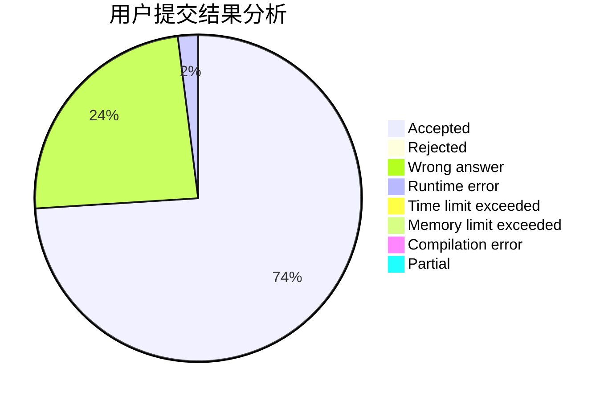
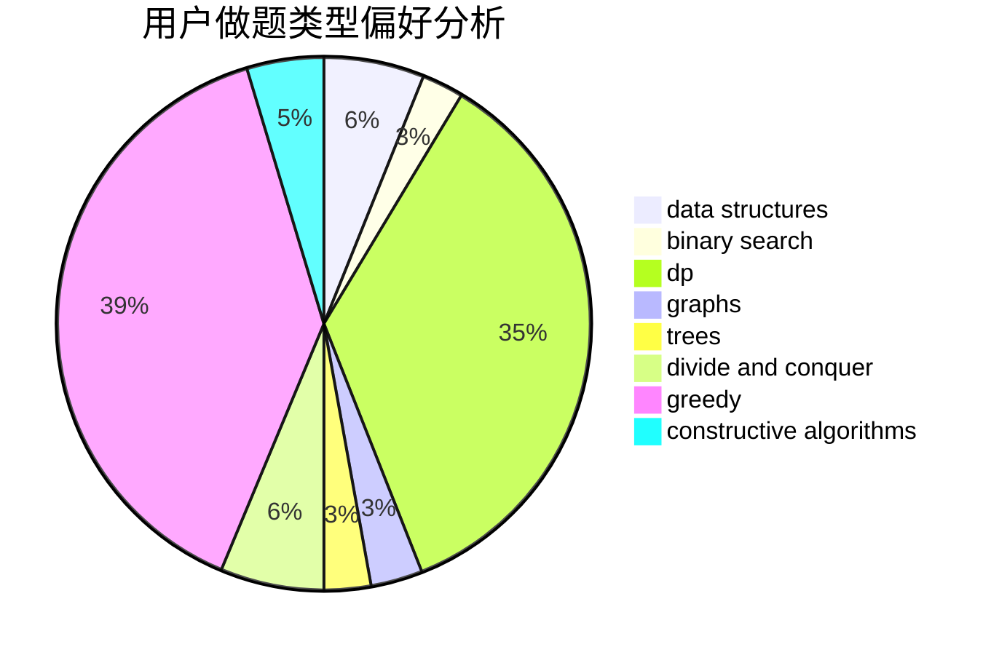
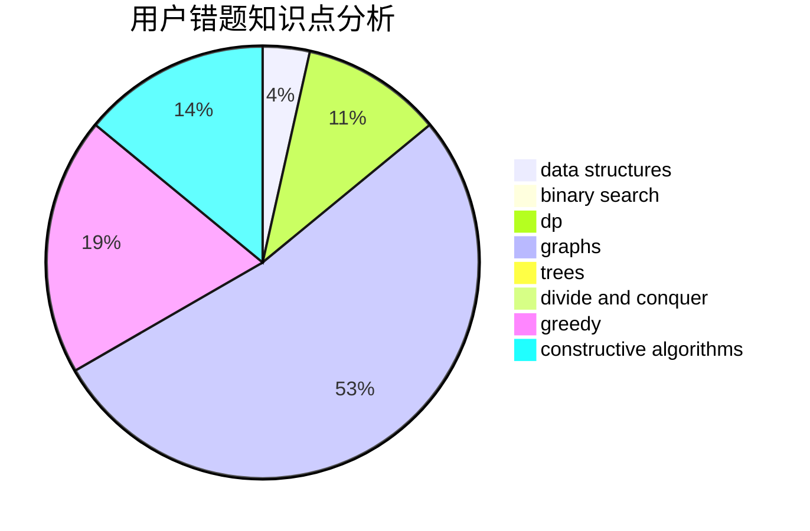

# WSJwsj_
<!-- tabs:start -->
#### **用户提交结果分析**

#### **用户做题类型偏好分析**

#### **用户错题知识点分析**

<!-- tabs:end -->
# 推荐题目
[Limericks](http://codeforces.com/problemset/problem/1331/B)		math,
                        number theory		  
[Prefix Sum Primes](http://codeforces.com/problemset/problem/1149/A)		constructive algorithms,
                        greedy,
                        math,
                        number theory		  
[Tree with Maximum Cost](http://codeforces.com/problemset/problem/1092/F)		dfs and similar,
                        dp,
                        trees		  
[Bus of Characters](http://codeforces.com/problemset/problem/982/B)		data structures,
                        greedy,
                        implementation		  
[Frets On Fire](http://codeforces.com/problemset/problem/1119/D)		binary search,
                        sortings		  
[Cutting Figure](http://codeforces.com/problemset/problem/193/A)		constructive algorithms,
                        graphs,
                        trees		  
[DZY Loves Fibonacci Numbers](https://codeforces.com/contest/447/problem/E)		data structures,
                        math,
                        number theory		  
[Tourists](http://codeforces.com/problemset/problem/286/D)		data structures,
                        sortings		  
[INTERCALC](http://codeforces.com/problemset/problem/784/C)		*special problem,
                        implementation		  
[Sequence Transformation](http://codeforces.com/problemset/problem/280/E)		data structures,
                        dp,
                        implementation,
                        math		  
<!-- tabs:start -->
#### **data structures**
[Limericks](http://codeforces.com/problemset/problem/982/B)		data structures,
                        greedy,
                        implementation		  
[Prefix Sum Primes](https://codeforces.com/contest/447/problem/E)		data structures,
                        math,
                        number theory		  
[Tree with Maximum Cost](http://codeforces.com/problemset/problem/286/D)		data structures,
                        sortings		  
[Bus of Characters](http://codeforces.com/problemset/problem/280/E)		data structures,
                        dp,
                        implementation,
                        math		  
[Frets On Fire](http://codeforces.com/problemset/problem/524/E)		data structures,
                        sortings		  
[Cutting Figure](https://codeforces.com/contest/879/problem/D)		data structures,
                        implementation		  
[DZY Loves Fibonacci Numbers](http://codeforces.com/problemset/problem/1492/C)		binary search,
                        data structures,
                        dp,
                        greedy,
                        two pointers		  
[Tourists](http://codeforces.com/problemset/problem/1490/G)		binary search,
                        data structures,
                        math		  
[INTERCALC](http://codeforces.com/problemset/problem/1479/D)		binary search,
                        bitmasks,
                        brute force,
                        data structures,
                        probabilities,
                        trees		  
[Sequence Transformation](http://codeforces.com/problemset/problem/1497/A)		brute force,
                        data structures,
                        greedy,
                        sortings		  
#### **binary search**
[Limericks](http://codeforces.com/problemset/problem/1119/D)		binary search,
                        sortings		  
[Prefix Sum Primes](http://codeforces.com/problemset/problem/1108/F)		binary search,
                        dsu,
                        graphs,
                        greedy		  
[Tree with Maximum Cost](http://codeforces.com/problemset/problem/1492/C)		binary search,
                        data structures,
                        dp,
                        greedy,
                        two pointers		  
[Bus of Characters](http://codeforces.com/problemset/problem/1463/D)		binary search,
                        constructive algorithms,
                        greedy,
                        two pointers		  
[Frets On Fire](http://codeforces.com/problemset/problem/1490/G)		binary search,
                        data structures,
                        math		  
[Cutting Figure](http://codeforces.com/problemset/problem/1479/D)		binary search,
                        bitmasks,
                        brute force,
                        data structures,
                        probabilities,
                        trees		  
[DZY Loves Fibonacci Numbers](http://codeforces.com/problemset/problem/1436/E)		binary search,
                        data structures,
                        two pointers		  
[Tourists](http://codeforces.com/problemset/problem/1461/D)		binary search,
                        brute force,
                        data structures,
                        divide and conquer,
                        implementation,
                        sortings		  
[INTERCALC](http://codeforces.com/problemset/problem/1493/C)		binary search,
                        brute force,
                        constructive algorithms,
                        greedy,
                        strings		  
[Sequence Transformation](http://codeforces.com/problemset/problem/1487/D)		binary search,
                        brute force,
                        math,
                        number theory		  
#### **dp**
[Limericks](http://codeforces.com/problemset/problem/1092/F)		dfs and similar,
                        dp,
                        trees		  
[Prefix Sum Primes](http://codeforces.com/problemset/problem/280/E)		data structures,
                        dp,
                        implementation,
                        math		  
[Tree with Maximum Cost](http://codeforces.com/problemset/problem/629/C)		dp,
                        strings		  
[Bus of Characters](https://codeforces.com/contest/1382/problem/D)		dp		  
[Frets On Fire](http://codeforces.com/problemset/problem/1421/E)		brute force,
                        dp,
                        implementation		  
[Cutting Figure](http://codeforces.com/problemset/problem/1363/E)		dfs and similar,
                        dp,
                        greedy,
                        trees		  
[DZY Loves Fibonacci Numbers](http://codeforces.com/problemset/problem/1296/E1)		constructive algorithms,
                        dp,
                        graphs,
                        greedy,
                        sortings		  
[Tourists](http://codeforces.com/problemset/problem/1118/F2)		combinatorics,
                        dfs and similar,
                        dp,
                        trees		  
[INTERCALC](http://codeforces.com/problemset/problem/1310/B)		dp,
                        implementation		  
[Sequence Transformation](http://codeforces.com/problemset/problem/1487/G)		combinatorics,
                        dp,
                        fft,
                        math		  
#### **graph**
[Limericks](http://codeforces.com/problemset/problem/193/A)		constructive algorithms,
                        graphs,
                        trees		  
[Prefix Sum Primes](https://codeforces.com/contest/871/problem/C)		dfs and similar,
                        dsu,
                        graphs,
                        trees		  
[Tree with Maximum Cost](http://codeforces.com/problemset/problem/1034/B)		brute force,
                        constructive algorithms,
                        flows,
                        graph matchings		  
[Bus of Characters](http://codeforces.com/problemset/problem/212/A)		flows,
                        graphs		  
[Frets On Fire](http://codeforces.com/problemset/problem/1108/F)		binary search,
                        dsu,
                        graphs,
                        greedy		  
[Cutting Figure](http://codeforces.com/problemset/problem/1296/E1)		constructive algorithms,
                        dp,
                        graphs,
                        greedy,
                        sortings		  
[DZY Loves Fibonacci Numbers](http://codeforces.com/problemset/problem/107/D)		dp,
                        graphs,
                        matrices		  
[Tourists](http://codeforces.com/problemset/problem/1487/C)		brute force,
                        constructive algorithms,
                        dfs and similar,
                        graphs,
                        greedy,
                        implementation,
                        math		  
[INTERCALC](http://codeforces.com/problemset/problem/1437/C)		dp,
                        flows,
                        graph matchings,
                        greedy,
                        math,
                        sortings		  
[Sequence Transformation](http://codeforces.com/problemset/problem/1470/D)		constructive algorithms,
                        dfs and similar,
                        graph matchings,
                        graphs,
                        greedy		  
#### **trees**
[Limericks](http://codeforces.com/problemset/problem/1092/F)		dfs and similar,
                        dp,
                        trees		  
[Prefix Sum Primes](http://codeforces.com/problemset/problem/193/A)		constructive algorithms,
                        graphs,
                        trees		  
[Tree with Maximum Cost](https://codeforces.com/contest/871/problem/C)		dfs and similar,
                        dsu,
                        graphs,
                        trees		  
[Bus of Characters](http://codeforces.com/problemset/problem/1363/E)		dfs and similar,
                        dp,
                        greedy,
                        trees		  
[Frets On Fire](http://codeforces.com/problemset/problem/1118/F2)		combinatorics,
                        dfs and similar,
                        dp,
                        trees		  
[Cutting Figure](http://codeforces.com/problemset/problem/1479/D)		binary search,
                        bitmasks,
                        brute force,
                        data structures,
                        probabilities,
                        trees		  
[DZY Loves Fibonacci Numbers](http://codeforces.com/problemset/problem/1511/C)		brute force,
                        data structures,
                        implementation,
                        trees		  
[Tourists](http://codeforces.com/problemset/problem/1499/F)		combinatorics,
                        dfs and similar,
                        dp,
                        trees		  
[INTERCALC](http://codeforces.com/problemset/problem/1491/E)		brute force,
                        dfs and similar,
                        divide and conquer,
                        number theory,
                        trees		  
[Sequence Transformation](http://codeforces.com/problemset/problem/1466/D)		data structures,
                        greedy,
                        sortings,
                        trees		  
#### **divide and conquer**
[Limericks](http://codeforces.com/problemset/problem/1461/D)		binary search,
                        brute force,
                        data structures,
                        divide and conquer,
                        implementation,
                        sortings		  
[Prefix Sum Primes](http://codeforces.com/problemset/problem/1466/G)		combinatorics,
                        divide and conquer,
                        hashing,
                        math,
                        string suffix structures,
                        strings		  
[Tree with Maximum Cost](http://codeforces.com/problemset/problem/1490/D)		dfs and similar,
                        divide and conquer,
                        implementation		  
[Bus of Characters](https://codeforces.com/contest/1483/problem/C)		data structures,
                        divide and conquer,
                        dp		  
[Frets On Fire](http://codeforces.com/problemset/problem/1491/E)		brute force,
                        dfs and similar,
                        divide and conquer,
                        number theory,
                        trees		  
[Cutting Figure](http://codeforces.com/problemset/problem/1303/G)		data structures,
                        divide and conquer,
                        geometry,
                        trees		  
[DZY Loves Fibonacci Numbers](http://codeforces.com/problemset/problem/1494/D)		constructive algorithms,
                        data structures,
                        dfs and similar,
                        divide and conquer,
                        dsu,
                        greedy,
                        sortings,
                        trees		  
[Tourists](http://codeforces.com/problemset/problem/1482/E)		data structures,
                        divide and conquer,
                        dp		  
[INTERCALC](http://codeforces.com/problemset/problem/566/C)		dfs and similar,
                        divide and conquer,
                        trees		  
[Sequence Transformation](http://codeforces.com/problemset/problem/1428/F)		binary search,
                        data structures,
                        divide and conquer,
                        dp,
                        two pointers		  
#### **greedy**
[Limericks](http://codeforces.com/problemset/problem/1149/A)		constructive algorithms,
                        greedy,
                        math,
                        number theory		  
[Prefix Sum Primes](http://codeforces.com/problemset/problem/982/B)		data structures,
                        greedy,
                        implementation		  
[Tree with Maximum Cost](http://codeforces.com/problemset/problem/1307/B)		geometry,
                        greedy,
                        math		  
[Bus of Characters](https://codeforces.com/contest/477/problem/B)		constructive algorithms,
                        greedy,
                        math		  
[Frets On Fire](http://codeforces.com/problemset/problem/853/A)		greedy		  
[Cutting Figure](https://codeforces.com/contest/1206/problem/C)		constructive algorithms,
                        greedy,
                        math		  
[DZY Loves Fibonacci Numbers](http://codeforces.com/problemset/problem/1108/F)		binary search,
                        dsu,
                        graphs,
                        greedy		  
[Tourists](http://codeforces.com/problemset/problem/844/A)		greedy,
                        implementation,
                        strings		  
[INTERCALC](http://codeforces.com/problemset/problem/1151/D)		greedy,
                        math,
                        sortings		  
[Sequence Transformation](http://codeforces.com/problemset/problem/1363/E)		dfs and similar,
                        dp,
                        greedy,
                        trees		  
#### **constructive algorithms**
[Limericks](http://codeforces.com/problemset/problem/1149/A)		constructive algorithms,
                        greedy,
                        math,
                        number theory		  
[Prefix Sum Primes](http://codeforces.com/problemset/problem/193/A)		constructive algorithms,
                        graphs,
                        trees		  
[Tree with Maximum Cost](http://codeforces.com/problemset/problem/369/B)		constructive algorithms,
                        implementation,
                        math		  
[Bus of Characters](http://codeforces.com/problemset/problem/1034/B)		brute force,
                        constructive algorithms,
                        flows,
                        graph matchings		  
[Frets On Fire](https://codeforces.com/contest/477/problem/B)		constructive algorithms,
                        greedy,
                        math		  
[Cutting Figure](https://codeforces.com/contest/716/problem/C)		constructive algorithms,
                        math		  
[DZY Loves Fibonacci Numbers](https://codeforces.com/contest/1206/problem/C)		constructive algorithms,
                        greedy,
                        math		  
[Tourists](http://codeforces.com/problemset/problem/1296/E1)		constructive algorithms,
                        dp,
                        graphs,
                        greedy,
                        sortings		  
[INTERCALC](http://codeforces.com/problemset/problem/1375/E)		constructive algorithms,
                        greedy,
                        sortings		  
[Sequence Transformation](http://codeforces.com/problemset/problem/1493/A)		constructive algorithms,
                        greedy		  
#### **sortings**
[Limericks](http://codeforces.com/problemset/problem/1119/D)		binary search,
                        sortings		  
[Prefix Sum Primes](http://codeforces.com/problemset/problem/286/D)		data structures,
                        sortings		  
[Tree with Maximum Cost](http://codeforces.com/problemset/problem/524/E)		data structures,
                        sortings		  
[Bus of Characters](https://codeforces.com/contest/1345/problem/C)		math,
                        number theory,
                        sortings		  
[Frets On Fire](http://codeforces.com/problemset/problem/1151/D)		greedy,
                        math,
                        sortings		  
[Cutting Figure](http://codeforces.com/problemset/problem/1296/E1)		constructive algorithms,
                        dp,
                        graphs,
                        greedy,
                        sortings		  
[DZY Loves Fibonacci Numbers](http://codeforces.com/problemset/problem/1375/E)		constructive algorithms,
                        greedy,
                        sortings		  
[Tourists](https://codeforces.com/contest/1496/problem/C)		geometry,
                        greedy,
                        math,
                        sortings		  
[INTERCALC](http://codeforces.com/problemset/problem/1495/A)		geometry,
                        greedy,
                        math,
                        sortings		  
[Sequence Transformation](http://codeforces.com/problemset/problem/1497/A)		brute force,
                        data structures,
                        greedy,
                        sortings		  
<!-- tabs:end -->
