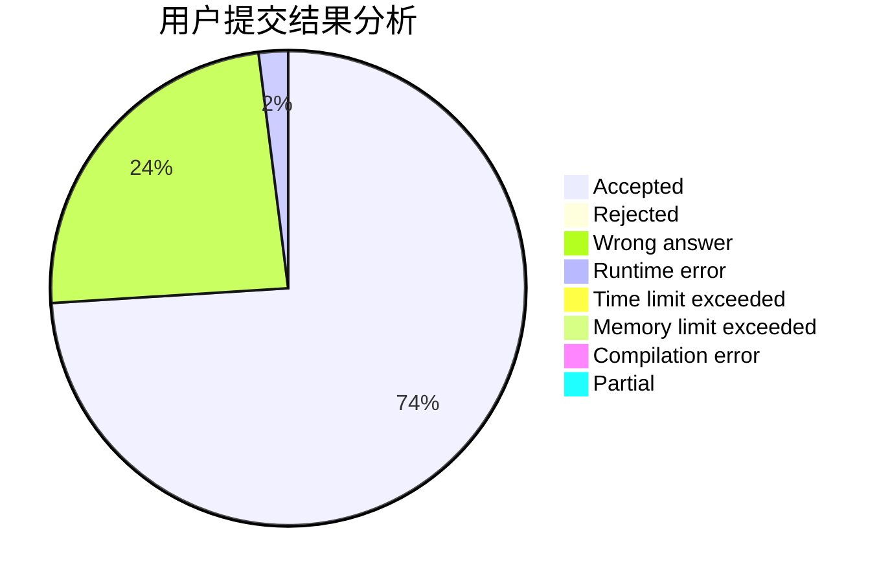
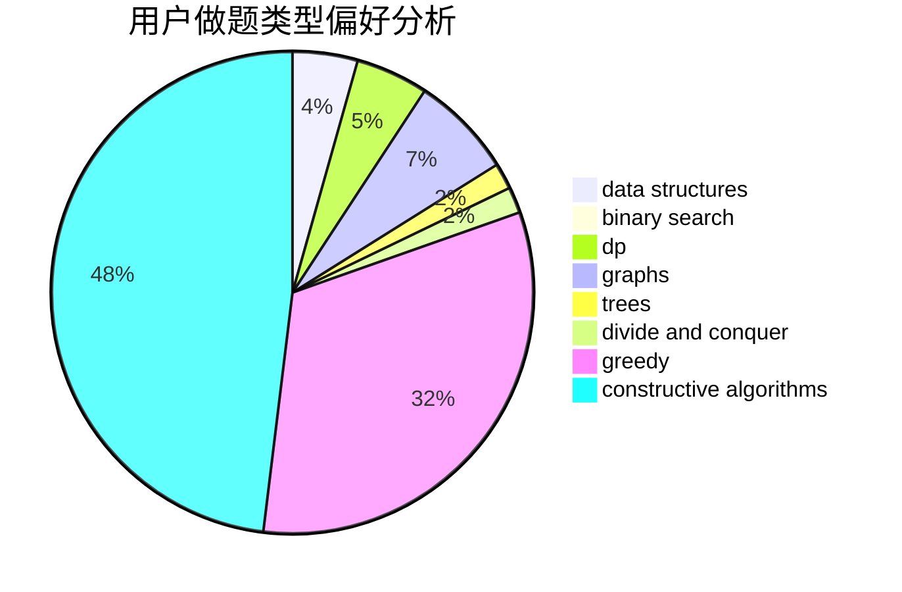
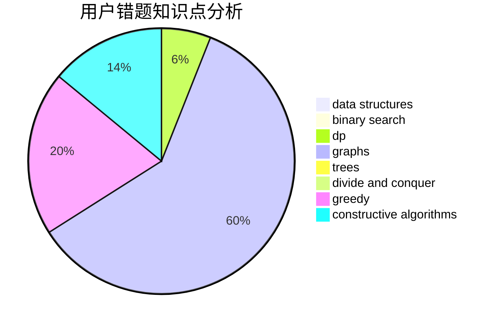

# WSJwsj_

<!-- tabs:start -->

#### **用户提交结果分析**

#### **用户做题类型偏好分析**

#### **用户错题知识点分析**

<!-- tabs:end -->
# 推荐题目
[997E](https://codeforces.com/contest/997/problem/E)		data structures		  
[300E](https://codeforces.com/contest/300/problem/E)		binary search,
                        math,
                        number theory		  
[11291](https://codeforces.com/contest/1129/problem/1)		dsu,graphs,sortings,trees		  
[497B](https://codeforces.com/contest/497/problem/B)		dsu,graphs,sortings,trees		  
[1278A](https://codeforces.com/contest/1278/problem/A)		brute force,
                        implementation,
                        strings		  
[801C](https://codeforces.com/contest/801/problem/C)		dsu,graphs,sortings,trees		  
[39D](https://codeforces.com/contest/39/problem/D)		math		  
[659B](https://codeforces.com/contest/659/problem/B)		constructive algorithms,
                        sortings		  
[1034E](https://codeforces.com/contest/1034/problem/E)		bitmasks,
                        dp,
                        math		  
[1210D](https://codeforces.com/contest/1210/problem/D)		graphs		  
